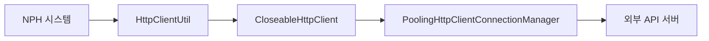

# HTTP/REST 클라이언트

> 최종 수정: 2026-03-08

---

## 1. 개요

NPH 시스템은 Apache HttpClient와 Jersey를 사용하여 외부 시스템과 HTTP/REST 통신을 수행한다.

---

## 2. JAR 파일

### 2.1 Apache HttpClient

| 파일명 | 버전 | 용도 |
|--------|------|------|
| **httpclient-4.5.3.jar** | 4.5.3 | HTTP 클라이언트 (최신) |
| **httpcore-4.4.6.jar** | 4.4.6 | HTTP 코어 |
| **commons-httpclient-3.1.jar** | 3.1 | HTTP 클라이언트 (구버전) |

### 2.2 Jersey (JAX-RS)

| 파일명 | 버전 | 용도 |
|--------|------|------|
| **jersey-bundle-1.19.4.jar** | 1.19.4 | JAX-RS 구현체 |

---

## 3. 주요 클래스

### 3.1 HttpClientUtil.java

```java
package com.rest.util;

import org.apache.http.client.methods.CloseableHttpResponse;
import org.apache.http.client.methods.HttpGet;
import org.apache.http.client.methods.HttpPost;
import org.apache.http.impl.client.CloseableHttpClient;
import org.apache.http.impl.conn.PoolingHttpClientConnectionManager;

/**
 * 외부기관 / 내부 API 서버 호출용 공통 HttpClient 유틸
 * - 싱글톤
 * - PoolingHttpClientConnectionManager 사용
 * - 타임아웃 설정
 * - 멀티스레드 안전
 */
public class HttpClientUtil {
    // HTTP GET/POST 요청 처리
}
```

### 3.2 사용 패턴



---

## 4. 연동 대상

### 4.1 외부 기관 연동

| 구분 | 용도 |
|------|------|
| **보험연동** | 건강보험, 국민건강보험 API |
| **외부 API** | 외부 기관 REST API 호출 |

### 4.2 내부 API

| 구분 | 용도 |
|------|------|
| **REST 서비스** | 내부 REST API 호출 |
| **마이플랫폼 연동** | 화면 간 데이터 통신 |

---

## 5. 기술 스택

| 기술 | 버전 | 상태 |
|------|------|------|
| **Apache HttpClient** | 4.5.3 | HTTP 클라이언트 (주 사용) |
| **Commons HttpClient** | 3.1 | 구버전 (레거시) |
| **Jersey** | 1.19.4 | JAX-RS REST 클라이언트 |

---

## 6. 관련 문서

- [README.md](./README.md)
- [B.FTP-클라이언트.md](./B.FTP-클라이언트.md)
- [C.SOAP-웹서비스.md](./C.SOAP-웹서비스.md)