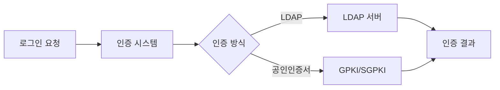

# LDAP/인증 연동

> 최종 수정: 2026-03-08

---

## 1. 개요

NPH 시스템은 LDAP 기반 설정 흔적을 분명히 가지며, 현재 소스베이스에서는 `xldap` 직접 사용도 확인된다. `ldapjdk`는 JAR 실체는 확인되지만 애플리케이션 코드의 직접 import는 아직 찾지 못했다. 따라서 현재 가장 강한 근거는 `xldap` 직접 사용과 `DSToolkitV30.conf`의 LDAP URL 설정이다.

---

## 2. JAR 파일

### 2.1 LDAP

| 파일명 | 용도 |
|--------|------|
| **ldapjdk.jar** | Netscape LDAP SDK (JAR 존재, 직접 import 미확인) |
| **xldap.jar** | 확장 LDAP 계열 JAR (직접 사용 확인) |

### 2.2 연관 라이브러리

| 파일명 | 용도 |
|--------|------|
| **sggpki.jar** | SG PKI (공인인증서) |
| **sgkm.jar** | SG KM (키매니저) |
| **sgsecukit.jar** | SG 보안 키트 |
| **libgpkiapi_jni.jar** | GPKI API JNI |

---

## 3. 주요 용도

### 3.1 사용자 인증



### 3.2 직접 확인된 xldap 사용 클래스`r`n`r`n- `UserMngmPC` -> `XLDAPUser``r`n- `EamIFUC` -> `XLDAPUser`, `XLDAPOrg`, `XLDAPRole`, `XLDAPPerm``r`n- `ComLoginUC`, `ReturnSessionCMD`, `MenuInfoCMD` -> `XLDAPRole``r`n`r`n### 3.3 디렉토리 서비스

| 구분 | 용도 |
|------|------|
| **사용자 조회** | `XLDAPUser` 기반 사용자 정보 조회/비밀번호 처리 |
| **조직도** | `XLDAPOrg` 기반 부서/조직 정보 조회 |
| **권한 관리** | `XLDAPRole`, `XLDAPPerm` 기반 역할/권한 확인 |

---

## 4. 연동 시스템

### 4.1 전자서명 스택과의 연관

LDAP은 전자서명/인증서 처리 스택과 함께 등장한다. 다만 현재 로컬 근거만으로 `SignGate 단일 제품과의 직접 연동 구조`를 강하게 단정하기는 어렵다.

**관련 문서**: [../0331.security-auth/D.SignGate-전자서명.md](../0331.security-auth/D.SignGate-전자서명.md)

### 4.2 DSToolkit

인증서 검증을 위한 DSToolkit이 LDAP을 사용하여 CA 정보를 조회한다.

**DSToolkit 설정의 LDAP URL 예시**:
```
ldap://ldap.signgate.com:389
```

---

## 5. 기술 스택

| 기술 | 상태 |
|------|------|
| **Netscape LDAP SDK** | JAR 존재, 직접 import 추가 확인 필요 |
| **xldap** | 직접 사용 확인 (EAM/권한/사용자 관리) |


---

## 6. 관련 문서

- [README.md](./README.md)
- [../0331.security-auth/D.SignGate-전자서명.md](../0331.security-auth/D.SignGate-전자서명.md)


