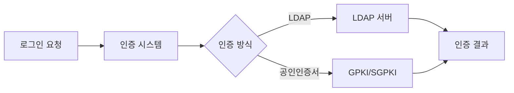

# LDAP/인증 연동

> 최종 수정: 2026-03-08

---

## 1. 개요

NPH 시스템은 LDAP을 사용하여 사용자 인증 및 디렉토리 서비스 연동을 수행한다.

---

## 2. JAR 파일

### 2.1 LDAP

| 파일명 | 용도 |
|--------|------|
| **ldapjdk.jar** | Netscape LDAP SDK |
| **xldap.jar** | 확장 LDAP |

### 2.2 연관 라이브러리

| 파일명 | 용도 |
|--------|------|
| **sggpki.jar** | SG PKI (공인인증서) |
| **sgkm.jar** | SG KM (키매니저) |
| **sgsecukit.jar** | SG 보안 키트 |
| **libgpkiapi_jni.jar** | GPKI API JNI |

---

## 3. 주요 용도

### 3.1 사용자 인증



### 3.2 디렉토리 서비스

| 구분 | 용도 |
|------|------|
| **사용자 조회** | LDAP 디렉토리에서 사용자 정보 조회 |
| **조직도** | 부서/조직 구조 조회 |
| **권한 관리** | LDAP 기반 권한 확인 |

---

## 4. 연동 시스템

### 4.1 SignGate와 연동

LDAP은 SignGate 전자서명 솔루션과 연동하여 사용자 인증을 수행한다.

**관련 문서**: [../0331.security-auth/D.SignGate-전자서명.md](../0331.security-auth/D.SignGate-전자서명.md)

### 4.2 DSToolkit

인증서 검증을 위한 DSToolkit이 LDAP을 사용하여 CA 정보를 조회한다.

**CA LDAP URL 예시**:
```
ldap://ldap.signgate.com:389
```

---

## 5. 기술 스택

| 기술 | 상태 |
|------|------|
| **Netscape LDAP SDK** | LDAP 클라이언트 |
| **SG PKI** | 공인인증서 연동 |
| **GPKI API** | 정부 PKI 연동 |

---

## 6. 관련 문서

- [README.md](./README.md)
- [../0331.security-auth/D.SignGate-전자서명.md](../0331.security-auth/D.SignGate-전자서명.md)