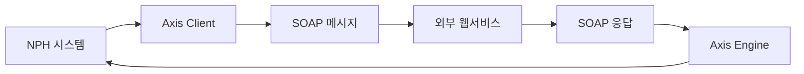

# SOAP 웹서비스

> 최종 수정: 2026-03-08

---

## 1. 개요

NPH 시스템은 Apache Axis를 사용하여 SOAP 웹서비스 통신을 수행한다.

---

## 2. JAR 파일

### 2.1 Apache Axis

| 파일명 | 용도 |
|--------|------|
| **axis.jar** | Axis SOAP 엔진 |
| **axis-ant.jar** | Axis Ant 태스크 |
| **jaxrpc.jar** | JAX-RPC API |
| **saaj.jar** | SOAP with Attachments API |
| **wsdl4j-1.5.1.jar** | WSDL 처리 |

### 2.2 관련 라이브러리

| 파일명 | 용도 |
|--------|------|
| **commons-discovery-0.2.jar** | 서비스 발견 |
| **axiom-api-1.2.9.jar** | AXIOM API |
| **axiom-impl-1.2.9.jar** | AXIOM 구현 |

---

## 3. SOAP 웹서비스 구조

### 3.1 아키텍처



### 3.2 주요 컴포넌트

| 컴포넌트 | 설명 |
|----------|------|
| **Axis Engine** | SOAP 메시지 처리 엔진 |
| **JAX-RPC** | Java API for XML-based RPC |
| **SAAJ** | SOAP with Attachments API for Java |
| **WSDL4J** | WSDL 문서 처리 |

---

## 4. 사용 패턴

### 4.1 웹서비스 클라이언트

```java
import org.apache.axis.client.Call;
import org.apache.axis.client.Service;
import javax.xml.rpc.ParameterMode;

// 웹서비스 호출
Service service = new Service();
Call call = (Call) service.createCall();
call.setTargetEndpointAddress(endpointUrl);
call.setOperationName(operationName);
Object result = call.invoke(params);
```

### 4.2 연동 대상

| 구분 | 용도 |
|------|------|
| **보험 청구** | 건강보험 심사 청구 |
| **처방 전송** | 약국 처방 전송 |
| **외부 연동** | 타 기관 웹서비스 |

---

## 5. 기술 스택

| 기술 | 버전 | 상태 |
|------|------|------|
| **Apache Axis** | 1.x | SOAP 웹서비스 |
| **JAX-RPC** | 1.x | XML RPC |
| **SAAJ** | 1.x | SOAP 첨부 |

---

## 6. 관련 문서

- [README.md](./README.md)
- [B.HTTP-REST-클라이언트.md](./B.HTTP-REST-클라이언트.md)
- [B.FTP-SSH-클라이언트.md](./B.FTP-SSH-클라이언트.md)