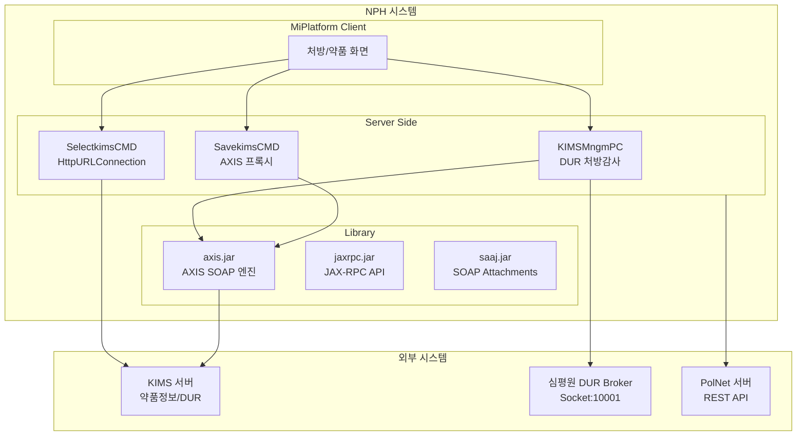

# SOAP 웹서비스

> 최종 수정: 2026-03-08

---

## 1. 개요

NPH 시스템은 Apache Axis를 사용하여 SOAP 웹서비스 통신을 수행한다. 주요 연동 대상은 KIMS(약품정보/DUR 시스템)이다.

## 1A. 직접 확인 근거 파일

| 구분 | 직접 확인 근거 |
|------|----------------|
| Axis JAR | `axis.jar`, `jaxrpc.jar`, `saaj.jar`, `wsdl4j-1.5.1.jar` |
| 생성/프록시 코드 | `MedicalInfoSoapStub.java`, `MedicalInfoSoapProxy.java` |
| 직접 사용 클래스 | `SavekimsCMD.java`, `SelectkimsCMD.java`, `KIMSMngmPC.java`, `PrintDrugFdisInfoCMD.java`, `SaveDrugMstCMD.java` |
| 운영 설정 흔적 | `COMMON/libs/log4j.properties`, `NPH_HIS/webapp/WEB-INF/lib/log4j.properties` |

---

## 2. JAR 파일

### 2.1 Apache Axis (사용 중)

| 파일명 | 용도 | 상태 |
|--------|------|------|
| **axis.jar** | Axis SOAP 엔진 | ✅ 사용 중 |
| **jaxrpc.jar** | JAX-RPC API | ✅ 사용 중 |
| **saaj.jar** | SOAP with Attachments API | ✅ 사용 중 |
| **wsdl4j-1.5.1.jar** | WSDL 처리 | ✅ 사용 중 |

### 2.2 미사용 JAR

| 파일명 | 용도 | 상태 | 비고 |
|--------|------|------|------|
| **axis-ant.jar** | Axis Ant 태스크 | ❌ 미사용 | 빌드 타임 전용, NPH는 Ant 미사용 |

> **axis-ant.jar 분석 결과**
> - **용도**: Ant 빌드에서 `axis-java2wsdl`, `axis-wsdl2java` 태스크 제공
> - **미사용 이유**: NPH 프로젝트는 Ant를 사용하지 않음 (`build.xml` 없음)
> - **실제 사용**: 런타임에는 `axis.jar`만으로 충분
> - **정리 권장**: 불필요한 JAR

### 2.3 관련 라이브러리

| 파일명 | 용도 |
|--------|------|
| **commons-discovery-0.2.jar** | 서비스 발견 |
| **axiom-api-1.2.9.jar** | AXIOM API |
| **axiom-impl-1.2.9.jar** | AXIOM 구현 |

---

## 3. 주요 연동 대상: KIMS (약품정보 시스템)

### 3.1 엔드포인트

| 환경 | URL | 서비스명 |
|------|-----|---------|
| **운영** | `http://kims.nph.go.kr/modules/MedicalInfo.asmx` | MedicalInfo |
| **개발** | `http://kims.nph.go.kr:8080/modules/MedicalInfo.asmx` | MedicalInfo |

### 3.2 연동 기능

| 메서드 | 용도 | 비고 |
|--------|------|------|
| **GetDrugInfo** | 약품 기본정보 조회 | DUR 지원 |
| **SetCustDrugInfo** | 고객 약품정보 설정 | |
| **CheckAlert** | DUR 처방감사 | 약물 상호작용 검사 |
| **CallPOCFunction** | POC 함수 호출 | |
| **DeleteIdentaDataByIdentaNo** | 식별데이터 삭제 | |
| **SaveRx** | 처방 저장 | |

### 3.3 인증 방식

```xml
<soap:Header>
  <CustomerInfo xmlns="http://poc.kimsonline.co.kr/">
    <CustID>PANLPH</CustID>
    <Password>PANLPH!@#</Password>
  </CustomerInfo>
</soap:Header>
```

---

## 4. SOAP 호출 패턴

### 4.1 패턴 A: HttpURLConnection 직접 구성 (주 사용)

**사용 파일:** `KIMSMngmPC.java`, `SelectkimsCMD.java`, `PrintDrugFdisInfoCMD.java` 등

```java
// 1. SOAP Envelope 직접 구성
StringWriter wout = new StringWriter();
wout.write("<?xml version=\"1.0\" encoding=\"utf-8\"?>");
wout.write("<soap:Envelope xmlns:xsi=\"http://www.w3.org/2001/XMLSchema-instance\"");
wout.write(" xmlns:xsd=\"http://www.w3.org/2001/XMLSchema\"");
wout.write(" xmlns:soap=\"http://schemas.xmlsoap.org/soap/envelope/\">");
wout.write("<soap:Header>");
wout.write("<CustomerInfo xmlns=\"http://poc.kimsonline.co.kr/\">");
wout.write("<CustID>" + CustID + "</CustID>");
wout.write("<Password>" + PassWord + "</Password>");
wout.write("</CustomerInfo></soap:Header>");
wout.write("<soap:Body>");
wout.write("<GetDrugInfo xmlns=\"http://poc.kimsonline.co.kr/\">");
wout.write("<Proc>" + proc + "</Proc>");
wout.write("<Param>" + param + "</Param>");
wout.write("<RtnType>" + rtnType + "</RtnType>");
wout.write("</GetDrugInfo>");
wout.write("</soap:Body></soap:Envelope>");

// 2. HTTP POST 전송
URL u = new URL(ServerIp + "/modules/MedicalInfo.asmx");
HttpURLConnection connection = (HttpURLConnection) u.openConnection();
connection.setRequestMethod("POST");
connection.setRequestProperty("SOAPAction", "http://poc.kimsonline.co.kr/GetDrugInfo");
connection.setRequestProperty("Content-Type", "text/xml; charset=utf-8");
connection.setDoOutput(true);

OutputStreamWriter out = new OutputStreamWriter(connection.getOutputStream());
out.write(wout.toString());
out.close();

// 3. XPath로 응답 파싱
InputStream is = connection.getInputStream();
Document document = DocumentBuilderFactory.newInstance().newDocumentBuilder().parse(is);
XPath xpath = XPathFactory.newInstance().newXPath();
String result = xpath.evaluate("//ProductNameKr", document, XPathConstants.STRING);
```

### 4.2 패턴 B: AXIS 프록시 사용

**사용 파일:** `SavekimsCMD.java`

```java
import org.apache.axis.client.Service;
import org.apache.axis.client.Call;
import org.apache.axis.message.SOAPHeaderElement;
import javax.xml.soap.SOAPElement;

// 1. AXIS WSDL2Java로 생성된 프록시 클래스 사용
MedicalInfoSoapProxy PocFn = new MedicalInfoSoapProxy(connectUrl);
MedicalInfoSoapStub stub = (MedicalInfoSoapStub) PocFn.getMedicalInfoSoap();

// 2. SOAP Header에 인증정보 설정
SOAPHeaderElement custominfo = new SOAPHeaderElement(
    "http://poc.kimsonline.co.kr/", "CustomerInfo");
SOAPElement node = custominfo.addChildElement("CustID");
node.addTextNode("PANLPH");
SOAPElement node2 = custominfo.addChildElement("Password");
node2.addTextNode("PANLPH!@#");
stub.setHeader(custominfo);

// 3. 서비스 메서드 호출
String rtn = PocFn.getDrugInfo(Proc, param.toString(), rtnType);
```

---

## 5. SOAP 연동 Java 파일

### 5.1 KIMS 약품정보 연동

| 파일 | 경로 | 용도 | 패턴 |
|------|-----|------|------|
| `KIMSMngmPC.java` | `md/ord/ptmdcr/pc/` | DUR 처방감사 | HttpURLConnection |
| `SavekimsCMD.java` | `az/bizcom/menu/cmd/` | 약품정보 저장 | AXIS 프록시 |
| `SelectkimsCMD.java` | `az/bizcom/menu/cmd/` | 약품정보 조회 | HttpURLConnection |
| `SaveDrugMstCMD.java` | `sp/pha/mdprinfomngm/cmd/` | 약품마스터 저장 | HttpURLConnection |
| `StrgDgstListCMD.java` | `sp/pha/mdprinfomngm/cmd/` | 저장소약국 목록 | HttpURLConnection |

### 5.2 기타 SOAP 연동

| 파일 | 경로 | 용도 |
|------|-----|------|
| `PrintDrugFdisInfoCMD.java` | `sp/pha/comdmngm/cmd/` | F-DIS 복약지도 출력 |
| `PrscMngmPC.java` | `md/ord/ptmdcr/pc/` | 처방관리 SOAP 연동 |
| `NrsnPrcsMngmPC.java` | `md/ipn/admsnrcr/pc/` | 간호프로세스 SOAP 연동 |

---

## 6. 기타 연동 방식

### 6.1 Socket 기반 DUR 연동

**파일:** `DurService.java`

```java
// 심평원 DUR Broker와 Socket 연결 (HTTP/SOAP 아님)
Socket socket = new Socket();
socket.connect(new InetSocketAddress(brokerIp, 10001), connTimeout);

// 전문 프로토콜로 통신
os.write(header.getBytes());
os.write(int4ToByteArray(sendBodySize));
os.write(content);
```

### 6.2 Apache HttpClient 기반 REST 연동

**파일:** `PolNetHandler.java`

```java
// Apache HttpClient 4.x 사용 (REST/HTTP)
HttpClientUtil httpClient = HttpClientUtil.getInstance();
String responseXml = httpClient.post(url, encryptedData, httpHeader);

// JAXB로 XML 마샬링/언마샬링
JAXBContext context = JAXBContext.newInstance(RequestVo.class);
Marshaller marshaller = context.createMarshaller();
```

---

## 7. 아키텍처



---

## 8. SOAP 메시지 예시

### 8.1 요청 메시지

```xml
<?xml version="1.0" encoding="utf-8"?>
<soap:Envelope xmlns:xsi="http://www.w3.org/2001/XMLSchema-instance"
               xmlns:xsd="http://www.w3.org/2001/XMLSchema"
               xmlns:soap="http://schemas.xmlsoap.org/soap/envelope/">
  <soap:Header>
    <CustomerInfo xmlns="http://poc.kimsonline.co.kr/">
      <CustID>PANLPH</CustID>
      <Password>PANLPH!@#</Password>
    </CustomerInfo>
  </soap:Header>
  <soap:Body>
    <GetDrugInfo xmlns="http://poc.kimsonline.co.kr/">
      <Proc>SELECT_DRUG</Proc>
      <Param><![CDATA[<DrugCode>12345</DrugCode>]]></Param>
      <RtnType>XML</RtnType>
    </GetDrugInfo>
  </soap:Body>
</soap:Envelope>
```

### 8.2 응답 메시지

```xml
<?xml version="1.0" encoding="utf-8"?>
<soap:Envelope xmlns:soap="http://schemas.xmlsoap.org/soap/envelope/">
  <soap:Body>
    <GetDrugInfoResponse xmlns="http://poc.kimsonline.co.kr/">
      <GetDrugInfoResult>
        <DrugInfo>
          <DrugCode>12345</DrugCode>
          <ProductNameKr>아스피린</ProductNameKr>
          <CompanyName>제약사명</CompanyName>
        </DrugInfo>
      </GetDrugInfoResult>
    </GetDrugInfoResponse>
  </soap:Body>
</soap:Envelope>
```

---

## 9. WSDL 파일

| 항목 | 상태 |
|------|------|
| NPH 애플리케이션 WSDL | ❌ 없음 |
| JEUS 샘플 WSDL | ✅ `/bin/JEUS7/samples/webservice/` 존재 |

> KIMS WSDL은 KIMS 서버에서 제공하며, NPH는 클라이언트 역할만 수행

---

## 10. 요약

| 항목 | 설명 |
|------|------|
| **SOAP 라이브러리** | Apache Axis 1.x (axis.jar) |
| **주요 연동 대상** | KIMS (약품정보/DUR 시스템) |
| **SOAP 방식** | HttpURLConnection 직접 SOAP 구성 (주) + AXIS 프록시 (일부) |
| **인증 방식** | SOAP Header에 `<CustID>`, `<Password>` 추가 |
| **네임스페이스** | `http://poc.kimsonline.co.kr/` |
| **기타 연동** | Socket (심평원 DUR), Apache HttpClient (PolNet REST) |

---

## 11. 관련 문서

- [README.md](./README.md) - Integration 개요
- [B.HTTP-REST-클라이언트.md](./B.HTTP-REST-클라이언트.md) - HTTP/REST 클라이언트
- [C.FTP-SSH-클라이언트.md](./C.FTP-SSH-클라이언트.md) - FTP/SSH 클라이언트
