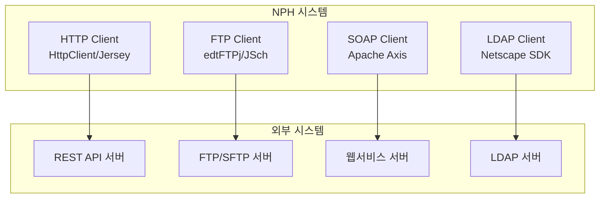

# integration 개요

> 최종 수정: 2026-03-08

---

## 1A. 상위 연결

- 이 폴더의 기준 설명은 [../README.md](../README.md) 를 먼저 본다.
- DevOn 코어는 [../../032.framework-core/0321.overview/A.Framework-개요.md](../../032.framework-core/0321.overview/A.Framework-개요.md) 와 같이 본다.
- 의료업무 맥락은 [../../035.Biz-medical-Domain](../../035.Biz-medical-Domain) 으로 이어진다.
- 실제 사례는 [../../037.runtime-trace/A.트레이스-읽는순서.md](../../037.runtime-trace/A.트레이스-읽는순서.md) 를 본다.

이 문서는 외부 시스템과의 공통 연동에 사용되는 솔루션과 패키지를 정리하는 기준본이다.

---

## 2. 분석 현황

| 솔루션 | 상태 | 문서 |
|--------|------|------|
| **HTTP/REST 클라이언트** | ✅ 분석 완료 | [B.HTTP-REST-클라이언트.md](./B.HTTP-REST-클라이언트.md) |
| **FTP/SSH 클라이언트** | ✅ 분석 완료 | [C.FTP-SSH-클라이언트.md](./C.FTP-SSH-클라이언트.md) |
| **LDAP/인증 연동** | ✅ 분석 완료 | [D.LDAP-인증연동.md](./D.LDAP-인증연동.md) |
| **SOAP 웹서비스** | ✅ 분석 완료 | [E.SOAP-웹서비스.md](./E.SOAP-웹서비스.md) |
| **JCAOS/SVNKit** | ✅ 분석 완료 | [F.JCAOS-SVNKit.md](./F.JCAOS-SVNKit.md) |

---

## 3. 기술 스택 요약

### 3.1 HTTP/REST 클라이언트

| 기술 | 버전 | 용도 |
|------|------|------|
| **Apache HttpClient** | 4.5.3 | HTTP 클라이언트 (주 사용) |
| **Commons HttpClient** | 3.1 | HTTP 클라이언트 (레거시) |
| **Jersey** | 1.19.4 | JAX-RS REST 클라이언트 |

### 3.2 FTP/SSH 클라이언트

| 기술 | 버전 | 용도 |
|------|------|------|
| **edtFTPj** | 2.0.1 | FTP/FTPS 클라이언트 |
| **JSch** | 0.1.54 | SSH/SFTP 클라이언트 |
| **Commons Net** | 2.0 | 네트워크 유틸리티 |

### 3.3 LDAP/인증

| 기술 | 용도 |
|------|------|
| **Netscape LDAP SDK** | LDAP 클라이언트 |
| **SG PKI** | 공인인증서 연동 |
| **GPKI API** | 정부 PKI 연동 |

### 3.4 SOAP 웹서비스

| 기술 | 버전 | 용도 |
|------|------|------|
| **Apache Axis** | 1.x | SOAP 웹서비스 |
| **JAX-RPC** | 1.x | XML RPC |
| **SAAJ** | 1.x | SOAP 첨부 |

### 3.5 기타 연동

| 기술 | 버전 | 용도 |
|------|------|------|
| **JCAOS** | 1.4.7.7 | 한국형 시스템 연동 |
| **SVNKit** | 1.8.14 | SVN 클라이언트 |

---

## 4. JAR 파일 목록

```
NPH_HIS/webapp/WEB-INF/lib/
├── axis.jar                    # Apache Axis (SOAP)
├── axis-ant.jar                # Axis Ant 태스크
├── jaxrpc.jar                  # JAX-RPC API
├── saaj.jar                    # SOAP Attachments API
├── wsdl4j-1.5.1.jar           # WSDL 처리
├── commons-discovery-0.2.jar   # 서비스 발견
├── axiom-api-1.2.9.jar        # AXIOM API
├── axiom-impl-1.2.9.jar       # AXIOM 구현
├── httpclient-4.5.3.jar        # Apache HttpClient 4.x
├── httpcore-4.4.6.jar         # HTTP Core
├── commons-httpclient-3.1.jar  # Commons HttpClient 3.x
├── jersey-bundle-1.19.4.jar    # Jersey JAX-RS
├── edtftpj-2.0.1.jar          # FTP 클라이언트
├── commons-net-2.0.jar        # Commons Net
├── jsch-0.1.54.jar            # SSH/SFTP
├── ldapjdk.jar                # LDAP SDK
├── xldap.jar                  # 확장 LDAP
├── jcaos-1.4.7.7.jar          # JCAOS
├── svnkit-1.8.14.jar          # SVNKit
└── ...
```

---

## 5. 아키텍처



---

## 6. 연동 대상

| 구분 | 기술 | 용도 |
|------|------|------|
| **보험 연동** | SOAP/HTTP | 건강보험, 국민건강보험 |
| **PACS 연동** | FTP/SFTP | 의료 영상 파일 전송 |
| **외부 기관** | HTTP/REST | 타 기관 API 연동 |
| **사용자 인증** | LDAP | 디렉토리 서비스 |

---

## 7. 분류 기준

- 외부 시스템 연계, 파일 전송, HTTP/SOAP/REST 클라이언트, 인증 연동 패키지는 여기서 관리한다.
- 의료 특화 연계의 업무 맥락은 `035.Biz-medical-Domain`과 같이 본다.

---

## 8. 파일 구조

```
0332.integration/
├── README.md                      # 이 문서 (개요)
├── B.HTTP-REST-클라이언트.md        # ✅ 분석 완료
├── C.FTP-SSH-클라이언트.md          # ✅ 분석 완료
├── D.LDAP-인증연동.md              # ✅ 분석 완료
├── E.SOAP-웹서비스.md              # ✅ 분석 완료
└── F.JCAOS-SVNKit.md              # ✅ 분석 완료
```

---

## 9. 관련 문서

- [../0331.security-auth/](../0331.security-auth/) - 보안/인증
- [../0333.Solutions/](../0333.Solutions/) - 공통 솔루션
- [../../030.index/0307.Tech Stack/Tech-Stack-개요.md](../../030.index/0307.Tech%20Stack/Tech-Stack-개요.md)