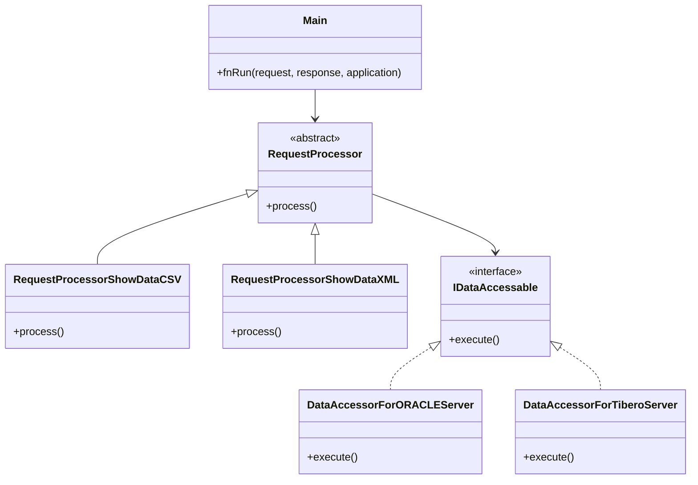
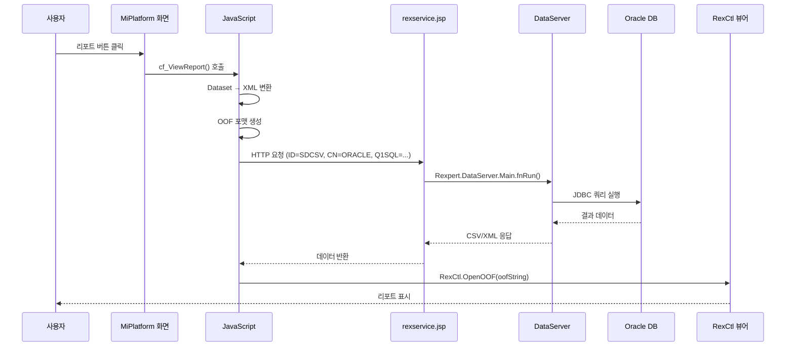

# Rexpert 리포트 엔진 분석

> 분석일: 2026-03-07
> 분석 대상: `/mnt/n/99.SourceCode Backup/NPH/AADEV_NPH/workspace`

---

## 1. 개요

NPH 시스템에서 **Rexpert 사용 자체는 강하게 확인된다.** 직접 근거는 `rexservice.jsp`, `DataSource.properties`, 다수 MiPlatform 화면의 `cf_PreviewReport()` 호출이다. 다만 이 문서에는 `제품 일반 정보`와 `NPH 실증`이 함께 들어 있으므로, 두 층위를 구분해서 읽어야 한다.

### 1.0 리뷰 메모

- `NPH 실증`으로 강하게 확인되는 것은 `Rexpert.DataServer.Main.fnRun()`, `Rexpert DataAccessor 설정`, 화면 XML의 `cf_PreviewReport()` 호출이다.
- 개발사/출시연도/시장 설명/GS 인증 같은 내용은 제품 일반 정보이며, NPH 소스 자체의 사실은 아니다.
- 따라서 이 문서는 `Rexpert 제품 소개`가 아니라 `NPH에서 Rexpert를 어떻게 붙여 썼는가`를 중심으로 읽는 것이 맞다.

### 1.1 제품 정보

| 항목 | 내용 |
|------|------|
| **개발사** | 한컴이노스트림 (구 클립소프트) |
| **출시** | 2004년 (Rexpert 3.0: 2011년) |
| **특징** | 제품 일반 정보 (NPH 소스 근거 아님) |
| **용도** | 공공기관, 병원, 기업 리포트 시스템 |
| **기술지원** | 제품 일반 정보 |

### 1.2 버전 정보

| 항목 | 버전 |
|------|------|
| Rexpert Server | 3.0 |
| Rexpert Viewer | 1.0.0.57 |
| Rexpert.jar | 154,565 bytes (151 KB) |
| 리포트 템플릿 | REX3 바이너리 포맷 (.reb) |
| 템플릿 수 | **1,674개** |

### 1.3 핵심 특징 (Rexpert 3.0)

| 특징 | 설명 |
|------|------|
| **성능 강화** | 원천소스 재구축, 쓰레드 최적화, 최소 메모리 사용 |
| **섹션+테이블** | 외산 툴의 그루핑 + 국산 툴의 장표 작성 기능 혼합 |
| **스크립트 지원** | JavaScript, VBScript 포괄적 사용 |
| **크로스 브라우저** | ActiveX + NPRuntime 방식으로 Firefox, Chrome 등 지원 |
| **접근성** | 센스리더, 드림보이스 등 음성인식 SW 지원 |
| **XML 바인딩** | XML 데이터 바인딩 지원 |

---

## 2. 아키텍처

> 이 장의 상단 구조도는 `NPH에서 확인된 호출 경로`를 중심으로 읽고, 제품 패키지 설명은 보조 정보로 본다.

### 2.1 전체 구조

```
┌─────────────────────────────────────────────────────────────────┐
│                      MiPlatform Client                           │
│  ┌──────────────────────────────────────────────────────────┐   │
│  │  XML 화면 (.xml)                                          │   │
│  │  - 버튼/메뉴 이벤트 → 리포트 호출 함수                    │   │
│  └──────────────────────────────────────────────────────────┘   │
│                              ↓                                    │
│  ┌──────────────────────────────────────────────────────────┐   │
│  │  JavaScript 라이브러리 (expLib.js, rexpert.js)           │   │
│  │  - cf_ViewReport()   : 미리보기 팝업                     │   │
│  │  - cf_printReport()  : 바로출력                          │   │
│  │  - cf_PreviewReport(): 화면 내장 뷰어                    │   │
│  │  - cf_DataSettoXML() : Dataset → XML 변환                │   │
│  └──────────────────────────────────────────────────────────┘   │
│                              ↓                                    │
│  ┌──────────────────────────────────────────────────────────┐   │
│  │  Rexpert ActiveX/OCX 컨트롤 (RexCtl)                      │   │
│  │  - CLSID: FC035099-833E-4AB1-BF48-37D08F5E553C           │   │
│  │  - OpenOOF(oofString) : 리포트 열기                       │   │
│  │  - Print(...), Export(...), SetCSS(...), UpdateCSS()     │   │
│  └──────────────────────────────────────────────────────────┘   │
└─────────────────────────────────────────────────────────────────┘
                               ↓
┌─────────────────────────────────────────────────────────────────┐
│                      Server Side                                  │
│  ┌──────────────────────────────────────────────────────────┐   │
│  │  JSP Services                                             │   │
│  │  - rexpreview.jsp : 뷰어 페이지 (5KB)                     │   │
│  │  - rexservice.jsp  : 데이터 서버 (511 bytes)             │   │
│  │  - sampleall.jsp   : 샘플 페이지 (14KB)                   │   │
│  └──────────────────────────────────────────────────────────┘   │
│  ┌──────────────────────────────────────────────────────────┐   │
│  │  Rexpert.jar (DataServer)                                 │   │
│  │  - Rexpert.DataServer.Main.fnRun()                       │   │
│  │  - DataAccessors: ORACLE, Tibero, SQLServer, DB2...      │   │
│  │  - RequestProcessors: CSV, XML 데이터 처리               │   │
│  └──────────────────────────────────────────────────────────┘   │
│  ┌──────────────────────────────────────────────────────────┐   │
│  │  Report Templates (.reb)                                 │   │
│  │  - /webapp/report/{업무영역}/                            │   │
│  │  - 1,674개 리포트 템플릿                                  │   │
│  └──────────────────────────────────────────────────────────┘   │
└─────────────────────────────────────────────────────────────────┘
```

### 2.2 패키지 구조

```
Rexpert.jar
├── Rexpert/DataServer/
│   ├── Main.class                    # 진입점
│   ├── MainLoginCheck.class          # 로그인 체크
│   │
│   ├── DataAccessors/                # 데이터 접근 계층
│   │   ├── IDataAccessable.class     # 인터페이스
│   │   ├── DataAccessorForORACLEServer.class
│   │   ├── DataAccessorForTiberoServer.class
│   │   ├── DataAccessorForSQLServer.class
│   │   ├── DataAccessorForDB2Server.class
│   │   ├── DataAccessorForSybase.class
│   │   ├── DataAccessorForAltibaseServer.class
│   │   ├── DataAccessorForSAPServer.class
│   │   ├── DBUtil.class
│   │   ├── FieldInfo.class
│   │   ├── FunctionInfo.class
│   │   ├── ParameterInfo.class
│   │   └── TableInfo.class
│   │
│   ├── Properties/                   # 설정 관리
│   │   ├── PropertiesManager.class   # Singleton
│   │   ├── DataConnection.class
│   │   ├── DataConnectionProperties.class
│   │   ├── DataSource.class
│   │   ├── DataSourceProperties.class
│   │   ├── LicenseProperties.class
│   │   └── ServerProperties.class
│   │
│   ├── RequestProcessors/            # 요청 처리
│   │   ├── RequestProcessor.class    # Base
│   │   ├── RequestProcessorShowDataCSV.class
│   │   ├── RequestProcessorShowDataXML.class
│   │   ├── RequestProcessorShowConnectionList.class
│   │   └── ...
│   │
│   ├── Requests/                     # 요청 모델
│   │   ├── Request.class
│   │   ├── RequestShowDataCSV.class
│   │   ├── RequestShowDataXML.class
│   │   └── WebParameterAnalyzer.class
│   │
│   └── ETC/                          # 유틸리티
│       ├── Base64Encoder.class
│       ├── DESEncrypt.class
│       ├── LogWriter.class           # Singleton
│       ├── Query.class
│       └── StringEncoding.class
```

### 2.3 클래스 다이어그램



### 2.4 데이터 흐름



---

## 3. 핵심 파일

### 3.1 서버 사이드

| 파일 | 경로 | 크기 | 설명 |
|------|------|------|------|
| Rexpert.jar | /WEB-INF/lib/Rexpert.jar | 151 KB | Java 라이브러리 |
| TPRreport.jar | /WEB-INF/lib/TPRreport.jar | - | TPR 리포트 생성 |
| rexservice.jsp | /jsp/report/rexservice.jsp | 511 B | 데이터 서버 |
| rexpreview.jsp | /jsp/report/rexpreview.jsp | 5 KB | 미리보기 페이지 |
| sampleall.jsp | /jsp/report/sampleall.jsp | 14 KB | 샘플 페이지 |

### 3.2 클라이언트 사이드

| 파일 | 경로 | 크기 | 설명 |
|------|------|------|------|
| rexpert.js | /jsp/include/js/rexpert.js | - | JavaScript API |
| rexpert_properties.js | /jsp/include/js/rexpert_properties.js | - | 환경 설정 |
| expLib.js | /ui/LIBs/expLib.js | 88 KB | 공통 리포트 함수 |
| Rexpert30Viewer.cab | /Miplatform330/install/Component/ | - | ActiveX 컨트롤 |

---

## 4. JavaScript API 상세

### 4.1 설정 변수

```javascript
// 서비스 URL
rex_gsRexServiceRootURL = "http://" + location.host + "/NPH_HIS/";
rex_gsPreViewURL = rex_gsRexServiceRootURL + "jsp/report/rexpreview.jsp";
rex_gsReportURL = rex_gsRexServiceRootURL + "report/sample/";
rex_gsRptServiceURL = rex_gsRexServiceRootURL + "jsp/report/rexservice.jsp";

// Export Service URL
rex_gsRptExportServiceURL = "http://" + location.host + "/RexServer/exportservice.jsp";

// 기본 설정
rex_gsUserService = "ORACLE";           // 기본 DB 연결
rex_viewer_version = "1,0,0,57";        // 뷰어 버전
rex_gsServerVersion = "3.0";             // 서버 버전

// CSV 구분자
rex_gsCsvSeparatorColumn = "|*|";        // 컬럼 구분자
rex_gsCsvSeparatorRow = "|#|";           // 행 구분자
rex_gsCsvEncoding = "utf-8";             // 인코딩

// XPath
rex_gsXPath = "gubun/rpt1/rexdataset/rexrow";
```

### 4.2 rex_fnParamSet 클래스

```javascript
function rex_fnParamSet(id) {
    this.id = id;                        // 파라미터 셋 ID
    this.type = "http";                  // 연결 타입 (http, file, memo)
    this.opentype = "open";               // 열기 타입 (open, iframe, print, save, embed, export)
    this.rptname = "";                    // 리포트 파일명
    this.exportfiletype = "pdf";          // 내보내기 형식
    this.datatype = "CSV";                // 데이터 타입

    this.rebfiles = {};                   // 리포트 파일 컬렉션
    this.subreports = {};                 // 서브리포트 컬렉션
    this.params = {};                     // 파라미터 컬렉션
    this.httpparams = {};                 // HTTP 파라미터
    this.datasets = {};                   // 데이터셋
    this.event = {};                      // 이벤트 핸들러

    // 메서드
    this.reb = function(id) {};           // 리포트 파일 반환
    this.sub = function(id) {};           // 서브리포트 반환
    this.param = function(id) {};         // 파라미터 반환
    this.httpparam = function(id) {};      // HTTP 파라미터 반환
    this.dataset = function(id) {};       // 데이터셋 반환
    this.toString = function() {};        // OOF XML 생성

    // 실행 메서드
    this.open = function() {};            // 새 창에서 미리보기
    this.iframe = function(oIframe) {};  // iframe에 표시
    this.embed = function(sRexCtl) {};   // ActiveX에 임베드
    this.print = function() {};           // 바로 인쇄
    this.save = function() {};            // 저장
    this.exportserver = function() {};    // 서버 내보내기
}
```

### 4.3 expLib.js 주요 함수

```javascript
// 리포트 미리보기
cf_ViewReport(sReportUrl, sReportMapStr, sFields, bOpenMode, bPrintWidowYN, sOption, sPrintDirveNm, sSubReportPath);

// 바로 인쇄
cf_printReport(sReportID, sReportUrl, sReportMapStr, sFields, bPrintWidowYN, sPrintDirveNm, sSubReportPath, sOption, sMultiOOF);

// 화면 내장 뷰어
cf_PreviewReport(sReportID, sReportUrl, sReportMapStr, sFields, sSubReportPath);

// Dataset → XML 변환
cf_DataSettoXML(arrDataset, arrReportPath);

// 필드 → XML 변환
cf_FieldtoXML(sFields);

// 그리드 범용 출력
cf_CommonGridReport(grObj, sTitle, sReportPath, arrParamList, sParam, sSubReportPath, bPrintWidowYN);
```

---

## 5. OOF (Object Oriented Format) 구조

### 5.1 XML 구조

```xml
<?xml version='1.0' encoding='utf-8'?>
<oof version='3.0'>
    <document enable-thread='1'>
        <!-- 리포트 템플릿 파일 목록 -->
        <file-list>
            <file type='reb' path='http://host/report/sample/report.reb'>
                <field-list>
                    <field name='param1'><![CDATA[value1]]></field>
                </field-list>
            </file>
        </file-list>

        <!-- 데이터 연결 목록 -->
        <connection-list>
            <connection type='http' namespace='*'>
                <config-param-list>
                    <config-param name='path'>http://host/jsp/report/rexservice.jsp</config-param>
                </config-param-list>
                <http-param-list>
                    <http-param name='Q1SQL'><![CDATA[]]></http-param>
                    <http-param name='CN'><![CDATA[ORACLE]]></http-param>
                    <http-param name='ID'><![CDATA[SDCSV]]></http-param>
                    <http-param name='PE'><![CDATA[FALSE]]></http-param>
                    <http-param name='QC'><![CDATA[1]]></http-param>
                    <http-param name='OT'><![CDATA[DataOnly]]></http-param>
                    <http-param name='Q1Type'><![CDATA[SQL]]></http-param>
                </http-param-list>
                <content content-type='csv'>
                    <content-param name='col-delim'>|*|</content-param>
                    <content-param name='row-delim'>|#|</content-param>
                    <content-param name='encoding'>utf-8</content-param>
                </content>
            </connection>
        </connection-list>

        <!-- 파라미터 필드 -->
        <field-list>
            <field name='argBtmInfo'><![CDATA[화면명 / 부서 / 성명 / IP / 시간]]></field>
        </field-list>
    </document>
</oof>
```

### 5.2 연결 타입

| 타입 | 설명 | 설정 |
|------|------|------|
| `http` | HTTP 요청으로 데이터 조회 | `path`, `httpparam` |
| `file` | 파일에서 직접 데이터 로드 | `path` |
| `memo` | 메모리 데이터 사용 | `data` |

### 5.3 대용량 데이터 처리

```javascript
// 스레드 처리 설정
sOOF += "<document enable-thread='0'>\n";  // 동기 처리 (대용량)

// CSV 포맷 (효율적)
<content content-type='csv'>
    <content-param name='col-delim'>|*|</content-param>
    <content-param name='row-delim'>|#|</content-param>
</content>
```

---

## 6. JSP 서비스 구현

### 6.1 rexservice.jsp

```jsp
<%
    // Rexpert 설정 디렉토리 (하드코딩!)
    System.setProperty("rexpert.properties.dir",
        "C:/AADEV_NPH/workspace/NPH_HIS/webapp/WEB-INF/Rexpert/conf");

    // 요청 파라미터
    String strId = request.getParameter("ID");

    // 응답 형식 설정
    if (strId.equalsIgnoreCase("SDXML")) {
        response.setContentType("text/xml;charset=EUC-KR");
    } else if (strId.equalsIgnoreCase("SDCSV")) {
        response.setContentType("text/html;charset=EUC-KR");
    }

    // Rexpert DataServer 실행
    Rexpert.DataServer.Main.fnRun(request, response, application);
%>
```

### 6.2 요청 파라미터

| 파라미터 | 설명 | 값 |
|----------|------|-----|
| `ID` | 데이터 형식 | `SDXML`, `SDCSV` |
| `Q1SQL` | SQL 쿼리 | `` 또는 실제 SQL |
| `CN` | 연결명 | `ORACLE`, `SQL_Server`, `DB2` |
| `OE` | 출력 인코딩 | `None` |
| `PE` | 파라미터 인코딩 | `TRUE`, `FALSE` |
| `QC` | 쿼리 카운트 | `1` |
| `OT` | 출력 타입 | `DataOnly` |
| `Q1Type` | 쿼리 타입 | `SQL` |

### 6.3 데이터베이스 연결

**DataSource.properties:**

```properties
# 지원 데이터베이스
SQL_Server=Rexpert.DataServer.DataAccessors.DataAccessorForSQLServer
ORACLE=Rexpert.DataServer.DataAccessors.DataAccessorForORACLEServer
DB2=Rexpert.DataServer.DataAccessors.DataAccessorForDB2Server
Sybase=Rexpert.DataServer.DataAccessors.DataAccessorForSybase
SAP=Rexpert.DataServer.DataAccessors.DataAccessorForSAPServer
Tibero=Rexpert.DataServer.DataAccessors.DataAccessorForTiberoServer
Altibase=Rexpert.DataServer.DataAccessors.DataAccessorForAltibaseServer
```

**DataConnection.properties:**

```properties
Connection2.Name=ORACLE
Connection2.SourceType=ORACLE
Connection2.DataCodePage=UTF-8
Connection2.SplitDataSet=|@|
Connection2.SplitRow=|#|
Connection2.SplitCol=|*|
Connection2.Parameter3.Name=ServerName
Connection2.Parameter3.Value=172.6.14.118
Connection2.Parameter4.Name=PortNumber
Connection2.Parameter4.Value=1521
Connection2.Parameter5.Name=DBName
Connection2.Parameter5.Value=TCS
Connection2.Parameter6.Name=UserName
Connection2.Parameter6.Value=hhcd
Connection2.Parameter7.Name=Password
Connection2.Parameter7.Value=hhcd
```

---

## 7. ActiveX 컨트롤 (RexCtl)

### 7.1 컨트롤 정보

```
CLSID: FC035099-833E-4AB1-BF48-37D08F5E553C
버전: 1,0,0,57
파일: Rexpert30Viewer.cab
```

### 7.2 주요 메서드

| 메서드 | 파라미터 | 설명 |
|--------|----------|------|
| `OpenOOF(oofString)` | OOF XML 문자열 | 리포트 열기 |
| `Print(dialog, startPage, endPage, copies, option)` | 인쇄 옵션 | 인쇄 |
| `PrintDirect(printer, startPage, endPage, copies, option)` | 프린터명 | 직접 인쇄 |
| `Export(dialog, type, filename, startPage, endPage, option)` | Export 옵션 | 파일 내보내기 |
| `CloseAll()` | - | 모든 리포트 닫기 |
| `GetVersion()` | - | 버전 반환 |
| `SetCSS(cssString)` | CSS 문자열 | 스타일 설정 |
| `UpdateCSS()` | - | 스타일 적용 |

### 7.3 CSS 설정 예시

```javascript
RexCtl.SetCSS("appearance.toolbar.visible=1");
RexCtl.SetCSS("appearance.statusbar.visible=0");
RexCtl.SetCSS("appearance.toolbar.button.exportpdf.visible=1");
RexCtl.SetCSS("appearance.toolbar.button.exporthwp.visible=1");
RexCtl.SetCSS("print.spool.title=" + sReportTitle);
RexCtl.SetCSS("print.copies=" + nCopies);
RexCtl.UpdateCSS();
```

### 7.4 이벤트 핸들러

```javascript
// JavaScript 이벤트 설정
oOOF.event.init = function(oRexCtl, sEvent, oData) {
    // 초기화 이벤트
    oRexCtl.SetCSS("appearance.toolbar.button.print.visible=1");
    oRexCtl.UpdateCSS();
};

oOOF.event.finishdocument = function(oRexCtl, sEvent, oData) {
    // 문서 로딩 완료
};

oOOF.event.finishprint = function(oRexCtl, sEvent, oData) {
    // 인쇄 완료
};

oOOF.event.finishexport = function(oRexCtl, sEvent, oData) {
    // 내보내기 완료
    // oData.filename에 저장된 파일명
};
```

---

## 8. 리포트 템플릿 구조

### 8.1 디렉토리 구조

```
/webapp/report/
├── AZ/           # 관리/공통 (124개)
│   ├── COM/      # 공통 리포트
│   ├── STA/      # 통계 리포트 (113개)
│   └── template/  # 템플릿
├── ER/           # 전자의무기록 (305개)
│   ├── EMR/      # EMR 관련 (169개)
│   └── STC/      # 응급통계 (76개)
├── HP/           # 병원행정 (244개)
│   ├── PAT/      # 환자 관련 (59개)
│   └── UNC/      # 미수금 (52개)
├── MD/           # 외래/진료 (504개)
│   ├── HEA/      # 건강검진 (289개)
│   ├── IPN/      # 입원 (78개)
│   └── ORD/      # 처방 (25개)
├── MR/           # 원무/수납 (213개)
│   └── EMR/      # EMR 관련 (169개)
├── SP/           # 검사/방사선 (271개)
│   ├── PHA/      # 약제 (71개)
│   ├── NUT/      # 영양 (59개)
│   └── LAB/      # 검사실 (50개)
├── pilot/        # 파일럿/테스트
├── sample/       # 샘플
│   ├── Rexpert.reb
│   ├── Rexpert1.reb
│   ├── simple.reb
│   └── QR_sample.reb
└── horHeader.reb # 공통 헤더
```

### 8.2 .reb 파일 구조

```
파일 헤더: REXPERT VER 3.0 COPYRIGHT BY CLIPSOFT
버전: 1.0.0.x
내용:
  - 데이터셋 정의 (SQLDS1, Server1)
  - 필드 정의 (TOBJID, POBJID, TOWNERID, COLNAME, INTCOL 등)
  - 연결 정보:
    - 데이터베이스: JNDI, ORACLE
    - URL: http://server:port/rexservice.jsp
```

---

## 9. 보안 및 운영 이슈

### 9.1 보안 취약점

| 항목 | 위험도 | 설명 |
|------|--------|------|
| 하드코딩된 경로 | 높음 | `C:/AADEV_NPH/...` 개발 경로 노출 |
| 평문 비밀번호 | 높음 | DataConnection.properties에 DB 비밀번호 평문 저장 |
| XSS 필터링 불충분 | 중간 | `<`, `>`만 필터링, 다른 특수문자 미처리 |
| SQL 인젝션 가능성 | 높음 | 동적 SQL 실행 지원 (``) |
| 인코딩 처리 비활성 | 중간 | `request.setCharacterEncoding("utf-8")` 주석 처리 |
| ActiveX 의존성 | 높음 | IE 전용, 다른 브라우저는 제한적 지원 |

### 9.2 운영 이슈

| 항목 | 설명 |
|------|------|
| 설정 경로 | 하드코딩 (`C:/AADEV_NPH/...`) - 배포 시 수정 필요 |
| 인코딩 | EUC-KR (레거시), UTF-8 전환 필요 |
| 브라우저 | IE 중심 ActiveX 의존 - HTML5 전환 필요 |

---

## 10. 연결 문서

- [README.md](./README.md)
- [Tech-Stack-개요.md](../../030.index/0307.Tech%20Stack/Tech-Stack-개요.md)
- [한컴이노스트림 기술지원](https://tech.hancomins.com)

---

## 11. 분석 필요 항목

### 11.1 마이그레이션

- [ ] ActiveX → HTML5 전환 방안
- [ ] Rexpert 대체 솔루션 검토
- [ ] 크로스 브라우저 지원

### 11.2 성능 최적화

- [ ] 대용량 데이터 처리 방식
- [ ] 리포트 캐싱 전략
- [ ] 서버 부하 분산

---

*분석 완료: 2026-03-07*


