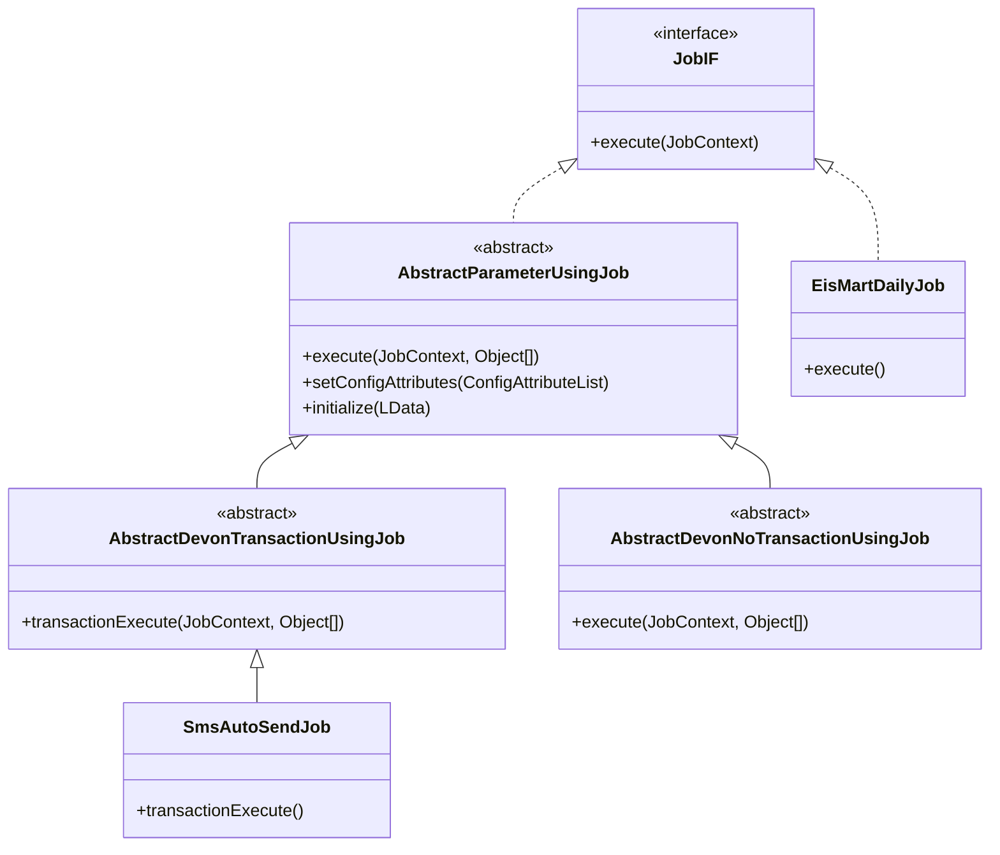
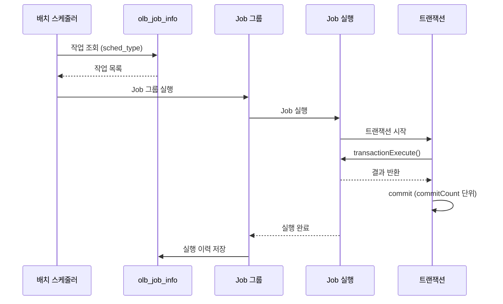

# Quartz/DEVON Batch 스케줄러 분석

> 분석일: 2026-03-07
> 분석 대상: `/mnt/n/99.SourceCode Backup/NPH/AADEV_NPH/workspace`

---

## 1. 개요

NPH 시스템은 **Quartz 1.6.1** JAR을 포함하고 있으나, 실제 스케줄링은 **DEVON Framework 자체 배치 스케줄러**를 사용한다. Quartz JAR은 DEVON Batch의 내부 의존성으로만 사용된다.

### 1.1 스케줄링 프레임워크

| 구성 요소 | 버전 | 설명 |
|----------|------|------|
| **Quartz** | 1.6.1 | 내부 의존성 (직접 사용 안함) |
| **DEVON Batch Core** | 1.1.0 | 배치 실행 프레임워크 |
| **DEVON Batch Scheduler** | - | 스케줄링 관리 |
| **InnoRules Batch** | - | 룰 엔진 배치 연동 |

### 1.2 핵심 파일

| 파일 | 경로 | 크기 | 설명 |
|------|------|------|------|
| quartz-1.6.1.jar | /WEB-INF/lib/ | 435 KB | Quartz 라이브러리 |
| devon-batch-core-1.1.0.jar | /WEB-INF/lib/ | 245 KB | 배치 코어 |
| devon-batch-scheduler.jar | /WEB-INF/lib/ | 96 KB | 스케줄러 |
| devon-batch-scheduler.xml | /devonhome_batch/conf/product/ | 7.3 KB | 스케줄러 설정 |
| devon-batch-core.xml | /devonhome_batch/conf/product/ | 2.8 KB | 배치 코어 설정 |

---

## 2. 아키텍처

### 2.1 스케줄러 구조

```
┌─────────────────────────────────────────────────────────────────┐
│                      DEVON Batch Scheduler                       │
│  ┌──────────────────────────────────────────────────────────┐   │
│  │  devon-batch-scheduler.xml                                │   │
│  │  - scheduler-enable: false (기본 비활성화)                 │   │
│  │  - executor: SCHEDULER-EMBEDDED                           │   │
│  │  - database: default (DevOn Spec)                        │   │
│  └──────────────────────────────────────────────────────────┘   │
│                              │                                    │
│                              ▼                                    │
│  ┌──────────────────────────────────────────────────────────┐   │
│  │  DB Tables                                                │   │
│  │  - olb_job_group_info (작업 그룹)                         │   │
│  │  - olb_job_info (작업 정의)                               │   │
│  │  - olb_job_exec_tx (실행 이력)                           │   │
│  │  - olb_job_group_exec_tx (그룹 실행 이력)               │   │
│  └──────────────────────────────────────────────────────────┘   │
└─────────────────────────────────────────────────────────────────┘
                               │
                               ▼
┌─────────────────────────────────────────────────────────────────┐
│                      Job Execution                              │
│  ┌──────────────────────────────────────────────────────────┐   │
│  │  JobIF (인터페이스)                                       │   │
│  │      └── AbstractParameterUsingJob                        │   │
│  │              ├── AbstractDevonTransactionUsingJob        │   │
│  │              │       └── 트랜잭션 사용 Job들               │   │
│  │              └── AbstractDevonNoTransactionUsingJob       │   │
│  │                      └── 트랜잭션 미사용 Job들              │   │
│  └──────────────────────────────────────────────────────────┘   │
└─────────────────────────────────────────────────────────────────┘
```

### 2.2 Job 클래스 계층



### 2.3 실행 흐름



---

## 3. 설정 파일

### 3.1 배치 스케줄러 설정

**파일:** `/devonhome_batch/conf/product/devon-batch-scheduler.xml`

```xml
<batch-scheduler>
    <id>
        <name>SCHEDULER</name>
    </id>
    <extra>
        <scheduler-enable>false</scheduler-enable>
    </extra>
    <database>
        <devon-spec-name>default</devon-spec-name>
        <timestamp-format>yyyy-MM-dd HH:mm:ss.SSSSSS</timestamp-format>
    </database>
    <executor>
        <location-list>
            <embedded>
                <id>SCHEDULER-EMBEDDED</id>
                <enabled>true</enabled>
            </embedded>
        </location-list>
    </executor>
</batch-scheduler>
```

### 3.2 배치 코어 설정

**파일:** `/devonhome_batch/conf/product/devon-batch-core.xml`

```xml
<batch-core>
    <job-context-data-store>
        <type>memory</type>
    </job-context-data-store>
    <job-delivery-buffer>
        <enabled>false</enabled>
    </job-delivery-buffer>
    <status-report-db>
        <devon-spec-name>default</devon-spec-name>
    </status-report-db>
    <file-log-directory>
        C:\AADEV_NPH\workspace\NPH_HIS\devonhome\logs\batch-file-log
    </file-log-directory>
</batch-core>
```

### 3.3 스케줄링 유형

```xml
<!-- DB 테이블: olb_job_group_info -->
sched_type = 'TIME'   -- 시간 기반 스케줄링
sched_type = 'CRON'   -- CRON 표현식 기반 스케줄링
```

---

## 4. 데이터베이스 테이블

### 4.1 작업 관리 테이블

| 테이블 | 설명 |
|--------|------|
| `olb_job_group_info` | 작업 그룹 정보 (스케줄 포함) |
| `olb_job_info` | 개별 작업 정의 |
| `olb_job_support_class_info` | 작업 지원 클래스 정보 |

### 4.2 실행 이력 테이블

| 테이블 | 설명 |
|--------|------|
| `olb_job_group_exec_tx` | 작업 그룹 실행 이력 |
| `olb_job_exec_tx` | 작업 실행 이력 |
| `olb_order_transfer_tx` | 실행 지시 이력 |

---

## 5. Job 구현 패턴

### 5.1 트랜잭션 사용 Job

```java
public class SmsAutoSendJob extends AbstractDevonTransactionUsingJob {

    @Override
    public Object transactionExecute(JobContext context, Object[] parsedParamSet)
            throws Exception {
        // 비즈니스 로직 수행
        LCommonDao dao = new LCommonDao();
        LMultiData result = dao.executeQuery("/batch/az/sms/retrieveSmsList");

        // SMS 발송 처리
        for (int i = 0; i < result.getDataCount(); i++) {
            // 발송 로직...
        }

        return result;
    }

    @Override
    public void setConfigAttributes(ConfigAttributeList attributes) {
        super.setConfigAttributes(attributes);
        // 추가 설정 속성
    }
}
```

### 5.2 파라미터 사용 Job

```java
public class DrgCheckDbToFileJob extends AbstractParameterUsingJob {

    public static final String CONFIG_KEY_FILEPATH = "filePath";

    @Override
    public void setConfigAttributes(ConfigAttributeList attributes) {
        super.setConfigAttributes(attributes);
        attributes.add(new ConfigAttribute(CONFIG_KEY_FILEPATH, "파일 위치", 60));
    }

    @Override
    public Object execute(JobContext context, Object[] parsedParamSet) {
        String filePath = getConfigAttribute(CONFIG_KEY_FILEPATH);
        // 파일 생성 로직
        return null;
    }

    @Override
    public void initialize(LData config) throws Exception {
        fileLocation = config.getString(CONFIG_KEY_FILEPATH);
    }
}
```

### 5.3 단순 JobIF 구현

```java
public class EisMartDailyJob implements JobIF {

    @Override
    public Object execute(JobContext context) throws LException {
        LCommonDao dao = new LCommonDao();
        dao.executeProcedure("/batch/hp/pat/eismart/retrieveEisMartDaily");
        return null;
    }
}
```

---

## 6. 배치 작업 목록

### 6.1 AZ (공통/관리) - 10개

| Job 클래스 | 설명 |
|------------|------|
| `SmsAutoSendJob` | SMS 자동 발송 |
| `DBDataEncriptJob` | DB 데이터 암호화 |
| `EncryDataJob` | 데이터 암호화 |
| `DurResetSeqToJob` | DUR 순번 초기화 |
| `HeapDumpAlarm` | 힙덤프 알람 |
| `KmiUserDataInterfaceJob` | KMI 사용자 인터페이스 |
| `LCommonEncJob` | 공통 암호화 |
| `MobileUserPrmtJob` | 모바일 사용자 권한 |

### 6.2 ER (응급) - 10개

| Job 클래스 | 설명 |
|------------|------|
| `SumOrderProcessDbToDbJob` | 주문 집계 처리 |
| `VctnNodyBtchCrtnDbToDbJob` | 휴가 당직 배치 생성 |
| `VctnNodyBtchRgstDbToDbJob` | 휴가 당직 배치 등록 |
| `DeptMoveAtmtDlwtDbToDbJob` | 부서 이동 승인 처리 |
| `FmlyExpyDbToDbJob` | 가족 비용 처리 |
| `MajrDrVctnNodyCrtnDbToDbJob` | 전문의 휴가 당직 생성 |
| `MmStockCreateDbToDbJob` | 재고 생성 |
| `PrvnChckDbToDbJob` | 수퍼바이저 체크 |

### 6.3 HP (병원/행정) - 27개

| Job 클래스 | 설명 |
|------------|------|
| `EisMartDailyJob` | 일일 진료현황 적재 |
| `EisMartBoardJob` | 대시보드 마트 적재 |
| `EoyrCmpyEdpMediCrtnJob` | 연말정산 전산매체 생성 |
| `DrgCheckDbToFileJob` | 약가심사 DB→파일 |
| `DrgCheckFileToDBJob` | 약가심사 파일→DB |
| `ItslComdDclrDbToDb` | 종합처방일련번호 업데이트 |
| `OtptUnMedDbToDb` | 외래 미수금 현황 |
| `HpcUnclOcrrDbToDbJob` | 입원 미수 발생 |
| `OpdUnclOcrrDbToDbJob` | 외래 미수 발생 |
| `ActgStddImptCrtnJob` | 회계기준 중요성 생성 |
| `RcptStddImptCrtnJob` | 수납기준 중요성 생성 |
| `SthsPtDdlyClclJob` | 입퇴원 환자 일일 계산 |
| `PreMedUnclDdClclJob` | 예진 미수 일계산 |
| `FtpUploadJob` | FTP 업로드 |
| `RmqsMesgJob` | RMQS 메시지 |

### 6.4 MD (진료/외래) - 18개

| Job 클래스 | 설명 |
|------------|------|
| `NedisAutoJob` | 응급 정보 자동화 |
| `NedisAutoKTASJob` | KTAS 자동화 |
| `HeaDailyReportJob` | 건강일보 |
| `OprPrvnAntbMedJob` | 수술 예방 항생제 |
| `AmiEprpMedJob` | AMI 조제 |
| `CabgEprpMedJob` | CABG 조제 |
| `HwiDataCreateDbToDbJob` | HWI 데이터 생성 |
| `DelPtInfcDbToDbJob` | 환자 감염 삭제 |

### 6.5 MR (원무) - 1개

| Job 클래스 | 설명 |
|------------|------|
| `SpResetSeqToJob` | 순번 초기화 |

### 6.6 SP (약제/영상) - 7개

| Job 클래스 | 설명 |
|------------|------|
| `DrugAcceptDbToDb` | 약품 접수 집계 |
| `PharOpAgrgsum` | 약국 외래 집계 |
| `PharReqularAgrgsum` | 약국 정규 집계 |
| `DinrClsnDbtoDb` | 식당 마감 |
| `MdprMstrInfoPrscItcnDbtoDb` | 의약품 처방 정보 |
| `MtrlCrfwVolSum` | 자료현황 집계 |
| `SendReservationSMSJob` | 예약 SMS 발송 |

---

## 7. 웹 설정

### 7.1 web.xml

```xml
<!-- 배치 스케줄러 서블릿 -->
<servlet>
    <servlet-name>BatchSchedulerChannel</servlet-name>
    <servlet-class>nph.bat.common.system.NphBatchChannelServlet</servlet-class>
    <url-pattern>*.batch</url-pattern>
    <url-pattern>*.dev</url-pattern>
</servlet>

<!-- 배치 로그인 체크 필터 -->
<filter>
    <filter-name>BatchLoginCheckFilter</filter-name>
    <filter-class>nph.bat.common.system.BatchLoginCheckFilter</filter-class>
    <url-pattern>/batchMgr/*</url-pattern>
</filter>
```

### 7.2 배치 관리 화면

**파일:** `/devonhome/navigation/batch/navigation.xml`

| 화면 | 설명 |
|------|------|
| `JobGroupManagement` | 작업 그룹 관리 |
| `JobManagement` | 작업 관리 |
| `JobGroupExecutionLog` | 실행 이력 조회 |
| `RunningJobGroups` | 실행 중 작업 그룹 조회 |
| `JobTarget` | 작업 대상 관리 |
| `JobSupportClassManagement` | 작업 지원 클래스 관리 |

---

## 8. Quartz 미사용 확인

### 8.1 검색 결과

```
전체 소스코드에서 `import org.quartz` 패키지 사용 없음
전체 소스코드에서 `@Scheduled` 어노테이션 사용 없음
전체 소스코드에서 `SchedulerFactory`, `JobDetail`, `Trigger` 사용 없음
```

### 8.2 실제 사용 방식

- **스케줄링**: DEVON Batch Scheduler (DB 기반)
- **Job 실행**: `JobIF` 인터페이스 구현
- **트랜잭션**: `DevonTransactionManager` 사용
- **설정 관리**: XML + DB 테이블

---

## 9. 연결 문서

- [A.shared-README.md](./A.shared-README.md)
- [B.Rexpert-리포트엔진.md](./B.Rexpert-리포트엔진.md)
- [Tech-Stack-개요.md](../../030.index/0307.Tech%20Stack/Tech-Stack-개요.md)

---

## 10. 분석 필요 항목

### 10.1 스케줄러 운영

- [ ] 스케줄러 활성화 절차
- [ ] CRON 표현식 설정 방법
- [ ] Job 실행 모니터링

### 10.2 배치 성능

- [ ] 대용량 데이터 처리 방식
- [ ] commitCount 최적화
- [ ] 트랜잭션 타임아웃 설정

### 10.3 Quartz 업그레이드 검토

- [ ] Quartz 1.6.1 → 최신 버전 업그레이드
- [ ] Spring Scheduler 대체 검토

---

*분석 완료: 2026-03-07*
