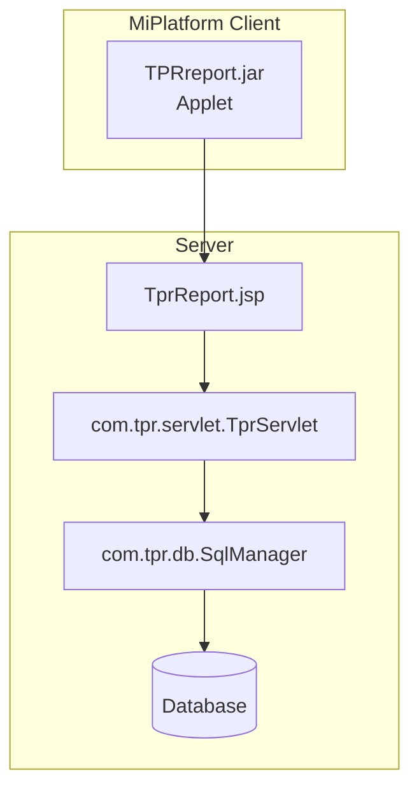

# TPR Report

> 최종 수정: 2026-03-07

---

## 1. 개요

TPR Report는 NPH 시스템에서 EMR(전자의무기록) 뷰어와 연동하여 리포트를 생성하는 솔루션이다.

---

## 2. 구성 요소

### 2.1 JAR 파일

| 파일 | 경로 | 비고 |
|------|------|------|
| **TPRreport.jar** | `webapp/EMR_DATA/applet/` | Applet용 리포트 엔진 |

### 2.2 Java 패키지 구조

```
com/tpr/
├── db/           # 데이터베이스 연결
│   └── SqlManager.java
├── servlet/      # 서블릿 처리
│   └── TprServlet.java
└── util/         # 유틸리티
    └── Config.java
```

### 2.3 JSP 파일

| 파일 | 경로 | 용도 |
|------|------|------|
| **TprReport.jsp** | `webapp/eView/` | 리포트 생성 JSP |

---

## 3. 연동 구조

### 3.1 아키텍처



### 3.2 주요 클래스

| 클래스 | 패키지 | 설명 |
|--------|--------|------|
| `TprServlet` | com.tpr.servlet | 리포트 요청 처리 서블릿 |
| `SqlManager` | com.tpr.db | SQL 실행 및 결과 관리 |
| `Config` | com.tpr.util | 설정 관리 |
| `BkmakeTPRreport` | makeTPRreport | TPR 리포트 생성 유틸리티 |

---

## 4. 주요 기능

### 4.1 리포트 생성

```java
// BkmakeTPRreport.java 구조
public class BkmakeTPRreport {
    public static String xmlResult = "";
    public static String serverIp = "10.60.210.27";

    public static String base64Encode(String str) throws IOException {
        sun.misc.BASE64Encoder encoder = new sun.misc.BASE64Encoder();
        byte[] b1 = str.getBytes("utf-8");
        return encoder.encode(b1);
    }
}
```

### 4.2 데이터 변환

- **Base64 인코딩**: 리포트 데이터 전송용
- **XML 결과**: `xmlResult` 변수에 저장
- **DB 연결**: SqlManager를 통한 데이터 조회

---

## 5. iText XML Worker 연동

### 5.1 관련 JAR

| 파일 | 버전 | 용도 |
|------|------|------|
| **xmlworker-1.2.0.jar** | 1.2.0 | HTML to PDF 변환 |

### 5.2 위치

```
webapp/EMR_DATA/applet/xmlworker-1.2.0.jar
```

### 5.3 용도

TPR Report에서 HTML 형식의 데이터를 PDF로 변환할 때 iText XML Worker를 사용한다.

---

## 6. Rexpert와의 관계

| 구분 | Rexpert | TPR Report |
|------|---------|------------|
| **용도** | 일반 리포트 출력 | EMR 뷰어 리포트 |
| **위치** | 서버 사이드 | Applet 기반 |
| **출력 형식** | OOF → 리포트 | XML → PDF |
| **사용 업무** | 처방전, 접수증 등 | EMR 문서 뷰어 |

**결론**: Rexpert와 TPR Report는 **독립적인 리포트 솔루션**으로, 서로 다른 용도로 사용된다.

---

## 7. 사용 화면

- **eView**: EMR 문서 뷰어
- **EMR_DATA**: EMR 데이터 처리

---

## 8. 기술 스택 요약

| 기술 | 버전 | 상태 |
|------|------|------|
| **TPRreport.jar** | - | Applet 리포트 |
| **xmlworker** | 1.2.0 | HTML to PDF |
| **Base64** | - | 데이터 인코딩 |

---

## 9. 관련 문서

- [A.Solutions-개요.md](./A.Solutions-개요.md)
- [B.Rexpert-리포트엔진.md](./B.Rexpert-리포트엔진.md)