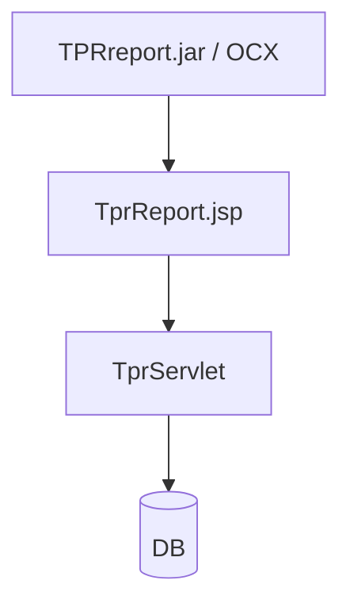

# TPR Report

> 최종 수정: 2026-03-08

---

## 1. 개요

TPR(Total Patient Record)은 현재 NPH에서 **의료 리포트/차트 출력 계열**로 확인되는 스택이다. 이 문서는 제품 일반론보다 `TprServlet`, `TprReport.jsp`, `TPRReportBohum_2.jsp`, `sql.xml`, `sqlParameter.xml`, `TPRsetup.XML`, `TPRreport.jar` 등 현재 코드베이스에서 직접 확인된 구성요소를 중심으로 읽어야 한다.

| 항목 | 내용 |
|------|------|
| **공급사 흔적** | BK/BKSNP 명명 흔적 |
| **버전 흔적** | `TPRsetup.XML`의 `Version='76'` |
| **용도** | EMR 차트, 임상관찰기록, 활력징후 출력 |

---

## 2. 구성 요소

### 2.1 JAR 파일

| 파일 | 경로 | 비고 |
|------|------|------|
| **TPRreport.jar** | `webapp/EMR_DATA/applet/` | Applet용 리포트 엔진 |
| **TPRreport.jar** | `webapp/WEB-INF/lib/` | 서버용 라이브러리 |
| **xmlworker-1.2.0.jar** | `webapp/EMR_DATA/applet/` | 인접 PDF 변환 스택 |

### 2.2 ActiveX/OCX 컴포넌트

```
webapp/EMR_DATA/applet/
├── TPR.cab
├── TPR.dll
├── TPR.ocx / TPR_.ocx
├── TPR_COMMON.dll
├── TPR_GRAPH_CONTROL.dll
├── TPR_IO_CONTROL.dll
├── TPR_ITEM_SET_MAIN.dll
├── TPR_USERCONTROL.dll
├── TRP_TRP_CONTROL.dll
├── TprExecuter.ocx
├── TprProject.exe
├── TPRsetup.exe
└── TPRsetup.msi
```

### 2.3 Java 패키지 구조

```
com/tpr/
├── db/
│   ├── DbManager.java
│   └── SqlManager.java
├── servlet/
│   ├── TprServlet.java
│   └── TprServletMethod.java
└── util/
    ├── Config.java
    ├── XMLConfiguration.java
    └── ConfigurationException.java

makeTPRreport/
└── BkmakeTPRreport.java
```

### 2.4 현재 확인된 사실

- `web.xml`에 `com.tpr.servlet.TprServlet` 과 `/TprServlet` 매핑이 존재한다.
- `EMR_DATA/TprReport.jsp`, `EMR_DATA/TPRReportBohum_2.jsp`, `eView/TprReport.jsp`가 존재한다.
- `WEB-INF/sql.xml`, `WEB-INF/sqlParameter.xml`에 `TPR0000R*` 계열 정의가 존재한다.
- `WEB-INF/classes/com/tpr/servlet/TprServlet.class`, `makeTPRreport/BkmakeTPRreport.class`가 존재한다.
- 따라서 TPR은 현재 NPH에서 별도 Servlet/JSP/SQL/class 파일군을 가진 독립 출력 스택으로 보는 것이 가장 안전하다.

---

## 3. 설정 파일

### 3.1 web.xml Servlet 설정

```xml
<servlet>
    <servlet-name>TprServlet</servlet-name>
    <servlet-class>com.tpr.servlet.TprServlet</servlet-class>
    <load-on-startup>0</load-on-startup>
</servlet>
<servlet-mapping>
    <servlet-name>TprServlet</servlet-name>
    <url-pattern>/TprServlet</url-pattern>
</servlet-mapping>
```

### 3.2 SQL 설정

| 파일 | 위치 | 용도 |
|------|------|------|
| `sql.xml` | `/WEB-INF/` | TPR SQL 쿼리 정의 (`TPR0000R01` 등) |
| `sqlParameter.xml` | `/WEB-INF/` | TPR SQL 파라미터 정의 |
| `TPRsetup.XML` | `/EMR_DATA/applet/` | TPR 설치 설정 (Version 76 흔적) |

---

## 4. 주요 클래스/함수

### 4.1 TprServlet

| 메서드 | 설명 |
|--------|------|
| `doGet()`/`doPost()` | HTTP 요청 처리 |
| `GetFilePath()` | TPR 기본 경로 조회 (`emr.tpr.base.dir`) |
| `GetXMLConfiguration()` | SQL 설정 로드 |
| `replaceStr()` | 특수문자 변환 |

### 4.2 BkmakeTPRreport

```java
public class BkmakeTPRreport {
    public static String xmlResult = "";
    public static String serverIp = "10.60.210.27";

    public static String MakeTprReport(...) {
        // IP, 환자ID, 기간, 사용자ID 파라미터 처리
    }

    public static String base64Encode(String str);
    public static String base64Decode(String str);
}
```

---

## 5. 사용 화면

| 영역 | 예시 |
|------|------|
| **MR** | `MR_COM99002M.xml ~ MR_COM99118P.xml`, `MR_RCH01013M.xml ~ MR_RCH90012M.xml` |
| **MD** | `MD_ORD01000M.xml ~ MD_ORD01401P.xml`, `MD_HEA01010M.xml` |
| **ER** | `ER_INS07005M.xml ~ ER_INS07018M.xml`, `ER_RES02001M.xml ~ ER_RES06010M.xml` |
| **HP** | `HP_DMS02202M.xml ~ HP_DMS99904P.xml` |

---

## 6. Rexpert와의 관계

| 항목 | TPR | Rexpert |
|------|-----|---------|
| **공급사 흔적** | BK/BKSNP 계열 명명 | 렉스퍼트 계열 흔적 |
| **버전 흔적** | 76 | 3.x 계열 |
| **용도** | EMR 차트/임상기록 | 일반 리포트 |
| **파일 형식** | TPR 전용 포맷/설정 파일군 | `.reb` |
| **뷰어** | TPR ActiveX/OCX | Rexpert Viewer ActiveX |
| **사용 위치** | 의료 문서/차트 출력 계열 | 통계/일반 보고서 계열 |

결론: TPR과 Rexpert는 병행 존재하지만, 현재 확인되는 파일군과 사용 맥락은 다르다.

---

## 7. iText XML Worker 연동

### 7.1 JAR 파일

| 파일 | 버전 | 용도 |
|------|------|------|
| **xmlworker-1.2.0.jar** | 1.2.0 | 인접 PDF 변환 스택 |

### 7.2 emrtopdf.jsp

```java
<%@ page import = "com.itextpdf.text.Document"%>
<%@ page import = "com.itextpdf.text.pdf.PdfWriter"%>
<%@ page import = "com.itextpdf.tool.xml.XMLWorkerHelper"%>

Document document = new Document();
PdfWriter writer = PdfWriter.getInstance(document, outputStream);
document.open();
XMLWorkerHelper.getInstance().parseXHtml(writer, document, htmlInputStream);
document.close();
```

현재 기준에서 iText 직접 근거는 `emrtopdf.jsp` 쪽이 더 강하다. TPR JSP 내부에서 iText를 직접 쓰는 근거는 아직 확인하지 못했다.

---

## 8. 아키텍처



---

## 9. 기술 스택 요약

| 기술 | 버전 | 상태 |
|------|------|------|
| **TPRreport.jar** | - | 의료 리포트/차트 출력 엔진 |
| **TPR ActiveX/OCX** | Version 76 흔적 | 클라이언트 뷰어/실행기 계열 |
| **xmlworker** | 1.2.0 | 인접 PDF 변환 스택 (직접 근거는 `emrtopdf.jsp`) |
| **Base64** | - | 데이터 인코딩 |

---

## 10. 관련 문서

- [README.md](./README.md)
- [B.Rexpert-리포트엔진.md](./B.Rexpert-리포트엔진.md)
- [F.iText-PDF.md](./F.iText-PDF.md)
