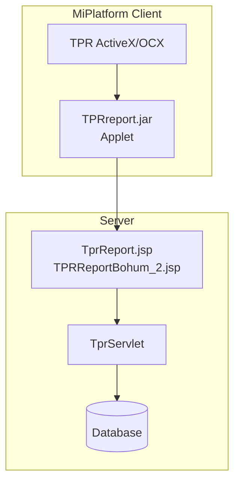

# TPR Report

> 최종 수정: 2026-03-08

---

## 1. 개요

TPR(Total Patient Record)은 한국형 EMR(전자의무기록) 리포트 엔진으로, 환자 의무기록을 시각화하여 출력하는 시스템이다.

| 항목 | 내용 |
|------|------|
| **공급사** | (주)비케이솔루션 (BK Solution) |
| **버전** | Version 76 |
| **용도** | EMR 차트, 임상관찰기록, 활력징후 출력 |

---

## 2. 구성 요소

### 2.1 JAR 파일

| 파일 | 경로 | 비고 |
|------|------|------|
| **TPRreport.jar** | `webapp/EMR_DATA/applet/` | Applet용 리포트 엔진 |
| **TPRreport.jar** | `webapp/WEB-INF/lib/` | 서버용 라이브러리 |
| **xmlworker-1.2.0.jar** | `webapp/EMR_DATA/applet/` | XML 처리 지원 |

### 2.2 ActiveX/OCX 컴포넌트

```
webapp/EMR_DATA/applet/
├── TPR.cab                    # ActiveX 캐비닛
├── TPR.dll                    # DLL
├── TPR.ocx / TPR_.ocx        # OCX 컨트롤
├── TPR_COMMON.dll            # 공통 모듈
├── TPR_GRAPH_CONTROL.dll     # 그래프 컨트롤
├── TPR_IO_CONTROL.dll        # 입출력 컨트롤
├── TPR_ITEM_SET_MAIN.dll     # 아이템 세트
├── TPR_USERCONTROL.dll       # 사용자 컨트롤
├── TRP_TRP_CONTROL.dll       # TRP 컨트롤
├── TprExecuter.ocx           # 실행기
├── TprProject.exe            # 프로젝트 실행파일
├── TPRsetup.exe              # 설치 파일
└── TPRsetup.msi              # MSI 설치 파일
```

### 2.3 Java 패키지 구조

```
com/tpr/
├── db/
│   ├── DbManager.java         # DB 연결 관리
│   └── SqlManager.java        # SQL 실행 및 XML 변환
├── servlet/
│   ├── TprServlet.java        # HTTP 요청 처리
│   └── TprServletMethod.java  # Servlet 메서드 확장
└── util/
    ├── Config.java            # 설정 인터페이스
    ├── XMLConfiguration.java  # XML 설정 처리
    └── ConfigurationException.java

makeTPRreport/
└── BkmakeTPRreport.java       # TPR 리포트 생성 유틸리티
```

---

## 3. 설정 파일

### 3.1 web.xml Servlet 설정

```xml
<servlet>
    <servlet-name>TprServlet</servlet-name>
    <servlet-class>com.tpr.servlet.TprServlet</servlet-class>
    <load-on-startup>0</load-on-startup>
</servlet>
<servlet-mapping>
    <servlet-name>TprServlet</servlet-name>
    <url-pattern>/TprServlet</url-pattern>
</servlet-mapping>
```

### 3.2 SQL 설정

| 파일 | 위치 | 용도 |
|------|------|------|
| `sql.xml` | `/WEB-INF/` | TPR SQL 쿼리 정의 (TPR0000R01 등) |
| `sqlParameter.xml` | `/WEB-INF/` | TPR SQL 파라미터 정의 |
| `TPRsetup.XML` | `/EMR_DATA/applet/` | TPR 설치 설정 (버전 76) |

---

## 4. 주요 클래스/함수

### 4.1 TprServlet.java

| 메서드 | 설명 |
|--------|------|
| `doGet()`/`doPost()` | HTTP 요청 처리 |
| `GetFilePath()` | TPR 기본 경로 조회 (`emr.tpr.base.dir`) |
| `GetXMLConfiguration()` | SQL 설정 로드 |
| `replaceStr()` | 특수문자 변환 |

### 4.2 BkmakeTPRreport.java

```java
public class BkmakeTPRreport {
    public static String xmlResult = "";
    public static String serverIp = "10.60.210.27";

    // TPR 리포트 생성
    public static String MakeTprReport(...) {
        // IP, 환자ID, 기간, 사용자ID 파라미터 처리
    }

    // Base64 인코딩/디코딩
    public static String base64Encode(String str);
    public static String base64Decode(String str);
}
```

---

## 5. 사용 화면

### 5.1 MR (원무/의무기록) 영역

| 화면 | 용도 |
|------|------|
| MR_COM99002M.xml ~ MR_COM99118P.xml | 공통 기능 |
| MR_RCH01013M.xml ~ MR_RCH90012M.xml | 간호기록 |

### 5.2 MD (진료) 영역

| 화면 | 용도 |
|------|------|
| MD_ORD01000M.xml ~ MD_ORD01401P.xml | 처방 관련 |
| MD_HEA01010M.xml | 건강검진 |

### 5.3 ER (응급) 영역

| 화면 | 용도 |
|------|------|
| ER_INS07005M.xml ~ ER_INS07018M.xml | 응급 보험 |
| ER_RES02001M.xml ~ ER_RES06010M.xml | 응급 예약 |

### 5.4 HP (병원) 영역

| 화면 | 용도 |
|------|------|
| HP_DMS02202M.xml ~ HP_DMS99904P.xml | DMS 관련 |

---

## 6. Rexpert와의 관계

| 항목 | TPR | Rexpert |
|------|-----|---------|
| **공급사** | BK Solution | 렉스퍼트 |
| **버전** | 76 | 3.0 |
| **용도** | EMR 차트/임상기록 | 일반 리포트 |
| **파일 형식** | TPR 전용 포맷 | .reb (Rexpert Binary) |
| **뷰어** | TPR ActiveX/OCX | Rexpert30Viewer ActiveX |
| **주요 사용처** | 간호기록, 활력징후 | 처방전, 진료기록 |

**결론**: TPR과 Rexpert는 **목적에 따라 병행 사용** - 서로 다른 목적으로 독립 운영

---

## 7. iText XML Worker 연동

### 7.1 JAR 파일

| 파일 | 버전 | 용도 |
|------|------|------|
| **xmlworker-1.2.0.jar** | 1.2.0 | HTML to PDF 변환 (iText 5.x) |

### 7.2 emrtopdf.jsp

```java
<%@ page import = "com.itextpdf.text.Document"%>
<%@ page import = "com.itextpdf.text.pdf.PdfWriter"%>
<%@ page import = "com.itextpdf.tool.xml.XMLWorkerHelper"%>

Document document = new Document();
PdfWriter writer = PdfWriter.getInstance(document, outputStream);
document.open();
XMLWorkerHelper.getInstance().parseXHtml(writer, document, htmlInputStream);
document.close();
```

---

## 8. 아키텍처



---

## 9. 기술 스택 요약

| 기술 | 버전 | 상태 |
|------|------|------|
| **TPRreport.jar** | - | EMR 리포트 엔진 |
| **TPR ActiveX/OCX** | Version 76 | 클라이언트 뷰어 |
| **xmlworker** | 1.2.0 | HTML to PDF (iText 5.x) |
| **Base64** | - | 데이터 인코딩 |

---

## 10. 관련 문서

- [A.Solutions-개요.md](./A.Solutions-개요.md)
- [B.Rexpert-리포트엔진.md](./B.Rexpert-리포트엔진.md)
- [F.iText-PDF.md](./F.iText-PDF.md)