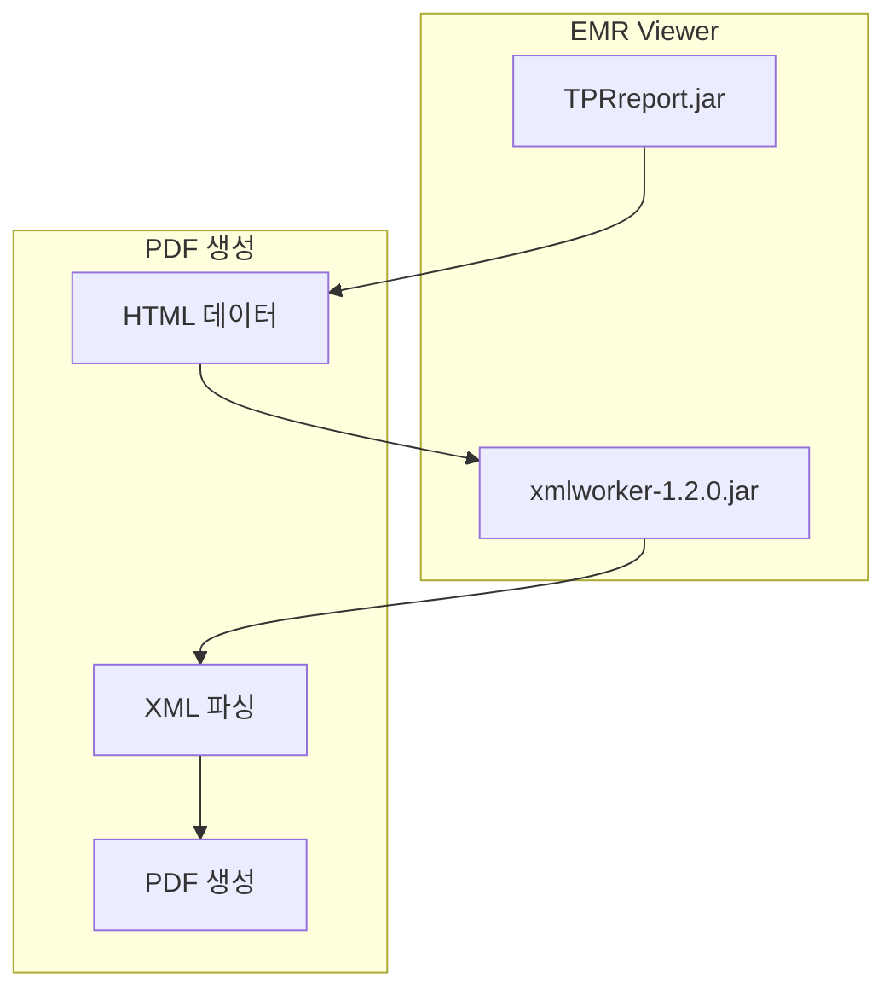

# iText XML Worker (PDF 처리)

> 최종 수정: 2026-03-07

---

## 1. 개요

NPH 시스템은 iText XML Worker를 사용하여 HTML을 PDF로 변환한다. 주로 EMR 뷰어와 TPR Report에서 사용된다.

---

## 2. JAR 파일

### 2.1 라이브러리 목록

| 라이브러리 | 파일명 | 버전 | 위치 |
|-----------|--------|------|------|
| **XML Worker** | xmlworker-1.2.0.jar | 1.2.0 | `webapp/EMR_DATA/applet/` |

### 2.2 iText 코어

iText 코어 라이브러리(itextpdf.jar)는 별도로 확인되지 않았으나, XML Worker는 iText 5.x에 포함된다.

```
xmlworker-1.2.0.jar  →  iText 5.x 기반
```

---

## 3. 기술 스택

### 3.1 iText 버전별 특징

| 버전 | 패키지 | 특징 |
|------|--------|------|
| **iText 2.x** | com.lowagie.* | 구버전 (AGPL) |
| **iText 5.x** | com.itextpdf.* | XML Worker 포함 |

### 3.2 XML Worker 기능


---

## 4. 사용 위치

### 4.1 Applet 연동

```
webapp/EMR_DATA/applet/
├── TPRreport.jar          # 리포트 엔진
├── xmlworker-1.2.0.jar   # HTML to PDF
├── painter.jar           # 화면 캡처
├── signedpainter.jar     # 서명용
└── SignPad.jar           # 사인패드
```

### 4.2 용도

| 용도 | 설명 |
|------|------|
| **EMR 문서 PDF** | EMR 뷰어에서 문서를 PDF로 변환 |
| **리포트 PDF** | TPR Report 결과물 PDF 변환 |
| **HTML 변환** | HTML 포맷 데이터를 PDF로 변환 |

---

## 5. 연동 구조

### 5.1 TPR Report와의 관계



### 5.2 주요 기능

| 기능 | 설명 |
|------|------|
| **HTML 파싱** | HTML 태그를 PDF 요소로 변환 |
| **스타일 적용** | CSS 스타일 PDF 반영 |
| **이미지 처리** | HTML 내 이미지 PDF 포함 |
| **한글 지원** | UTF-8 인코딩 처리 |

---

## 6. Java 연동

### 6.1 Import 문

```java
// iText 5.x (XML Worker 사용 시)
import com.itextpdf.text.Document;
import com.itextpdf.text.pdf.PdfWriter;
import com.itextpdf.tool.xml.XMLWorkerHelper;

// iText 2.x (구버전)
import com.lowagie.text.Document;
import com.lowagie.text.pdf.PdfWriter;
```

### 6.2 사용 예시

```java
// HTML to PDF 변환 (개념적)
Document document = new Document();
PdfWriter writer = PdfWriter.getInstance(document, outputStream);
document.open();
XMLWorkerHelper.getInstance().parseXHtml(writer, document, htmlInputStream);
document.close();
```

---

## 7. NPH 사용 패턴

### 7.1 Base64 인코딩

```java
// TPR Report에서 사용하는 Base64 인코딩
public static String base64Encode(String str) throws IOException {
    sun.misc.BASE64Encoder encoder = new sun.misc.BASE64Encoder();
    byte[] b1 = str.getBytes("utf-8");
    return encoder.encode(b1);
}
```

### 7.2 데이터 흐름

```
DB 데이터 → XML 변환 → HTML 생성 → XML Worker → PDF
```

---

## 8. Applet 구성

### 8.1 EMR_DATA/applet 파일

| 파일 | 용도 |
|------|------|
| **TPRreport.jar** | 리포트 엔진 |
| **xmlworker-1.2.0.jar** | HTML to PDF |
| **painter.jar** | 화면 캡처 |
| **signedpainter.jar** | 서명 캡처 |
| **SignPad.jar** | 사인패드 입력 |
| **ChartController.jar** | 차트 컨트롤 |
| **PedigreeChart.jar** | 가계도 차트 |

---

## 9. 요약

| 구분 | 내용 |
|------|------|
| **라이브러리** | iText XML Worker 1.2.0 |
| **버전** | iText 5.x 기반 |
| **위치** | Applet 디렉토리 |
| **용도** | HTML to PDF 변환 |
| **연동** | TPR Report, EMR Viewer |

---

## 10. 관련 문서

- [A.Solutions-개요.md](./A.Solutions-개요.md)
- [D.TPR-Report.md](./D.TPR-Report.md)
- [B.Rexpert-리포트엔진.md](./B.Rexpert-리포트엔진.md)