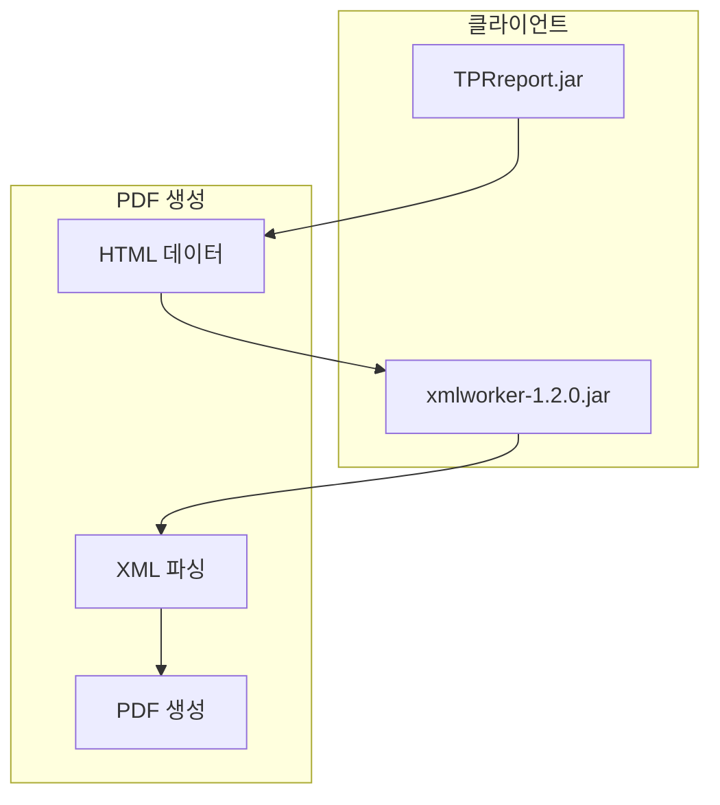

# iText XML Worker (PDF 처리)

> 최종 수정: 2026-03-08

---

## 1. 개요

NPH 시스템은 iText XML Worker를 사용하여 HTML을 PDF로 변환한다. 주로 EMR 뷰어와 TPR Report에서 사용된다.

---

## 2. JAR 파일

### 2.1 라이브러리 목록

| 라이브러리 | 파일명 | 버전 | 위치 |
|-----------|--------|------|------|
| **XML Worker** | xmlworker-1.2.0.jar | 1.2.0 | `webapp/EMR_DATA/applet/` |

### 2.2 버전 호환

| XML Worker | iText 버전 |
|------------|------------|
| 1.2.0 | iText 5.0.0 ~ 5.2.0 |

**참고**: iText 코어 라이브러리(`itextpdf-5.x.x.jar`)는 WEB-INF/lib에 별도로 존재하지 않으나, xmlworker-1.2.0은 iText 5.x에 포함된다.

---

## 3. Import 문

### 3.1 emrtopdf.jsp

```java
<%@ page import = "com.itextpdf.text.Document"%>
<%@ page import = "com.itextpdf.text.DocumentException"%>
<%@ page import = "com.itextpdf.text.pdf.PdfWriter"%>
<%@ page import = "com.itextpdf.tool.xml.XMLWorkerHelper"%>
```

### 3.2 버전별 패키지

| 버전 | 패키지 | 비고 |
|------|--------|------|
| **iText 2.x** | com.lowagie.* | 구버전 (AGPL) |
| **iText 5.x** | com.itextpdf.* | XML Worker 포함 |

---

## 4. 사용 위치

### 4.1 Applet 연동

```
webapp/EMR_DATA/applet/
├── TPRreport.jar          # 리포트 엔진
├── xmlworker-1.2.0.jar   # HTML to PDF
├── painter.jar           # 화면 캡처
├── signedpainter.jar     # 서명 캡처
├── SignPad.jar           # 사인패드 입력
├── ChartController.jar   # 차트 컨트롤
├── PedigreeChart.jar     # 가계도 차트
├── QuickPDFDLL0816.dll   # QuickPDF 라이브러리
├── novapdf-full.exe      # novaPDF PDF 프린터
└── EDViewer_Ocx.ocx      # EMR 문서 뷰어 ActiveX
```

### 4.2 PDF 관련 JSP

| 파일 | 위치 | 용도 |
|------|------|------|
| **emrtopdf.jsp** | `webapp/eView/` | EMR 문서 PDF 변환 |
| **TprReport.jsp** | `webapp/eView/` | TPR 리포트 생성 |
| **TPRReportBohum_2.jsp** | `webapp/EMR_DATA/` | TPR 보고서 HTML 생성 |

---

## 5. 기술 스택

### 5.1 PDF 처리 방식



### 5.2 주요 기능

| 기능 | 설명 |
|------|------|
| **HTML 파싱** | HTML 태그를 PDF 요소로 변환 |
| **스타일 적용** | CSS 스타일 PDF 반영 |
| **이미지 처리** | HTML 내 이미지 PDF 포함 |
| **한글 지원** | UTF-8 인코딩 처리 |

---

## 6. 코드 예시

### 6.1 HTML to PDF 변환

```java
// emrtopdf.jsp 예시
Document document = new Document();
PdfWriter writer = PdfWriter.getInstance(document, outputStream);
document.open();
XMLWorkerHelper.getInstance().parseXHtml(writer, document, htmlInputStream);
document.close();
```

### 6.2 TPR Report Base64 인코딩

```java
// BkmakeTPRreport.java
public static String base64Encode(String str) throws IOException {
    sun.misc.BASE64Encoder encoder = new sun.misc.BASE64Encoder();
    byte[] b1 = str.getBytes("utf-8");
    return encoder.encode(b1);
}
```

---

## 7. 연동 구조

### 7.1 TPR Report와의 관계

| 단계 | 설명 |
|------|------|
| 1. DB 데이터 조회 | SqlManager를 통한 데이터 조회 |
| 2. XML 변환 | 데이터를 XML 형식으로 변환 |
| 3. HTML 생성 | XML을 HTML로 변환 |
| 4. PDF 변환 | XML Worker로 HTML → PDF |
| 5. Base64 인코딩 | PDF 데이터 인코딩 |

### 7.2 데이터 흐름

```
DB 데이터 → XML 변환 → HTML 생성 → XML Worker → PDF → Base64
```

---

## 8. PDF 관련 컴포넌트

### 8.1 ActiveX/OCX

| 파일 | 용도 |
|------|------|
| **EDViewer_Ocx.ocx** | EMR 문서 뷰어 |
| **QuickPDFDLL0816.dll** | QuickPDF 라이브러리 |
| **novapdf-full.exe** | novaPDF PDF 프린터 설치 파일 |

### 8.2 JavaScript

| 파일 | 용도 |
|------|------|
| **BK_PDF_COMMMON.js** | PDF 관련 공통 JavaScript |

---

## 9. 주요 업무

| 업무 | 용도 |
|------|------|
| **EMR 문서 PDF** | EMR 뷰어에서 문서를 PDF로 변환 |
| **리포트 PDF** | TPR Report 결과물 PDF 변환 |
| **HTML 변환** | HTML 포맷 데이터를 PDF로 변환 |

---

## 10. 요약

| 구분 | 내용 |
|------|------|
| **라이브러리** | iText XML Worker 1.2.0 |
| **버전** | iText 5.0.0 ~ 5.2.0 호환 |
| **위치** | Applet 디렉토리 |
| **용도** | HTML to PDF 변환 |
| **연동** | TPR Report, EMR Viewer |
| **주요 파일** | emrtopdf.jsp |

---

## 11. 관련 문서

- [README.md](./README.md)
- [D.TPR-Report.md](./D.TPR-Report.md)
- [B.Rexpert-리포트엔진.md](./B.Rexpert-리포트엔진.md)
