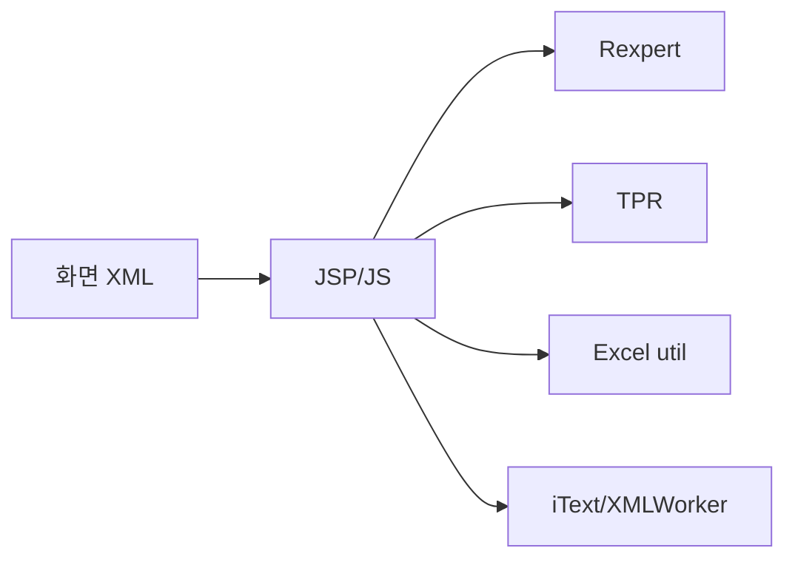

# Solutions 개요

> 최종 수정: 2026-03-08

---

## 1A. 상위 연결

- 이 폴더의 기준 설명은 [../README.md](../README.md) 를 먼저 본다.
- DevOn 코어는 [../../032.framework-core/0321.overview/A.Framework-개요.md](../../032.framework-core/0321.overview/A.Framework-개요.md) 와 같이 본다.
- 의료업무 맥락은 [../../035.Biz-medical-Domain](../../035.Biz-medical-Domain) 으로 이어진다.
- 실제 사례는 [../../037.runtime-trace/트레이스-읽는순서.md](../../037.runtime-trace/트레이스-읽는순서.md) 를 본다.

이 문서는 DevOn 바깥에서 동작하는 공통 솔루션과 플랫폼 공통 패키지를 정리하는 기준본이다.

---

## 2. 분석 현황

| 솔루션 | 상태 | 문서 |
|--------|------|------|
| **Rexpert** | ✅ 분석 완료 | [B.Rexpert-리포트엔진.md](./B.Rexpert-리포트엔진.md) |
| **Quartz** | ✅ 분석 완료 | [C.Quartz-스케줄러.md](./C.Quartz-스케줄러.md) |
| **TPR Report** | ✅ 분석 완료 | [D.TPR-Report.md](./D.TPR-Report.md) |
| **Excel 라이브러리** | ✅ 분석 완료 | [E.Excel-라이브러리.md](./E.Excel-라이브러리.md) |
| **iText XML Worker** | ✅ 분석 완료 | [F.iText-PDF.md](./F.iText-PDF.md) |

---

## 3. 기술 스택 요약

### 3.1 리포트 엔진

| 기술 | 버전 | 공급사 | 비고 |
|------|------|--------|------|
| **Rexpert** | 3.x 계열 | - | `rexservice.jsp`, `rexpert.js`, `cf_PreviewReport()` 기준 사용 확인 |
| **Rexpert Viewer** | 1.0.0.57 | - | ActiveX/Plugin 계열 흔적 |
| **TPR Report** | Version 76 흔적 | - | `TprServlet`, `TprReport.jsp`, `sql.xml`, `TPRsetup.XML` 기준 확인 |

### 3.2 리포트 파일 형식

| 형식 | 설명 |
|------|------|
| `.reb` | Rexpert 리포트 템플릿 (REX3 바이너리) |
| `.oof` | OOF (Object Oriented Format) 데이터 |

### 3.3 스케줄러

| 기술 | 버전 | 비고 |
|------|------|------|
| **Quartz** | 1.6.1 | JAR 포함, 현재 코드베이스에서 `org.quartz` 직접 사용 미확인 |
| **DevOn Batch** | 1.1.0 | 실제 배치 실행 코어, 상세는 `032.framework-core/0323.batch-rule` 참조 |

### 3.4 Excel/PDF 처리

| 기술 | 버전 | 비고 |
|------|------|------|
| **Apache POI** | 3.2 (2008) | 외부 Excel 라이브러리, DevOn Excel API 문서와 함께 존재 |
| **JExcelApi** | - | 외부 Excel 라이브러리, DevOn Excel API 문서와 함께 존재 |
| **iText XML Worker** | 1.2.0 | `emrtopdf.jsp` 기준 HTML to PDF 변환 확인 |

---

## 4. 아키텍처 위치



---

## 5. 솔루션 사용 현황

### 5.1 Rexpert

- `rexservice.jsp`, `rexpert.js`, `rexpert_properties.js`가 존재한다.
- 다수 화면 XML에서 `cf_PreviewReport()`, `cf_ViewReport()`, `cf_printReport()` 호출이 확인된다.
- 따라서 Rexpert는 NPH에서 현재도 강하게 확인되는 보고서 출력 스택이다.

### 5.2 Quartz / DevOn Batch

- `quartz-1.6.1.jar`는 포함되어 있다.
- 현재 코드베이스에서는 `org.quartz`, `SchedulerFactory`, `JobDetail`, `Trigger` 직접 사용을 확인하지 못했다.
- 실제 운영 표면은 `BatchExecutor.cmd`, `batchMgr`, `devon-batch-scheduler.xml`, `BatchInfoUC` 쪽이 더 강하다.

### 5.3 Excel / PDF

- `poi-3.2-FINAL-20081019.jar`, `jxl.jar`, `xmlworker-1.2.0.jar`은 포함되어 있다.
- Excel은 현재 `utilLib.js`와 MiPlatform Grid 메서드 기반의 화면 기능이 더 강하게 확인된다.
- PDF는 `eView/emrtopdf.jsp`의 `com.itextpdf.*`, `XMLWorkerHelper` import가 직접 근거다.

---

## 6. 파일 구조

```
0333.Solutions/
├── README.md
├── B.Rexpert-리포트엔진.md
├── C.Quartz-스케줄러.md
├── D.TPR-Report.md
├── E.Excel-라이브러리.md
└── F.iText-PDF.md
```

---

## 7. 분류 기준

- DevOn 자체 실행 구조가 아닌 외부 솔루션/패키지 설명은 여기서 관리한다.
- 단, 배치/룰의 DevOn 실행 구조 설명은 `032.framework-core`에 둔다.
- 의료 특화 솔루션의 기준본은 `035.Biz-medical-Domain`에 둔다.

---

## 8. 다음 단계

1. Rexpert 제품 일반론과 NPH 실증 구간 분리 유지
2. TPR의 업무 위치는 `035.Biz-medical-Domain`과 연결 보강
3. Excel/iText의 서버측 직접 사용 경로 추가 확인

---

## 9. 관련 문서

- [B.Rexpert-리포트엔진.md](./B.Rexpert-리포트엔진.md)
- [Tech-Stack-개요.md](../../030.index/0307.Tech%20Stack/Tech-Stack-개요.md)
