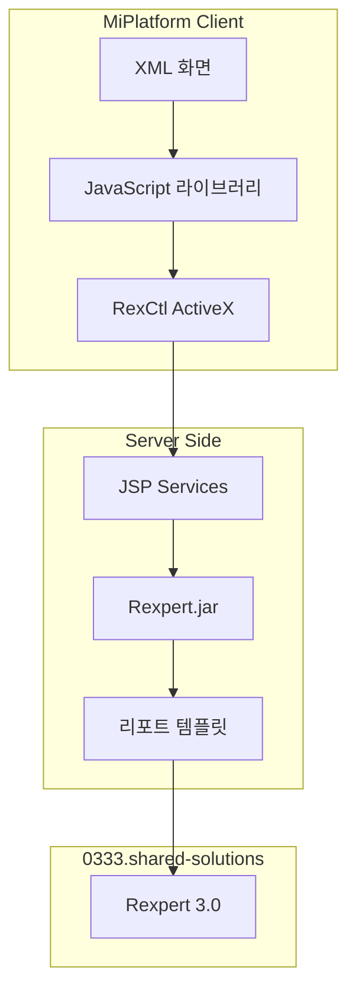

# shared-solutions 개요

> 최종 수정: 2026-03-07

---

## 1. 목적

이 문서는 DevOn 바깥에서 동작하는 공통 솔루션과 플랫폼 공통 패키지를 정리하는 기준본이다.

---

## 2. 분석 현황

| 솔루션 | 상태 | 문서 |
|--------|------|------|
| **Rexpert** | ✅ 분석 완료 | [B.Rexpert-리포트엔진.md](./B.Rexpert-리포트엔진.md) |
| **Quartz** | 🔲 미분석 | - |
| **TPR Report** | 🔲 미분석 | - |
| **Apache POI** | 🔲 미분석 | - |
| **JExcelApi** | 🔲 미분석 | - |
| **iText XML Worker** | 🔲 미분석 | - |

---

## 3. 기술 스택 요약

### 3.1 리포트 엔진

| 기술 | 버전 | 공급사 | 비고 |
|------|------|--------|------|
| **Rexpert** | 3.0 | (주)렉스퍼트 | 한국형 리포트 엔진 ✅ |
| **Rexpert Viewer** | 1.0.0.57 | (주)렉스퍼트 | ActiveX/Plugin |

### 3.2 리포트 파일 형식

| 형식 | 설명 |
|------|------|
| `.reb` | Rexpert 리포트 템플릿 (REX3 바이너리) |
| `.oof` | OOF (Object Oriented Format) 데이터 |

---

## 4. 아키텍처 위치



---

## 5. Rexpert 사용 현황

### 5.1 사용 패턴

```
화면 이벤트 → JavaScript 호출 → Dataset 변환 → OOF 생성 → ActiveX 렌더링
```

### 5.2 주요 함수

| 함수 | 설명 |
|------|------|
| `cf_ViewReport()` | 리포트 미리보기 팝업 |
| `cf_printReport()` | 바로출력 |
| `cf_PreviewReport()` | 화면 내장 뷰어 |
| `cf_DataSettoXML()` | Dataset → XML 변환 |

### 5.3 사용 화면

- MD/ORD - 처방전, 처방 내역
- MD/HEA - 건강검진 리포트
- MR/RCH - 접수증 출력
- ER/CSR - 응급 환자 리포트
- SP/LAB - 검사 결과 리포트
- HP/PAT - 환자 라벨 출력

---

## 6. 파일 구조

```
0333.shared-solutions/
├── A.shared-solutions-개요.md
├── B.Rexpert-리포트엔진.md      # ✅ 분석 완료
└── (예정)
    ├── Quartz-스케줄러.md
    ├── TPR-Report.md
    ├── Apache-POI.md
    └── JExcelApi.md
```

---

## 7. 분류 기준

- DevOn 자체 실행 구조가 아닌 외부 솔루션/패키지 설명은 여기서 관리한다.
- 단, 배치/룰의 DevOn 실행 구조 설명은 `032.framework-core`에 둔다.
- 의료 특화 솔루션의 기준본은 `035.Biz-medical-Domain`에 둔다.

---

## 8. 다음 단계

1. Quartz 스케줄러 분석
2. TPR Report 분석
3. Apache POI / JExcelApi 분석
4. iText XML Worker 분석

---

## 9. 관련 문서

- [B.Rexpert-리포트엔진.md](./B.Rexpert-리포트엔진.md) - Rexpert 상세 분석
- [Tech-Stack-개요.md](../../030.index/0307.Tech%20Stack/Tech-Stack-개요.md)
