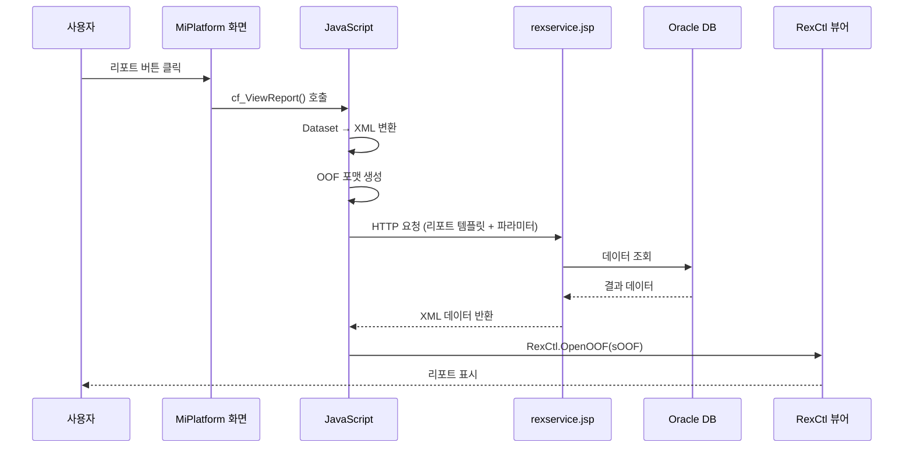

# Rexpert 리포트 엔진 분석

> 분석일: 2026-03-07
> 분석 대상: `/mnt/n/99.SourceCode Backup/NPH/AADEV_NPH/workspace`

---

## 1. 개요

NPH 시스템은 **Rexpert 3.0** 리포트 엔진을 사용하여 의료 문서, 처방전, 검사 결과, 영수증 등 다양한 리포트를 생성한다. Rexpert는 한국형 리포트 솔루션으로, ActiveX/Plugin 방식으로 클라이언트에서 리포트를 렌더링한다.

### 1.1 버전 정보

| 항목 | 버전 |
|------|------|
| Rexpert Server | 3.0 |
| Rexpert Viewer | 1.0.0.57 |
| Rexpert.jar | 151 KB |
| 리포트 템플릿 | REX3 바이너리 포맷 (.reb) |

### 1.2 핵심 파일

| 파일 | 경로 | 크기 | 설명 |
|------|------|------|------|
| Rexpert.jar | /WEB-INF/lib/Rexpert.jar | 151 KB | Java 라이브러리 |
| rexpert.js | /jsp/include/js/rexpert.js | - | JavaScript API |
| rexpert_properties.js | /jsp/include/js/rexpert_properties.js | - | 환경 설정 |
| expLib.js | /ui/LIBs/expLib.js | 88 KB | 공통 리포트 함수 |
| rexpreview.jsp | /jsp/report/rexpreview.jsp | 5 KB | 미리보기 페이지 |
| rexservice.jsp | /jsp/report/rexservice.jsp | 0.5 KB | 데이터 서버 |

---

## 2. 아키텍처

### 2.1 전체 구조

```
┌─────────────────────────────────────────────────────────────────┐
│                      MiPlatform Client                           │
│  ┌──────────────────────────────────────────────────────────┐   │
│  │  XML 화면 (.xml)                                          │   │
│  │  - 버튼/메뉴 이벤트 → 리포트 호출 함수                    │   │
│  └──────────────────────────────────────────────────────────┘   │
│                              ↓                                    │
│  ┌──────────────────────────────────────────────────────────┐   │
│  │  JavaScript 라이브러리 (expLib.js, rexpert.js)           │   │
│  │  - cf_ViewReport()   : 미리보기 팝업                     │   │
│  │  - cf_printReport()  : 바로출력                          │   │
│  │  - cf_PreviewReport(): 화면 내장 뷰어                    │   │
│  └──────────────────────────────────────────────────────────┘   │
│                              ↓                                    │
│  ┌──────────────────────────────────────────────────────────┐   │
│  │  Rexpert ActiveX/OCX 컨트롤 (RexCtl)                      │   │
│  │  - CLSID: FC035099-833E-4AB1-BF48-37D08F5E553C           │   │
│  └──────────────────────────────────────────────────────────┘   │
└─────────────────────────────────────────────────────────────────┘
                               ↓
┌─────────────────────────────────────────────────────────────────┐
│                      Server Side                                  │
│  ┌──────────────────────────────────────────────────────────┐   │
│  │  JSP Services                                             │   │
│  │  - rexpreview.jsp : 뷰어 페이지                          │   │
│  │  - rexservice.jsp  : 데이터 서버                         │   │
│  └──────────────────────────────────────────────────────────┘   │
│  ┌──────────────────────────────────────────────────────────┐   │
│  │  Rexpert.jar                                              │   │
│  │  - Rexpert.DataServer.Main.fnRun()                       │   │
│  └──────────────────────────────────────────────────────────┘   │
│  ┌──────────────────────────────────────────────────────────┐   │
│  │  Report Templates (.reb)                                 │   │
│  │  - /webapp/report/{업무영역}/                            │   │
│  │  - AZ, ER, HP, MD, MR, SP, pilot, sample                │   │
│  └──────────────────────────────────────────────────────────┘   │
└─────────────────────────────────────────────────────────────────┘
```

### 2.2 데이터 흐름



---

## 3. 리포트 호출 패턴

### 3.1 기본 호출 구조

```javascript
// 1. 리포트 파라미터 객체 생성
var oReport = GetfnParamSet();

// 2. 리포트 템플릿 지정 (필수)
oReport.rptname = "Rexpert1";              // .reb 파일명 (확장자 제외)
oReport.rptname = "AZ/STA/AZ_STA0111101R"; // 경로 포함 가능

// 3. 데이터 타입 설정
oReport.type = "http";      // 데이터 연동 방식: http, file, memo
oReport.datatype = "xml";   // 데이터 형식: xml, csv

// 4. 파라미터 전달
oReport.param("PID").value = "홍길동";
oReport.param("test").value = "paramvalue2";

// 5. 데이터베이스 연결명 지정
oReport.connectname = "ORACLE";  // rexpert_properties.js에 정의된 DB 연결명

// 6. 리포트 출력
oReport.open();              // 새 창에서 미리보기
oReport.iframe(iframeObj);   // iframe에 출력
oReport.embed("RexCtl");      // ActiveX 컨트롤에 출력
oReport.print(false, 1, -1, 1, "");  // 바로 인쇄
oReport.save(false, "pdf", "test.pdf", 1, -1, "");  // PDF 저장
```

### 3.2 MiPlatform 공통 함수 (expLib.js)

| 함수명 | 설명 |
|--------|------|
| `cf_ViewReport()` | 리포트 미리보기 팝업 (가장 많이 사용) |
| `cf_printReport()` | 바로출력 (프린터로 직접 인쇄) |
| `cf_PreviewReport()` | 화면 내장 리포트 뷰어 |
| `cf_CommonGridReport()` | 그리드 범용 출력 |
| `cf_DataSettoXML()` | Dataset → XML 변환 |
| `cf_FieldtoXML()` | 파라미터 → XML 변환 |

### 3.3 호출 예시

```javascript
// XML 화면에서 호출
var sReportUrl = "/HP/PAT/HP_PAT9910401R";
var sReportMapStr = "ds_List=ds_List";
var sFields = "sPerd=" + quote(sPerd);
cf_ViewReport(sReportUrl, sReportMapStr, sFields, true, false, "");

// 데이터셋 매핑
sReportMapStr = "ds_Main=gds_Main ds_Detail=gds_Detail";

// 파라미터 전달
sFields = "sPid=" + quote(sPid) + "^sPtNm=" + quote(sName) + "^sSex=" + quote(sSex);
```

---

## 4. 데이터 연동 방식

### 4.1 HTTP 연동 (가장 일반적)

```javascript
oReport.type = "http";
oReport.datatype = "xml";
oReport.connectname = "ORACLE";  // DB 연결명

// HTTP 파라미터 전달
oReport.httpparam("Q1SQL").value = "";
oReport.httpparam("CN").value = "ORACLE";
oReport.httpparam("ID").value = "SDXML";
```

### 4.2 XML 데이터 직접 전달 (memo 방식)

```javascript
oReport.type = "memo";
oReport.datatype = "xml";
oReport.data = "<gubun><rpt1><rexdataset><rexrow><EMPNO><![CDATA[7369]]></EMPNO></rexrow></rexdataset></rpt1></gubun>";
```

### 4.3 CSV 데이터 전달

```javascript
oReport.type = "memo";
oReport.datatype = "csv";
oReport.data = "7369|*|SMITH|*|CLERK|#|";
```

### 4.4 서브 리포트 데이터 연동

```javascript
// 다중 데이터소스 처리
oReport.reb("reb1").rptname = "samples/oracle_emp";
oReport.reb("reb1").connectname = "oracle1";

oReport.reb("reb1").sub("ADO1").type = "file";
oReport.reb("reb1").sub("ADO1").datatype = "xml";
oReport.reb("reb1").sub("ADO1").path = "http://...";
```

---

## 5. OOF (Object Oriented Format) 구조

리포트 데이터는 XML 기반 OOF 포맷으로 전달:

```xml
<?xml version='1.0' encoding='utf-8'?>
<oof version='3.0'>
  <document enable-thread='1'>
    <file-list>
      <file type='reb' path='{URL}{sReportUrl}.reb'></file>
    </file-list>
    <connection-list>
      <connection type='memo' namespace='*'>
        <config-param-list>
          <config-param name='data'><![CDATA[{데이터셋 XML}]]></config-param>
        </config-param-list>
        <content content-type='csv'>...</content>
      </connection>
    </connection-list>
    <field-list>
      <field name='param1'><![CDATA[value1]]></field>
    </field-list>
  </document>
</oof>
```

---

## 6. 출력 형식

### 6.1 출력 메서드

| 메서드 | 설명 | 파라미터 |
|--------|------|----------|
| `open()` | 새 창에서 미리보기 | 없음 |
| `iframe(iframeObj)` | iframe에 출력 | iframe 객체 또는 ID |
| `embed(RexCtl)` | ActiveX 컨트롤에 출력 | 컨트롤 ID |
| `print(dialog, startPage, endPage, copies, option)` | 인쇄 | 대화상자, 시작페이지, 끝페이지, 부수, 옵션 |
| `save(dialog, fileType, fileName, startPage, endPage, option)` | 저장 | 대화상자, 파일타입, 파일명, 페이지, 옵션 |
| `exportserver(fileName, fileType)` | 서버 내보내기 | 파일명, 파일타입 |

### 6.2 지원 파일 형식

| 형식 | 설명 |
|------|------|
| `pdf` | PDF 문서 |
| `xls` | Excel 문서 |
| `hwp` | 한글 문서 |
| `html` | HTML 문서 |
| `txt` | 텍스트 문서 |

---

## 7. 환경 설정

### 7.1 rexpert_properties.js

```javascript
// 서비스 URL 설정
var rex_gsRexServiceRootURL = "http://" + location.host + "/NPH_HIS/";
var rex_gsPreViewURL = rex_gsRexServiceRootURL + "jsp/report/rexpreview.jsp";
var rex_gsReportURL = rex_gsRexServiceRootURL + "report/sample/";
var rex_gsRptServiceURL = rex_gsRexServiceRootURL + "jsp/report/rexservice.jsp";

// 내보내기 서비스 URL
var rex_gsRptExportServiceURL = "http://" + location.host + "/RexServer/exportservice.jsp";
var rex_gsRptExportURL = "http://" + location.host + "/RexServer/export.jsp";

// 기본 DB 연결
var rex_gsUserService = "ORACLE";

// 뷰어 버전
var rex_viewer_version = "1,0,0,57";

// CSV 구분자
var rex_gsCsvSeparatorColumn = "|*|";
var rex_gsCsvSeparatorRow = "|#|";
var rex_gsCsvEncoding = "utf-8";

// XML XPath
var rex_gsXPath = "gubun/rpt1/rexdataset/rexrow";

// 서버 버전
var rex_gsServerVersion = "3.0";
```

### 7.2 rexservice.jsp

```jsp
<%
System.setProperty("rexpert.properties.dir",
    "C:/AADEV_NPH/workspace/NPH_HIS/webapp/WEB-INF/Rexpert/conf");

String strId = request.getParameter("ID");
if (strId.equalsIgnoreCase("SDXML")) {
    response.setContentType("text/xml;charset=EUC-KR");
} else if (strId.equalsIgnoreCase("SDCSV")) {
    response.setContentType("text/html;charset=EUC-KR");
}

Rexpert.DataServer.Main.fnRun(request, response, application);
%>
```

---

## 8. 리포트 템플릿 구조

### 8.1 디렉토리 구조

```
/webapp/report/
├── AZ/           # 관리/공통
│   ├── COM/      # 공통 리포트
│   └── STA/      # 통계 리포트
├── ER/           # 응급실
│   └── CSR/      # 응급센터
├── HP/           # 병원행정/원무
│   └── PAT/      # 환자 관련
├── MD/           # 외래/진료
│   ├── FDM/      # 가족의학과
│   ├── HEA/      # 건강증진센터
│   ├── INF/      # 감염내과
│   ├── IPN/      # 입원
│   └── ORD/      # 처방
├── MR/           # 원무/수납
│   └── RCH/      # 접수
├── SP/           # 검사/방사선
│   ├── LAB/      # 검사실
│   └── PHA/      # 약제
├── pilot/        # 파일럿/테스트
├── sample/       # 샘플
└── horHeader.reb # 공통 헤더 템플릿
```

### 8.2 템플릿 파일 형식

| 속성 | 값 |
|------|-----|
| 확장자 | .reb |
| 포맷 | REX3 바이너리 |
| 버전 | 1.0.0.119 |
| 총 개수 | 약 1,674개 |

---

## 9. ActiveX/Plugin 컨트롤

### 9.1 컨트롤 정보

```
파일: Rexpert30Viewer.cab
CLSID: FC035099-833E-4AB1-BF48-37D08F5E553C
버전: 1,0,0,57
```

### 9.2 주요 메서드

```javascript
RexCtl.OpenOOF(sOOF);      // OOF 포맷으로 리포트 열기
RexCtl.Print(...);          // 인쇄
RexCtl.Export(...);         // 내보내기
RexCtl.SetCSS(...);         // 스타일 설정
RexCtl.UpdateCSS();         // 스타일 적용
```

### 9.3 이벤트 처리

```javascript
oReport.event.init = function(oRexCtl, sEvent, oArgs) {
    // 초기화 이벤트
    oRexCtl.SetCSS("appearance.toolbar.button.print.visible=1");
    oRexCtl.UpdateCSS();
};

oReport.event.finishdocument = function(oRexCtl, sEvent, oArgs) {
    // 문서 로딩 완료 이벤트
};

oReport.event.finishprint = function(oRexCtl, sEvent, oArgs) {
    // 인쇄 완료 이벤트
};

oReport.event.finishexport = function(oRexCtl, sEvent, oArgs) {
    // 내보내기 완료 이벤트
};
```

---

## 10. CSS 스타일 설정

```javascript
// 뷰어 스타일 설정
RexCtl.SetCSS("appearance.toolbar.visible=1");
RexCtl.SetCSS("appearance.statusbar.visible=0");
RexCtl.SetCSS("appearance.toolbar.button.exportpdf.visible=1");
RexCtl.SetCSS("appearance.toolbar.button.exporthwp.visible=1");
RexCtl.SetCSS("print.spool.title=" + sReportTitle);
RexCtl.SetCSS("print.copies=" + nCopies);
RexCtl.UpdateCSS();
```

---

## 11. Java 클래스 구조

### 11.1 주요 패키지

```
Rexpert.jar
├── Rexpert.DataServer.Main      # 데이터 서버 메인
├── Rexpert.Viewer               # 뷰어 관련
├── Rexpert.Report               # 리포트 처리
└── Rexpert.Util                 # 유틸리티
```

### 11.2 Java 소스 사용

NPH 프로젝트에서는 Rexpert를 직접 Java에서 호출하는 방식보다는 JavaScript 기반으로 호출하는 방식을 주로 사용한다. Java 소스에서는 주로 JSP 서비스에서 `Rexpert.DataServer.Main.fnRun()`을 호출하여 데이터를 처리한다.

---

## 12. 사용 화면 예시

### 12.1 리포트 사용 화면 (주요)

| 화면 | 업무 | 설명 |
|------|------|------|
| MD_ORD01001P.xml | 처방 | 처방전 출력 |
| MD_ORD01078M.xml | 처방 | 처방 내역 리포트 |
| MD_HEA01010M.xml | 건강증진 | 건강검진 리포트 |
| MR_RCH01075M.xml | 접수 | 접수증 출력 |
| ER_CSR01001M.xml | 응급 | 응급 환자 리포트 |
| SP_LAB01010M.xml | 검사 | 검사 결과 리포트 |
| HP_PAT01101M.xml | 환자 | 환자 라벨 출력 |

### 12.2 공통 리포트 뷰어

**AZ_COM01006P.xml**: 공통 리포트 뷰어 팝업

```xml
<report Bottom="712" FinishDocument="RexCtl_FinishDocument"
        FinishPrint="fFinishPrint" Height="712" Id="RexCtl"
        Right="1024" Width="1024"></report>
```

---

## 13. 연결 문서

- [A.shared-solutions-개요.md](./A.shared-solutions-개요.md)
- [Tech-Stack-개요.md](../../030.index/0307.Tech%20Stack/Tech-Stack-개요.md)

---

## 14. 분석 필요 항목

### 14.1 리포트 템플릿 분석

- [ ] .reb 파일 구조 분석 (REX3 포맷)
- [ ] 리포트 디자인 도구 확인
- [ ] 템플릿 수정 방법

### 14.2 성능 최적화

- [ ] 대용량 데이터 처리 방식
- [ ] 리포트 캐싱 전략
- [ ] 서버 부하 분산

### 14.3 마이그레이션

- [ ] ActiveX → HTML5 전환 방안
- [ ] Rexpert 대체 솔루션 검토

---

*분석 완료: 2026-03-07*


