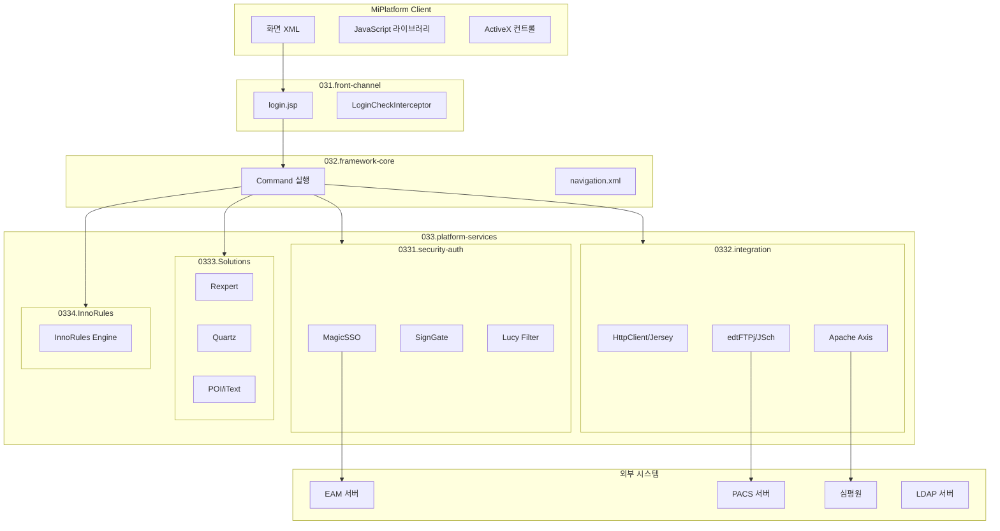

# Platform Services 개요

> 최종 수정: 2026-03-08

---

## 1. 목적

이 폴더는 DevOn 프레임워크 자체가 아닌 **외부 솔루션, 패키지, 플랫폼 서비스**를 정리하는 기준 폴더다.

운영 기준:
- DevOn 내부 구조면 `032.framework-core`
- DevOn 외부 솔루션/패키지면 `033.platform-services`

---

## 2. 하위 구획

| 폴더 | 설명 | 상태 |
|------|------|------|
| **0331.security-auth** | SSO, SAML, 전자서명, XSS 방어 등 보안/인증 | ✅ 분석 완료 |
| **0332.integration** | SOAP/REST 연동, HTTP/FTP/SFTP, 외부 시스템 연계 | ✅ 분석 완료 |
| **0333.Solutions** | 공통 솔루션, 외부 라이브러리, 플랫폼 공통 서비스 | ✅ 분석 완료 |
| **0334.InnoRules** | 외부 의료 Rule 엔진 솔루션과 Java/Batch 연동 | ✅ 분석 완료 |

---

## 3. 기술 스택 요약

### 3.1 보안/인증 (0331.security-auth)

| 기술 | 버전 | 공급사 | 용도 |
|------|------|--------|------|
| **MagicSSO** | 버전 미확인 | 드림시큐리티 계열 | SSO 계열 구성요소 |
| **DSToolkit** | 3.4.2.0 | 드림시큐리티 | 인증 툴킷 |
| **MagicSAML** | 1.3.3 | 드림시큐리티 | SAML SP |
| **OpenSAML** | 2.6.4 | Shibboleth | SAML 라이브러리 |
| **SignGate** | 버전 미확인 | 공급사 단정 보류 | 전자서명 계열 JAR/스크립트 확인 |
| **Lucy XSS Filter** | 1.1.2 | 네이버 | XSS 방어 |

### 3.2 연동 (0332.integration)

| 기술 | 버전 | 용도 |
|------|------|------|
| **Apache HttpClient** | 4.5.3 | HTTP 클라이언트 (주 사용) |
| **Jersey** | 1.19.4 | JAX-RS REST 클라이언트 |
| **edtFTPj** | 2.0.1 | FTP/FTPS 클라이언트 |
| **JSch** | 0.1.54 | SSH/SFTP 클라이언트 |
| **Apache Axis** | 1.x | SOAP 웹서비스 |
| **JCAOS** | 1.4.7.7 | 한국형 시스템 연동 |

### 3.3 솔루션 (0333.Solutions)

| 기술 | 버전 | 용도 |
|------|------|------|
| **Rexpert** | 3.x 계열 | 직접 근거 파일 기준 사용 확인 |
| **Quartz** | 1.6.1 | 스케줄러 JAR |
| **Apache POI** | 3.2 | Excel 처리 |
| **iText XML Worker** | 1.2.0 | HTML to PDF 변환 |

### 3.4 룰 엔진 (0334.InnoRules)

| 기술 | 용도 |
|------|------|
| **InnoRules** | 의료 Rule 엔진 (심사/청구) |

---

## 4. 아키텍처 위치

---

## 5. 연결 문서

### 5.1 상위 문서

- [../030.index/README.md](../030.index/README.md) - 전체 색인

### 5.2 하위 문서

| 폴더 | README |
|------|--------|
| **0331.security-auth** | [README.md](./0331.security-auth/README.md) |
| **0332.integration** | [README.md](./0332.integration/README.md) |
| **0333.Solutions** | [README.md](./0333.Solutions/README.md) |
| **0334.InnoRules** | [README.md](./0334.InnoRules/README.md) |

### 5.3 연관 문서

| 문서 | 설명 |
|------|------|
| [Front Channel 개요](../031.front-channel/0313.ui-entry/A.Front-Channel-개요.md) | 화면 진입점 |
| [Framework 개요](../032.framework-core/0321.overview/A.Framework-개요.md) | DevOn 코어 |
| [Data Access 개요](../032.framework-core/0322.data-access/A.Data-Access-개요.md) | 데이터 접근 |
| [Fact Check](../038.fact-todo-reference/0382.fact-check/00.fact-check.md) | 사실/미확인 |

---

## 6. 읽는 순서

1. **보안/인증** → [0331.security-auth/README.md](./0331.security-auth/README.md)
2. **연동** → [0332.integration/README.md](./0332.integration/README.md)
3. **솔루션** → [0333.Solutions/README.md](./0333.Solutions/README.md)
4. **룰 엔진** → [0334.InnoRules/README.md](./0334.InnoRules/README.md)

---

## 7. 참고

- 의료 특화 솔루션 자체 분석은 이 폴더에서 다루되, 업무 맥락 설명은 별도 도메인 문서가 준비되면 분리한다.
- 예: `EDViewer`는 기술 접점은 여기서 언급될 수 있지만, 업무 의미 중심 설명은 별도 문서로 분리하는 것이 적절하다.
