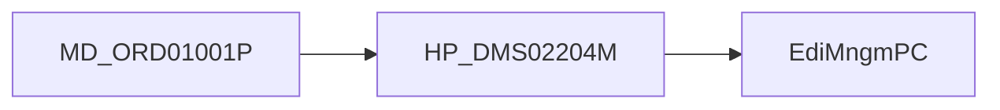

# 트레이스 읽는순서

## 1. 목적

약어/용어는 [약어-용어집.md](../030.index/0303.약어-용어집/약어-용어집.md) 를 먼저 보면 빠르다.

이 문서는 `037.runtime-trace`의 세 문서를 어떤 순서로 읽으면 좋은지 정리한 짧은 안내문이다.

## 2. 추천 순서

1. [B.MD_ORD01001P-실행체인.md](./B.MD_ORD01001P-%EC%8B%A4%ED%96%89%EC%B2%B4%EC%9D%B8.md)
   - 가장 과밀한 대표 화면
   - `.mhi -> command -> PC/UC -> EC -> xmlquery`가 가장 복합적으로 보인다
2. [C.HP_DMS02204M-실행체인.md](./C.HP_DMS02204M-%EC%8B%A4%ED%96%89%EC%B2%B4%EC%9D%B8.md)
   - 조회형처럼 보이지만 심사 후처리 도메인 파일군이 함께 묶인 사례
3. [D.EdiMngmPC-분기구조.md](./D.EdiMngmPC-%EB%B6%84%EA%B8%B0%EA%B5%AC%EC%A1%B0.md)
   - 분기형 PC가 왜 생겼는지 보여주는 사례

## 3. 세 문서의 공통 템플릿

모든 trace 문서는 아래 순서로 맞춘다.

1. 목적
2. 상위 구조에서 이 문서를 읽는 위치
3. 대표 진입 경로
4. command / PC / UC / EC
5. query path -> xmlquery
6. 해석
7. 다시 올라갈 문서

템플릿은 [E.실행체인-템플릿.md](./E.%EC%8B%A4%ED%96%89%EC%B2%B4%EC%9D%B8-%ED%85%9C%ED%94%8C%EB%A6%BF.md) 에 둔다.

## 4. 세 문서의 차이

| 문서 | 핵심 특징 | 중점 포인트 |
|------|-----------|-------------|
| `MD_ORD01001P` | 과밀 화면 | 시나리오 과적재, 다중 query family |
| `HP_DMS02204M` | 심사/후처리형 | 조회 화면처럼 보여도 도메인 파일군이 두꺼움 |
| `EdiMngmPC` | 분기형 PC | 파일유형/버전 분기를 화면 밖으로 밀어낸 구조 |

## 5. 상위 문서로 돌아가기

- 개요로 돌아가려면
  - [../032.framework-core/0321.overview/A.Framework-개요.md](../032.framework-core/0321.overview/A.Framework-%EA%B0%9C%EC%9A%94.md)
- front-channel로 돌아가려면
  - [../031.front-channel/0312.navigation-command/A.Command-Navigation-Dispatch.md](../031.front-channel/0312.navigation-command/A.Command-Navigation-Dispatch.md)
- data-access로 돌아가려면
  - [../032.framework-core/0322.data-access/B.LCommonDao-LQueryMaker.md](../032.framework-core/0322.data-access/B.LCommonDao-LQueryMaker.md)
- 설계평가로 돌아가려면
  - [../../95.추가 검토 사항 및 계획/953.refactoring-ideation/rep.대형화면3종-구조비교.md](../../95.%EC%B6%94%EA%B0%80%20%EA%B2%80%ED%86%A0%20%EC%82%AC%ED%95%AD%20%EB%B0%8F%20%EA%B3%84%ED%9A%8D/953.refactoring-ideation/rep.%EB%8C%80%ED%98%95%ED%99%94%EB%A9%B43%EC%A2%85-%EA%B5%AC%EC%A1%B0%EB%B9%84%EA%B5%90.md)

