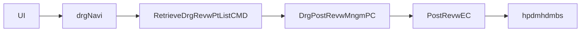

# HP_DMS02204M 실행 체인 복원

## 1. 목적

약어/용어는 [약어-용어집.md](../030.index/0303.약어-용어집/약어-용어집.md) 를 먼저 보면 빠르다.

이 문서는 `HP_DMS02204M` 화면의 실제 조회 체인을 `화면 -> navigation -> command -> PC -> EC -> query path -> xmlquery` 기준으로 닫기 위한 trace 문서다.

## 2. 상위 구조에서 이 문서를 읽는 위치

- 이 문서는 [../032.framework-core/0321.overview/03.Architecture-overview.md](../032.framework-core/0321.overview/03.Architecture-overview.md)의 심사/후처리 계열 사례다.
- front dispatch는 [../031.front-channel/0312.navigation-command/Command-Navigation-Dispatch.md](../031.front-channel/0312.navigation-command/Command-Navigation-Dispatch.md)를 같이 보면 된다.
- XML Query는 [../032.framework-core/0322.data-access/03.XML-Query-실행구조.md](../032.framework-core/0322.data-access/03.XML-Query-%EC%8B%A4%ED%96%89%EA%B5%AC%EC%A1%B0.md)와 연결해서 보는 것이 좋다.

## 3. 대표 진입 경로

- 화면 URL: `/hp/dms/drgNavi/RetrieveDrgRevwPtList.mhi`
- navigation: `devonhome/navigation/mhi/hp/dms/drgNavi.xml`
- action: `RetrieveDrgRevwPtList`
- service 진입: `TxServiceUtil.getNTxService("hp.dms.DrgPostRevwMngmPC")`

## 4. command / PC / UC / EC

### 4.1 command

- `RetrieveDrgRevwPtList` -> `nph.his.hp.dms.drg.cmd.RetrieveDrgRevwPtListCMD`

### 4.2 PC

`DrgPostRevwMngmPC`
- `retrieveDrgRevwPtList(data)`는 `PostRevwEC.retrieveDrgRevwPtList(data)`로 위임한다
- 같은 PC 안에 `ROW_STATUS_CREATE`, `ROW_STATUS_UPDATE`, `ROW_STATUS_DELETE` 분기가 다수 존재한다
- 즉 조회 전용 PC라기보다, 심사 후처리 업무를 함께 품은 PC다

### 4.3 UC

- 현재 이 trace 범위에서는 핵심 UC보다는 `PC -> EC` 흐름이 중심이다
- 따라서 이 문서는 UC보다 `DrgPostRevwMngmPC -> PostRevwEC`를 기준 체인으로 본다

### 4.4 EC

`PostRevwEC`
- `/hp/dms/hpdmhdmbs/retrieveDrgRevwPtList`
- 같은 EC 안에 `saveDrgPostRevw`, 다수 `update*`, 다수 `delete*`도 공존한다

## 5. query path -> xmlquery

- xmlquery: `hp/dms/hpdmhdmbs.xml`
- statement: `retrieveDrgRevwPtList`, `saveDrgPostRevw`, 다수 `update*`, 다수 `delete*`

## 6. 해석

- `HP_DMS02204M`는 화면만 보면 조회 중심이다.
- 하지만 실제로는 `hpdmhdmbs.xml`이라는 큰 도메인 파일군의 일부를 사용한다.
- 그래서 이 화면은 조회처럼 보이지만, 내부 구조는 심사 후처리 도메인과 강하게 결합된 사례다.

## 7. 다시 올라갈 문서

- 개요로 돌아가려면
  - [../032.framework-core/0321.overview/01.Framework-개요.md](../032.framework-core/0321.overview/01.Framework-%EA%B0%9C%EC%9A%94.md)
- command 흐름으로 돌아가려면
  - [../031.front-channel/0312.navigation-command/Command-Navigation-Dispatch.md](../031.front-channel/0312.navigation-command/Command-Navigation-Dispatch.md)
- data-access로 연결하려면
  - [../032.framework-core/0322.data-access/03.XML-Query-실행구조.md](../032.framework-core/0322.data-access/03.XML-Query-%EC%8B%A4%ED%96%89%EA%B5%AC%EC%A1%B0.md)
- 구조 평가와 연결하려면
  - [../../95.추가 검토 사항 및 계획/953.refactoring-ideation/rep.대형화면3종-구조비교.md](../../95.%EC%B6%94%EA%B0%80%20%EA%B2%80%ED%86%A0%20%EC%82%AC%ED%95%AD%20%EB%B0%8F%20%EA%B3%84%ED%9A%8D/953.refactoring-ideation/rep.%EB%8C%80%ED%98%95%ED%99%94%EB%A9%B43%EC%A2%85-%EA%B5%AC%EC%A1%B0%EB%B9%84%EA%B5%90.md)

