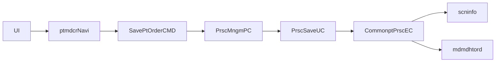

# MD_ORD01001P 실행 체인 복원

## 1. 목적

약어/용어는 [약어-용어집.md](../030.index/0303.약어-용어집/약어-용어집.md) 를 먼저 보면 빠르다.

이 문서는 `MD_ORD01001P` 화면의 대표 저장/DUR 경로를 실제 코드 기준으로 `화면 -> navigation -> command -> PC/UC -> EC -> query path -> xmlquery`까지 닫기 위한 trace 문서다.

## 2. 상위 구조에서 이 문서를 읽는 위치

- 이 문서는 [../032.framework-core/0321.overview/03.Architecture-overview.md](../032.framework-core/0321.overview/03.Architecture-overview.md)의 대표 과밀 화면 사례다.
- front dispatch 설명은 [../031.front-channel/0312.navigation-command/Command-Navigation-Dispatch.md](../031.front-channel/0312.navigation-command/Command-Navigation-Dispatch.md)를 먼저 보면 빠르다.
- DAO/XML Query는 [../032.framework-core/0322.data-access/02.LCommonDao-LQueryMaker.md](../032.framework-core/0322.data-access/02.LCommonDao-LQueryMaker.md), [../032.framework-core/0322.data-access/03.XML-Query-실행구조.md](../032.framework-core/0322.data-access/03.XML-Query-%EC%8B%A4%ED%96%89%EA%B5%AC%EC%A1%B0.md)와 같이 읽는 것이 좋다.

## 3. 대표 진입 경로

범위는 다음 두 경로에 집중한다.

- `/md/ord/ptmdcrNavi/SavePtOrder.mhi`
- `/md/ord/ptmdcrNavi/UpdateDurt.mhi`

화면 레벨 확인값:

- 화면 XML: `NPH_HIS/webapp/ui/MD/ORD/MD_ORD01001P.xml`
- 대표 URL: `/md/ord/ptmdcrNavi/SavePtOrder.mhi`, `/md/ord/ptmdcrNavi/UpdateDurt.mhi`
- 저장 입력 Dataset: `ds_Ordr`, `ds_OrdrDur`
- 저장 출력 Dataset: `ds_FirstDis`, `ds_RuleResult`

## 4. command / PC / UC / EC

### 4.1 command

- `SavePtOrder` -> `nph.his.md.ord.ptmdcr.cmd.SavePtOrderCMD`
- `UpdateDurt` -> `nph.his.md.ord.ptmdcr.cmd.UpdateDurtCMD`

`SavePtOrderCMD`
- `TxServiceUtil.getTxService("md.ord.PrscMngmPC")`
- `prscMngmPC.savePtOrder(mData)`
- DUR 경로에서는 `prscMngmPC.savePtOrderDur(mDurData)`도 호출

`UpdateDurtCMD`
- `TxServiceUtil.getTxService("md.ord.ZzzPrscMngmPC")`
- `CommonptPrscEC`를 직접 사용해 `saveDurt`, `updateDurt`, `updateDurChckDvsn` 수행

### 4.2 PC / UC

`PrscMngmPC`
- 처방 저장 흐름의 상위 오케스트레이터
- `savePtOrder(...)`에서 `PrscSaveUC`로 위임
- 행상태(`CREATE/UPDATE/DELETE`) 분기와 공통 처방 EC 호출이 매우 많다

`PrscSaveUC`
- 일반 처방 저장과 DUR 점검/규칙점검 연동을 함께 품는다
- `/md/ord/scninfo/retrieveRuleCheck`를 반복 참조한다

`PrscCheckDurUC`
- DUR 점검/재전송/사유 처리 보조 UC
- `retrieveDurSendCheck`, `retrieveDurPidCheck`, `saveDurt`, `updateDurt` 사용

### 4.3 EC

`CommonptPrscEC`
- `/md/ord/scninfo/retrieveDurSendCheck`
- `/md/ord/scninfo/retrieveDurPidCheck`
- `/md/ord/scninfo/retrieveRuleCheck`
- `/md/ord/scninfo/saveDurt`
- `/md/ord/scninfo/updateDurt`
- `/md/ord/mdmdhtord/retrievePrscList`

## 5. query path -> xmlquery

### 5.1 DUR/규칙 점검 계열
- xmlquery: `md/ord/scninfo.xml`
- statement: `saveDurt`, `updateDurt`, `retrieveDurSendCheck`, `retrieveDurPidCheck`, `retrieveRuleCheck`

### 5.2 처방 목록/기본 주문 계열
- xmlquery: `md/ord/mdmdhtord.xml`
- statement: `RetrievePtOrder`, `RetrievePtOrderPreOtpt`, `RetrievePtOrderStat`, `RetrievePtOrderPreAutoCopy`, `retrievePtOrderPreSbstCd`, `retrievePrscList`

## 6. 해석

- `MD_ORD01001P`는 단순 조회 화면이 아니다.
- 처방 저장, 규칙 점검, DUR 점검, DUR 이력 저장/변경, 사유 보정이 한 화면에 이어진다.
- 이 화면의 복잡도는 `LQueryMaker` 자체보다 화면에 너무 많은 사용자 시나리오가 한꺼번에 얹힌 점에서 온다.

## 7. 다시 올라갈 문서

- 개요로 돌아가려면
  - [../032.framework-core/0321.overview/01.Framework-개요.md](../032.framework-core/0321.overview/01.Framework-%EA%B0%9C%EC%9A%94.md)
- dispatch 기준으로 다시 보려면
  - [../031.front-channel/0312.navigation-command/Command-Navigation-Dispatch.md](../031.front-channel/0312.navigation-command/Command-Navigation-Dispatch.md)
- DAO/XML Query 기준으로 다시 보려면
  - [../032.framework-core/0322.data-access/02.LCommonDao-LQueryMaker.md](../032.framework-core/0322.data-access/02.LCommonDao-LQueryMaker.md)
  - [../032.framework-core/0322.data-access/03.XML-Query-실행구조.md](../032.framework-core/0322.data-access/03.XML-Query-%EC%8B%A4%ED%96%89%EA%B5%AC%EC%A1%B0.md)
- 설계평가와 연결해서 보려면
  - [../../95.추가 검토 사항 및 계획/953.refactoring-ideation/rep.대형화면3종-구조비교.md](../../95.%EC%B6%94%EA%B0%80%20%EA%B2%80%ED%86%A0%20%EC%82%AC%ED%95%AD%20%EB%B0%8F%20%EA%B3%84%ED%9A%8D/953.refactoring-ideation/rep.%EB%8C%80%ED%98%95%ED%99%94%EB%A9%B43%EC%A2%85-%EA%B5%AC%EC%A1%B0%EB%B9%84%EA%B5%90.md)

