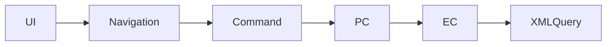

# 실행체인 템플릿

## 1. 목적

약어/용어는 [03.약어-용어집.md](../0310.index/03.%EC%95%BD%EC%96%B4-%EC%9A%A9%EC%96%B4%EC%A7%91.md) 를 먼저 보면 빠르다.

이 문서는 `[화면/업무명]`의 실제 실행체인을 `화면 -> navigation -> command -> PC/UC -> EC -> query path -> xmlquery` 기준으로 정리하기 위한 템플릿이다.

## 2. 상위 구조에서 이 문서를 읽는 위치

- 이 문서는 [../032.framework-core/0321.overview/03.Architecture-overview.md](../032.framework-core/0321.overview/03.Architecture-overview.md)의 `[사례 분류]` 사례다.
- front dispatch는 [../031.front-channel/0312.navigation-command/Command-Navigation-Dispatch.md](../031.front-channel/0312.navigation-command/Command-Navigation-Dispatch.md)를 같이 본다.
- data-access는 [../032.framework-core/0322.data-access/02.LCommonDao-LQueryMaker.md](../032.framework-core/0322.data-access/02.LCommonDao-LQueryMaker.md), [../032.framework-core/0322.data-access/03.XML-Query-실행구조.md](../0313.data-access/03.XML-Query-%EC%8B%A4%ED%96%89%EA%B5%AC%EC%A1%B0.md)와 같이 본다.

## 3. 대표 진입 경로

- 화면 URL:
- navigation:
- action:
- command:
- service 진입:

## 4. command / PC / UC / EC

### 4.1 command
- action -> command 매핑
- `TxServiceUtil` 사용 여부

### 4.2 PC
- 대표 PC 역할
- 오케스트레이션 포인트

### 4.3 UC
- 있으면 기술
- 없거나 핵심이 아니면 `이 trace 범위에서는 중심이 아님`으로 기술

### 4.4 EC
- 대표 EC 역할
- 대표 query path 목록

## 5. query path -> xmlquery

- 대표 query path
- 대응 xmlquery 파일
- 대표 statement

## 6. 해석

- 이 사례가 왜 복잡한지
- 구조상 어디가 핵심인지
- 프레임워크가 왜 개입했는지

## 7. 다시 올라갈 문서

- 개요
- front-channel
- data-access
- design-review

