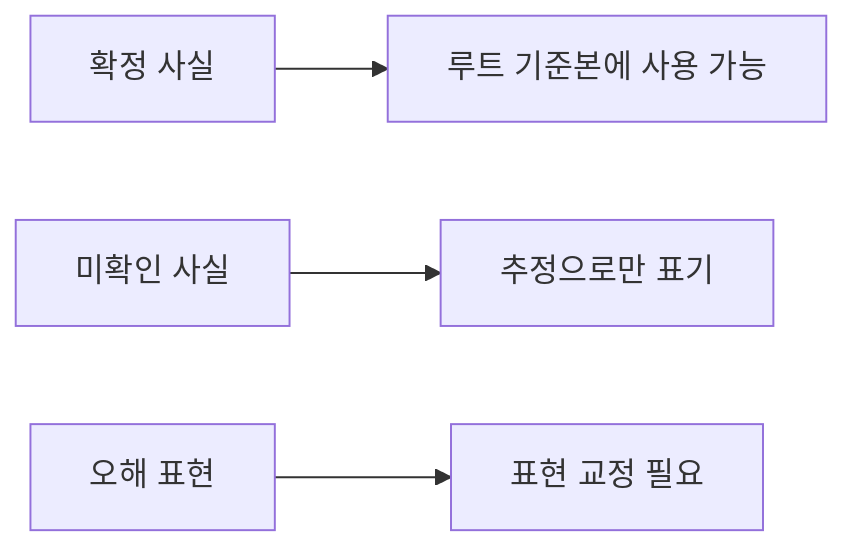

# fact-check

## 1. 목적

이 문서는 `Architecture - Framework` 폴더에서 반복적으로 헷갈릴 수 있는 내용을 `확정 사실`, `미확인 사실`, `오해하기 쉬운 표현`으로 나눠 정리한 문서다.

## 2. 빠른 분류

## 3. 확정 사실

### 3.1 front-channel

- `MiplatformServlet`은 MiPlatform 요청 진입점이다.
- `LCommandEngine`는 action 문자열 기반의 command dispatch 엔진이다.
- 현재 확인된 주요 stack은 `defaultStack`, `notLoginCheckStack`, `miUploadStack`이다.
- 현재 확인된 실제 interceptor 클래스는 `LoginCheckInterceptor`, `UrlPrivCheckInterceptor`, `FileUploadInterceptor`다.
- `LServiceProxy`, `LServiceDelegator`, `LServiceInterceptorIF`, `LNullServiceInterceptor`는 실존이 확인된다.

### 3.2 data-access

- NPH 업무 소스는 `LCommonDao`를 광범위하게 직접 사용한다.
- `LQueryMaker`는 `devon-framework.jar`와 API 문서에서 실존이 확인된다.
- `LCommonDao.class` 실행 경로에서는 `resolveSQL`, `resolveRawSQL`, `getQuery`, `getQueryArgument`, `getFetchSize`, `isSetMetadata`가 확인된다.
- query path는 `devonhome/xmlquery/*.xml`의 statement로 매핑된다.
- 현재 NPH 해석에서 Data Access는 ORM이 아니라 `XML Query + AutoDAO + JDBC` 구조에 가깝다.

### 3.3 tx / pool

- `LJDBCTransactionManager`, `LJTATransactionManager`는 실존이 확인된다.
- `LDataSourcePool` 계층은 JNDI / JDBC / DBCP 경로를 수용하는 추상화로 보는 것이 안전하다.
- 현재 NPH는 `프레임워크 추상화 + WAS JNDI 자원 사용` 해석이 가장 안전하다.

### 3.4 대표 사례

- `MD_ORD01001P`는 `mdmdhtord.xml`, `scninfo.xml`을 같이 탄다.
- `HP_DMS02204M`는 `hpdmhdmbs.xml` 파일군과 연결된다.
- `HP_DMS01303M` / `EdiMngmPC`는 `hpdmhf*`, `hpdmhi*`, `hpdmht*` 계열과 연결된다.

## 4. 미확인 사실

- `urlPriv`가 기본 stack에 실제로 어떻게 부착되는지
- `LJndiDataSource`, `LJdbcDataSource`의 내부 구현 세부
- `LDataSourcePool`이 모든 pool을 직접 소유하는지, 주로 WAS pool wrapper인지의 세부 구현
- 일부 old 문서에 남아 있던 가상 클래스명/예시 코드의 실제 실존 여부

이 항목들은 문서에 넣더라도 `미확인`, `추정`, `가능성`으로만 표기해야 한다.

## 5. 오해하기 쉬운 표현

### 5.1 `LQueryMaker는 NPH에서 안 쓴다`

정확한 표현:
- NPH 업무 코드가 `LQueryMaker`를 직접 쓰지는 않는다.
- 하지만 `LCommonDao` 내부에서 실제 호출되므로 런타임 내부 중요도는 높다.

### 5.2 `이 구조는 무능해서 만든 것이다`

정확한 표현:
- 그렇게 단정하기 어렵다.
- 더 안전한 평가는 `당시에는 필요했던 표준화 구조가 장기 운영 속에서 기술부채로 무거워진 상태`다.

### 5.3 `DevOn은 그냥 Struts1이다`

정확한 표현:
- Struts1과 유사한 진입 사고는 있지만,
- 실제 NPH의 DevOn은 Navigation, Command, ServiceProxy, TxServiceUtil, LCommonDao, MiPlatform 계층까지 포함한 더 두꺼운 통합형 구조다.

### 5.4 `모든 경로가 resolveSQL만 탄다`

정확한 표현:
- 일반 조회/수정 경로는 `resolveSQL` 중심이다.
- 페이징/일부 특수 경로는 `resolveRawSQL`도 탄다.

## 6. 언제 이 문서를 보나

- 구조 문서를 읽다가 헷갈릴 때
- 어떤 표현이 확정인지 추정인지 구분이 필요할 때
- old 문서의 과거 표현을 현재 기준으로 교정할 때

## 7. 다시 올라갈 문서

- 전체 개요로 돌아가려면
  - [../../032.framework-core/0321.overview/A.Framework-개요.md](../../032.framework-core/0321.overview/A.Framework-개요.md)
- front-channel로 돌아가려면
  - [../../031.front-channel/0313.ui-entry/A.Front-Channel-개요.md](../../031.front-channel/0313.ui-entry/A.Front-Channel-개요.md)
- data-access로 돌아가려면
  - [../../032.framework-core/0322.data-access/A.Data-Access-개요.md](../../032.framework-core/0322.data-access/A.Data-Access-개요.md)
  - [../../032.framework-core/0322.data-access/B.LCommonDao-LQueryMaker.md](../../032.framework-core/0322.data-access/B.LCommonDao-LQueryMaker.md)
- 개선/재구성 검토 문서로 가려면`r`n  - [../../../95.추가 검토 사항 및 계획/953.refactoring-ideation](../../../95.추가 검토 사항 및 계획/953.refactoring-ideation)
- reference로 내려가려면
  - [../0381.reference/00.reference-읽는순서.md](../0381.reference/00.reference-읽는순서.md)

