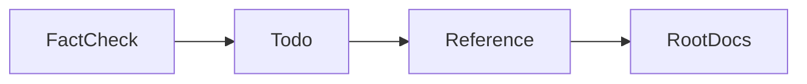

# todo 읽는순서

## 1. 목적

이 문서는 `038.fact-todo-reference/0383.todo` 폴더를 어떤 용도로 쓰는지, 무엇부터 확인하면 되는지 정리한 짧은 안내문이다.

## 2. 역할

`0383.todo`는 새 해석을 적는 곳이 아니다.

- 아직 확정하지 못한 항목
- 근거는 있지만 세부 구현이 덜 닫힌 항목
- 다음 조사 우선순위

만 모아두는 관리 폴더다.

## 3. 추천 순서

1. [../0382.fact-check/00.fact-check.md](../0382.fact-check/00.fact-check.md)
   - 확정/미확인 경계를 먼저 본다
2. [01.미확인-후속조사.md](./01.%EB%AF%B8%ED%99%95%EC%9D%B8-%ED%9B%84%EC%86%8D%EC%A1%B0%EC%82%AC.md)
   - 실제 남은 미확인 항목과 우선순위를 본다
3. 필요하면 `0381.reference`로 내려가 근거를 확인한다

## 4. 다시 올라갈 문서

- 기준본 목차로 돌아가려면
  - [../../030.index/README.md](../../030.index/README.md)
- 사실 확인 문서로 돌아가려면
  - [../0382.fact-check/00.fact-check.md](../0382.fact-check/00.fact-check.md)

