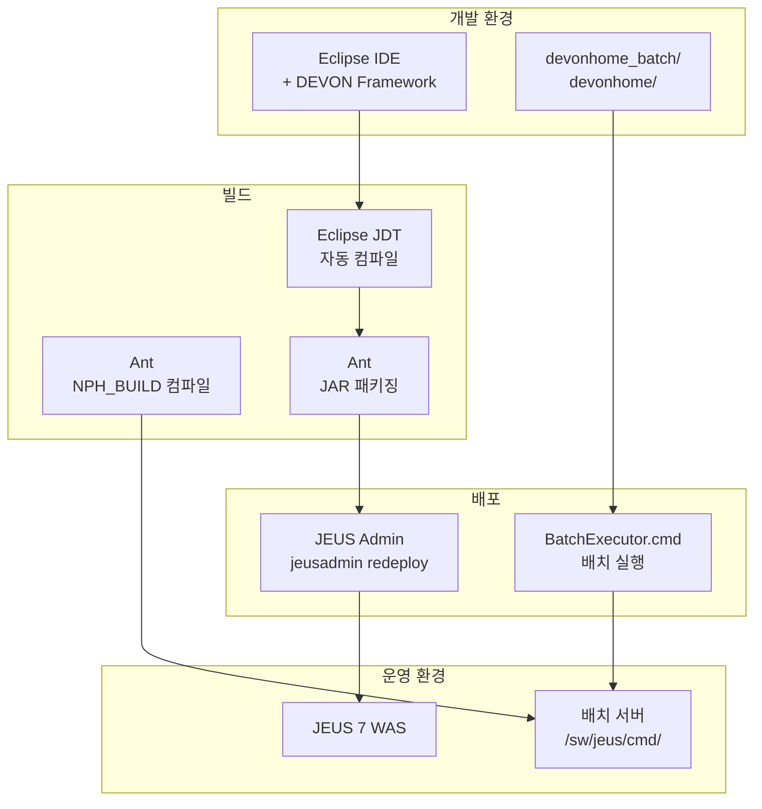

# NPH 빌드 및 배포 시스템 분석 보고

> 최초 작성: 2026-03-08

---

## 1. 개요

NPH 프로젝트의 빌드와 배포는 **Eclipse IDE + DEVON Framework + JEUS WAS** 조합으로 구성되어 있습니다. Ant는 전체 빌드 시스템이 아닌 특정 목적에만 부분 사용됩니다.

---

## 2. 빌드 시스템 상세

### 2.1 Eclipse IDE 기반 개발

**프로젝트 설정 파일:** `NPH_HIS/.project`

```xml
<buildSpec>
    <buildCommand>
        <name>org.eclipse.jdt.core.javabuilder</name>  <!-- Java 컴파일 -->
    </buildCommand>
    <buildCommand>
        <name>org.eclipse.wst.common.project.facet.core.builder</name>  <!-- 웹 프로젝트 -->
    </buildCommand>
    <buildCommand>
        <name>org.eclipse.wst.validation.validationbuilder</name>  <!-- 검증 -->
    </buildCommand>
</buildSpec>
<natures>
    <nature>org.eclipse.jdt.core.javanature</nature>
    <nature>org.eclipse.wst.common.modulecore.ModuleCoreNature</nature>
    <nature>org.eclipse.wst.jsdt.core.jsNature</nature>
</natures>
```

**의미:**
- Eclipse JDT(Java Development Tools)가 Java 컴파일을 자동 수행
- WST(Web Standard Tools)가 웹 프로젝트 관리
- 개발자가 Eclipse에서 저장하면 자동으로 `webapp/WEB-INF/classes/`에 컴파일

### 2.2 Ant 사용 현황

#### 파일 1: NPH_BUILD/build.xml (NPH_BUILD 프로젝트용)

```xml
<project default="all" name="NPH_BUILD" basedir="./">
    <target name="all">
        <mkdir dir="/sw/jeus/cmd/NPH_BUILD/bin/" />
        <javac srcdir="/sw/jeus/cmd/NPH_BUILD/src"
               destdir="/sw/jeus/cmd/NPH_BUILD/bin/"
               encoding="UTF-8">
            <classpath refid="classpath" />
        </javac>
    </target>
</project>
```

**용도:** 배치 작업용 NPH_BUILD 모듈 컴파일 (운영 서버 경로: `/sw/jeus/cmd/NPH_BUILD`)

#### 파일 2: NPH_HIS/ant/build-wstest.xml

```xml
<project default="for_ws_job" name="COMMON" basedir="./">
    <target name="for_ws_job">
        <delete file="${basedir}/nphHis.jar"/>
        <jar destfile="${basedir}/nphHis.jar"
             basedir="C:\AADEV_NPH\workspace\NPH_HIS\webapp\WEB-INF\classes\"/>
        <copy file="${basedir}/nphHis.jar"
              todir="C:\AADEV_NPH\workspace\NPH_WS\webapp\WEB-INF\lib\"/>
    </target>
</project>
```

**용도:** NPH_HIS 컴파일 결과를 JAR로 패키징하여 NPH_WS(웹서비스) 프로젝트로 복사

### 2.3 Ant 사용 요약

| 파일 | 위치 | 용도 | Ant 태스크 |
|------|------|------|-----------|
| `build.xml` | NPH_BUILD | 배치 모듈 컴파일 | `<javac>`, `<mkdir>` |
| `build-wstest.xml` | NPH_HIS/ant | JAR 패키징 | `<jar>`, `<copy>`, `<delete>` |

**axis-ant.jar 사용 여부:** ❌ 미사용
- 일반 Ant 태스크(`<javac>`, `<jar>`, `<copy>`)만 사용
- Axis 전용 태스크(`<axis-java2wsdl>`, `<axis-wsdl2java>`)는 미사용

---

## 3. 배포 시스템 상세

### 3.1 JEUS WAS 배포

**배포 스크립트:** `NPH_HIS/redeploy.cmd`

```cmd
cd C:\AADEV_NPH\bin\JEUS6\bin
jeusadmin NPH -Uadministrator -Pjeusadmin redeploy NPH_HIS
```

**분석:**
- JEUS Admin CLI(`jeusadmin`) 사용
- `redeploy` 명령으로 애플리케이션 재배포
- 인증: administrator / jeusadmin

### 3.2 배치 실행

**배치 실행 스크립트:** `NPH_HIS/cmd/BatchExecutor.cmd`

```cmd
set CLASSPATH=C:\AADEV_NPH\bin\JEUS7\lib\datasource\ojdbc6.jar;
             C:\AADEV_NPH\workspace\NPH_HIS\webapp\WEB-INF\lib\devon-core.jar;
             C:\AADEV_NPH\workspace\NPH_HIS\webapp\WEB-INF\lib\devon-framework.jar;
             ... (다수 JAR)
             C:\AADEV_NPH\workspace\NPH_HIS\webapp\WEB-INF\classes;

C:\AADEV_NPH\bin\jdk1.7.0_80.x86\bin\java
    -Ddevon.home=C:\AADEV_NPH\workspace\NPH_HIS\devonhome_batch
    -classpath "%CLASSPATH%"
    devon.batch.core.shell.JobGroupExecutor %*
```

**분석:**
- Java 1.7 사용 (JDK 7)
- DEVON Batch Framework 실행
- `JobGroupExecutor`가 배치 잡을 실행

---

## 4. 전체 빌드/배포 흐름



---

## 5. 기술 스택 요약

| 구분 | 기술 | 버전/설명 |
|------|------|----------|
| **IDE** | Eclipse | WST, JDT 플러그인 |
| **프레임워크** | DEVON Framework | DAF, DBM |
| **빌드** | Eclipse JDT + Ant (부분) | JDT: 주 빌드, Ant: 보조 |
| **배포** | JEUS Admin | jeusadmin redeploy |
| **WAS** | JEUS 7 | TmaxSoft |
| **JDK** | Java 7, 8 | 배치: JDK 7, WAS: JDK 8 |
| **배치 프레임워크** | DEVON Batch | Quartz 기반 |

---

## 6. 수정 대상 (대기 중)

기존 문서에서 **"Ant 미사용"**으로 기술했으나, 실제로는 **"Ant 사용 중 (Axis 태스크는 미사용)"**이 정확합니다.

### 수정 대상 파일

| 파일 | 수정 내용 |
|------|----------|
| `E.SOAP-웹서비스.md` | axis-ant.jar 미사용 사유: "Ant 미사용" → "Axis Ant 태스크 미사용" |
| `README.md` (0332.integration) | 4.1 미사용 JAR 섹션 수정 |

### 수정 전 (현재)

```markdown
> - **미사용 이유**: NPH 프로젝트는 Ant를 사용하지 않음 (`build.xml` 없음)
```

### 수정 후 (예정)

```markdown
> - **미사용 이유**: NPH는 Ant를 사용하나 Axis 전용 태스크(`<axis-java2wsdl>`, `<axis-wsdl2java>`)는 미사용
```

---

## 7. 검증 근거 파일

| 파일 | 경로 | 확인 내용 |
|------|------|----------|
| `.project` | `NPH_HIS/.project` | Eclipse JDT 빌드 설정 |
| `build.xml` | `workspace/NPH_BUILD/build.xml` | Ant 컴파일 스크립트 |
| `build-wstest.xml` | `NPH_HIS/ant/build-wstest.xml` | Ant JAR 패키징 스크립트 |
| `redeploy.cmd` | `NPH_HIS/redeploy.cmd` | JEUS 배포 스크립트 |
| `BatchExecutor.cmd` | `NPH_HIS/cmd/BatchExecutor.cmd` | 배치 실행 스크립트 |

---

## 8. 관련 문서

- [../033.platform-services/0332.integration/E.SOAP-웹서비스.md](../033.platform-services/0332.integration/E.SOAP-웹서비스.md)
- [../033.platform-services/0332.integration/README.md](../033.platform-services/0332.integration/README.md)