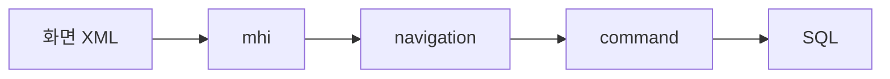
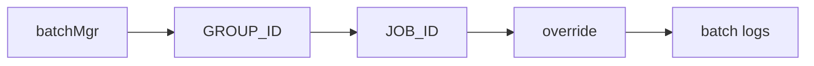

# 로그 기반 시스템 분석 방법론 (codex GPT5.4)

## 1. 목적
이 문서는 NPH 로그를 통해 시스템 상태와 운영 흐름을 읽는 방법론을 정리한 Minority Report다.

목표는 세 가지다.

1. 로그를 온라인/배치/외부연계/기동 관점으로 나눠 읽는 기준을 제시한다.
2. 실제 확인한 로그 사례를 바탕으로 사건을 복원하는 절차를 남긴다.
3. 운영 대시보드로 올릴 만한 핵심 지표를 제안한다.

## 2. 이 시스템 로그를 읽는 기본 전제

### 2.0 이 문서가 기대는 기존 Minority Report
이번 방법론은 아래 기존 로그 보고서의 사실을 바탕으로 재정리한 것이다.

- [NPH-로그파일-분석보고서.md](/home/forsylph/ollama/NPH/03.analysis_results/038.fact-todo-reference/0389.Minority%20Report/NPH-%EB%A1%9C%EA%B7%B8%ED%8C%8C%EC%9D%BC-%EB%B6%84%EC%84%9D%EB%B3%B4%EA%B3%A0%EC%84%9C.md)
- [NPH-Access-Log-사용패턴분석.md](/home/forsylph/ollama/NPH/03.analysis_results/038.fact-todo-reference/0389.Minority%20Report/NPH-Access-Log-%EC%82%AC%EC%9A%A9%ED%8C%A8%ED%84%B4%EB%B6%84%EC%84%9D.md)

즉 이 문서는 새로운 통계 문서가 아니라, 기존 수치와 최근 코드/설정 검토를 묶어 운영 해석 기준으로 재정리한 문서다.

### 2.0A Access Log 해석 주의사항
기존 Access Log 보고서 기준으로 이번 방법론은 아래 한계를 전제로 한다.

| 항목 | 현재 해석 |
|---|---|
| 환경 | 개발/테스트 환경 흔적이 강함 |
| 사용자 | `127.0.0.1` 단일 IP 중심 |
| 기간 | `2025-12-08 ~ 2026-03-04` |
| 특징 | 로그인 후 공통코드 다중 호출이 실제 업무 비중을 과대 보이게 만들 수 있음 |

즉 Access Log의 절대 수치를 그대로 운영 KPI로 쓰기보다, `패턴`과 `병목 후보`를 읽는 자료로 보는 편이 맞다.

### 2.1 이 시스템은 로그가 부족한 시스템이 아니다
현재 확인한 로그만 봐도 아래는 남는다.

- 사이트 기동 흔적
- 외부 핸들러 초기화 흔적
- 일반 `.mhi` 호출 흔적
- SQL 실행 흔적
- 배치 JobGroup/Job 실행 흔적
- 예외와 상태 전이 흔적

문제는 로그가 없는 것이 아니라, 로그를 업무 의미로 번역하는 비용이 높다는 점이다.

### 2.2 먼저 사건 종류를 분류해야 한다
이 시스템은 한 종류의 로그만 보면 잘못 읽기 쉽다.

먼저 아래 네 가지 중 어디에 가까운지 정해야 한다.

1. 온라인 화면 문제
2. 배치 실행 문제
3. 외부 연계 문제
4. 사이트 기동/초기화 문제

이 분류가 끝나야 볼 로그 파일과 문서가 정해진다.

## 3. 실제 분석 절차

### 3.1 1단계: 사건의 시작점 찾기

#### 온라인 화면 문제
시작점은 보통 `.mhi`다.

우선 보는 것:
- `debug.log`
- 화면 XML
- `031.front-channel`

찾는 키:
- `CheckLoginUser-new1.mhi`
- `RetrieveToday.mhi`
- `RetrieveDbmsConnectionString.mhi`
- 화면 함수명

#### 배치 문제
시작점은 `GROUP_ID` 또는 `JOB_ID`다.

우선 보는 것:
- `batch-file-log/.../GROUP_ID-EXEC_COUNT.log`
- `GROUP_ID-EXEC_COUNT-JOB_ID.log`
- `devon-batch-syslog`
- `batchLog`

찾는 키:
- `HP_BAT01206B`
- `HP_BAT01206B01`
- `override`
- `EXEC_COUNT`

#### 외부 연계 문제
시작점은 초기화 로그 또는 연계 클래스명이다.

우선 보는 것:
- `info.log`
- `debug.log`
- `0332.integration`

찾는 키:
- `LST handler`
- `POLNET handler`
- `HttpClientUtil`
- `Loaded Cert`

#### 사이트 기동 문제
시작점은 컨텍스트 초기화다.

우선 보는 것:
- `info.log`
- `devon.log`

찾는 키:
- `Initializing context`
- `WorkQueueManager`
- `LDataSourcePool.update()`

### 3.2 2단계: 사건 체인 묶기

#### 온라인

읽는 순서:
1. 어떤 화면이었나
2. 어떤 `.mhi`를 쳤나
3. 어떤 navigation/action 이었나
4. 어떤 command/PC/EC가 붙었나
5. 어떤 SQL이 돌았나

#### 배치

읽는 순서:
1. 어떤 JobGroup 인가
2. 어떤 Job 인가
3. override가 있었나
4. 상태 전이가 어디서 멈췄나
5. 예외가 그룹 레벨인지 잡 레벨인지

#### 외부 연계

읽는 순서:
1. 기동 시 핸들러 등록이 됐나
2. 인증서 로드가 됐나
3. 호출 흔적이 있나
4. 실패가 초기화 실패인지 호출 실패인지

### 3.3 3단계: 기술 로그를 업무 의미로 번역
이 단계가 가장 중요하다.

예:
- `CheckLoginUser-new1.mhi`
  - 로그인 시도
- `RetrieveToday.mhi`
  - 메인/공통 초기 조회
- `RetrieveDbmsConnectionString.mhi`
  - 운영/환경 상태 조회
- `HP_BAT01206B`
  - 특정 배치 그룹 실행

로그는 기술 이벤트를 주지만, 운영 판단은 업무 의미로 번역해야 가능하다.

### 3.4 Access Log에서 먼저 봐야 할 상위 패턴
기존 Access Log 분석에서 실제로 많이 보인 호출은 아래와 같다.

| 분류 | 대표 호출 | 해석 |
|---|---|---|
| 로그인 | `CheckLoginUser-new1.mhi` | 로그인 인증 |
| 공통 초기화 | `RetrieveToday.mhi`, `UpdateCntInit1.mhi` | 로그인 직후 초기화 |
| 메뉴 로딩 | `MenuInfo.mhi`, `RetrieveMenuGrpCd.mhi`, `MenuOnload.mhi` | 메뉴/권한 초기화 |
| 공통코드 | `RetrieveComnCd.mhi` | 가장 흔한 공통 조회 |
| 운영 조회 | `RetrieveDbmsConnectionString.mhi` | 운영/환경 정보 조회 |

이 다섯 묶음은 실제 업무 기능보다 먼저 반복적으로 보이는 시스템성 호출이다.

따라서 Access Log만 보고 `AZ 호출이 많다 = AZ 업무가 가장 활발하다`고 단정하면 안 된다.

## 4. 실제 있었던 일로 보는 예시

## 4. 실제 있었던 일로 보는 예시

### 4.1 예시 1: 2026-03-04는 배치일이 아니라 사이트 기동/일반 운영일이다

#### 확인된 사실
- `20260304PMinfo.log`
  - `AsyncWorkContextListener Initializing context...`
  - `WorkQueueManager Max Queue Capacity set to: 100`
  - `LST handler`
  - `POLNET handler`
  - `HttpClientUtil` 인증서 로드
- `20260304PMdebug.log`
  - `az/bizcom/authNavi/CheckLoginUser-new1.mhi`
  - `az/bizcom/comNavi/RetrieveToday.mhi`
  - `az/sys/userMngmNavi/UpdateCntInit1.mhi`
  - `az/bizcom/comNavi/RetrieveDbmsConnectionString.mhi`
- `20260304PMdbwrap.log`
  - 일반 업무 SQL 실행

#### 해석
- 사이트는 기동됐다.
- 외부 연계 초기화도 수행됐다.
- 사용자는 로그인 후 일반 기능을 사용했다.
- 이 날의 핵심은 배치가 아니라 온라인 운영이다.

#### 운영 판단
- "배치가 안 돈다"라는 문제의 근거로 이 날 로그를 잡으면 안 된다.
- 이 날 로그는 온라인/초기화 분석에 더 적합하다.

### 4.2 예시 2: 2026-02-02는 실제 배치 실행 구조를 보여준다

#### 확인된 사실
- `HP_BAT01206B-86.log`
- `HP_BAT01206B-86-HP_BAT01206B01.log`
- 로그 문구:
  - `작업그룹 HP_BAT01206B를 [동기]로 실행합니다.`
  - `작업[HP_BAT01206B01] 설정이 다음과 같이 override될 예정입니다.`
  - 상태 전이
  - `JobGroupExecutionException`
  - `BatchStackedException`

#### 해석
- 배치는 실제로 `GROUP_ID -> JOB_ID -> override -> 상태 전이` 구조로 움직인다.
- `scheduler XML`만 봐서는 운영 구조를 이해할 수 없다.
- 이 시스템의 배치는 `관리형 배치 운영 구조`다.

#### 운영 판단
- 배치 장애는 `GROUP_ID`, `JOB_ID`, `override`, `실행 상태`, `예외 레벨`을 같이 봐야 한다.

### 4.3 예시 3: 로그인은 단순 API 1건이 아니라 초기화 시퀀스다

#### 기존 Access Log 보고서에서 확인된 시퀀스
1. `CheckLoginUser-new1.mhi`
2. `RetrieveToday.mhi`
3. `UpdateCntInit1.mhi`
4. `RetrieveDbmsConnectionString.mhi`
5. `MenuInfo.mhi`
6. `RetrieveMenuGrpCd.mhi`
7. `MenuOnload.mhi`
8. `RetrieveComnCd.mhi` 다수
9. `createPriveRtrvLog.mhi`
10. `RetrieveScrnAuth.mhi`

#### 해석
- 이 시스템에서 "로그인 1회"는 실제로 단일 인증 요청이 아니다.
- 인증, 공통코드, 메뉴, 권한, 운영 조회가 한 세션 시작점에 몰려 있다.
- 따라서 로그인 직후 지연은 로그인 API 하나만의 문제가 아닐 수 있다.

#### 운영 판단
- 로그인 문제를 볼 때는 `CheckLoginUser-new1.mhi`만 보면 안 된다.
- 적어도 `MenuInfo.mhi`, `RetrieveComnCd.mhi`, `RetrieveScrnAuth.mhi`까지 같이 봐야 한다.

### 4.4 예시 4: 큰 응답은 화면 기능보다 공통/기초데이터에서 먼저 터진다

#### 기존 Access Log 보고서의 대표 대용량 응답
| API | 크기 |
|---|---|
| `cmcdNavi/RetrieveListMaster.mhi` | 853KB |
| `RetrieveOtptLoad.mhi` | 513KB |
| `MenuInfo.mhi` | 249KB |
| `RetrieveInsnTypeList.mhi` | 203KB |
| `RetrieveInnerDataSet.mhi` | 221KB |

#### 해석
- 대용량 응답은 거창한 특수 기능보다도
  - 코드 마스터
  - 메뉴 정보
  - 외래 환자 목록
  같은 기초 데이터에서 많이 발생한다.

#### 운영 판단
- 성능 개선은 "핵심 업무 화면 최적화"만으로는 부족하다.
- 공통/기초 데이터 조회가 더 큰 비용일 수 있다.

## 5. 운영 대시보드 예제

### 5.1 온라인 운영 대시보드

| 지표 | 의미 |
|---|---|
| 로그인 성공/실패 수 | 인증 이상 감지 |
| `.mhi` 호출 상위 20개 | 자주 쓰는 기능 파악 |
| 평균 응답시간 상위 20개 | 느린 화면 탐지 |
| 실패 `.mhi` 상위 10개 | 오류 집중 지점 파악 |
| 장시간 SQL 상위 N개 | 병목 쿼리 탐지 |

예시 카드:
- `CheckLoginUser-new1.mhi` 호출 수
- `RetrieveToday.mhi` 평균 응답시간
- `UpdateCntInit1.mhi` 실패율
- `RetrieveDbmsConnectionString.mhi` 호출 빈도
- `MenuInfo.mhi` 평균 응답크기
- `RetrieveComnCd.mhi` 세션당 호출 수

### 5.2 배치 운영 대시보드

| 지표 | 의미 |
|---|---|
| JobGroup 실행 수 | 배치 부하 규모 |
| 실패 JobGroup 수 | 운영 위험 |
| 최근 실패 Job ID | 즉시 점검 대상 |
| override 실행 횟수 | 수동 개입 정도 |
| 평균 실행시간 상위 JobGroup | 병목 배치 |
| 최근 예외 유형 | 장애 패턴 |

예시 카드:
- `HP_BAT01206B` 최근 7일 실행 수
- `HP_BAT01206B01` 최근 실패 횟수
- override 사용 상위 JobGroup
- `BatchStackedException` 발생 추세

### 5.3 외부 연계 운영 대시보드

| 지표 | 의미 |
|---|---|
| LST/POLNET 초기화 성공 여부 | 기동 정상성 |
| 인증서 로드 성공 여부 | 연계 준비 상태 |
| 외부 연계 호출 성공률 | 연계 품질 |
| timeout 횟수 | 네트워크 문제 |
| endpoint별 평균 응답시간 | 연계 성능 |

예시 카드:
- `HttpClientUtil Loaded Cert`
- `LST handler registered`
- `POLNET handler registered`
- 최근 실패 endpoint 수

### 5.4 시간대/활동량 대시보드

기존 Access Log 보고서 기준으로 시간대 분포도 중요하다.

| 시간대 | 의미 |
|---|---|
| `08:00~09:00` | 로그인 집중, 메뉴 로드 |
| `09:00~12:00` | 오전 업무 피크 |
| `14:00~17:00` | 오후 업무 피크 |

운영 대시보드에는 아래를 추가하는 게 좋다.

- 시간대별 `.mhi` 호출 수
- 시간대별 로그인 지연
- 시간대별 대용량 응답 API 상위 N개

## 6. 개선 포인트

### 6.1 공통 상관키 도입
최소한 아래는 공통 포맷으로 묶는 게 좋다.

| 항목 | 이유 |
|---|---|
| requestId | 사용자 행동 단위 추적 |
| userId | 운영 책임 추적 |
| screenId | 화면 기준 분석 |
| menuId | 메뉴 기준 분석 |
| mhi | 서버 진입점 추적 |
| command | 프레임워크 내부 추적 |
| elapsedMs | 병목 판단 |
| resultCode | 실패 구분 |

### 6.2 `.mhi -> command -> xmlquery`를 한 묶음으로 남기기
현재는 이 체인을 문서와 소스를 같이 봐야 한다.

운영 개선 기준:
- `.mhi`
- `command`
- `query path`
- `xmlquery statement`
- `rows`
- `elapsed`

이걸 한 요청 묶음으로 남기면 운영자와 개발자가 같은 언어로 대화할 수 있다.

### 6.3 배치 로그에 target class 남기기
현재 가장 아쉬운 지점이다.

지금은 `HP_BAT01206B01`은 보이지만 실제 Java Job 클래스는 바로 안 보인다.

개선 기준:
- `GROUP_ID`
- `JOB_ID`
- `target class`
- `reader`
- `writer`
- `override`

를 함께 기록

### 6.4 외부 연계 품질 로그 추가
지금은 "연계 초기화됨"은 보이는데 "연계 품질"은 잘 안 보인다.

추가해야 할 것:
- endpoint
- elapsed
- success/fail
- timeout
- retry count
- last error type

### 6.5 개발/테스트 환경 로그와 운영 로그를 구분해서 봐야 한다
기존 Access Log 보고서가 이미 지적한 대로, 현재 수집된 로그는 개발/테스트 환경 흔적이 강하다.

따라서 개선안도 두 층으로 나눠야 한다.

1. `개발/테스트용`
- 추적성
- 디버깅 편의
- 세부 SQL/세부 단계

2. `운영용`
- 사용자 행동 요약
- 실패율
- 성능 지표
- 외부 연계 품질

이 둘을 섞으면 로그량만 많고 해석은 더 어려워진다.

## 7. 이 시스템을 보는 로그 리딩 관점의 결론

1. 이 시스템은 로그를 안 남기는 시스템이 아니다.
2. 오히려 운영 흔적은 꽤 성실히 남긴다.
3. 문제는 로그 부족이 아니라 해석 비용이 높다는 점이다.
4. 따라서 개선 포인트는 기능보다 관측성, 상관관계, 운영자 가독성 쪽이다.
5. 이 시스템은 "무너진 시스템"이라기보다 "운영 지식이 있어야 잘 다루는 시스템"에 가깝다.

## 8. 같이 볼 문서
- 배치 운영 구조는 [D.현행-스케줄-운영방식.md](/home/forsylph/ollama/NPH/03.analysis_results/032.framework-core/0323.batch-rule/D.%ED%98%84%ED%96%89-%EC%8A%A4%EC%BC%80%EC%A4%84-%EC%9A%B4%EC%98%81%EB%B0%A9%EC%8B%9D.md)
- 버전관리·배포관리 초안은 [Draft.버전관리-배포관리-드래프트.md](/home/forsylph/ollama/NPH/03.analysis_results/032.framework-core/0325.Version%20Control%20and%20Deployment/Draft.%EB%B2%84%EC%A0%84%EA%B4%80%EB%A6%AC-%EB%B0%B0%ED%8F%AC%EA%B4%80%EB%A6%AC-%EB%93%9C%EB%9E%98%ED%94%84%ED%8A%B8.md)
- SVN 로그 조회 사례는 [F.AZ_SYS03100M-SVN로그조회-실행체인.md](/home/forsylph/ollama/NPH/03.analysis_results/037.runtime-trace/F.AZ_SYS03100M-SVN%EB%A1%9C%EA%B7%B8%EC%A1%B0%ED%9A%8C-%EC%8B%A4%ED%96%89%EC%B2%B4%EC%9D%B8.md)
