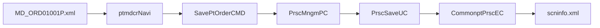
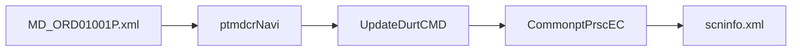

# MD_ORD01001P 실행 체인 복원

## 1. 문서 목적

이 문서는 `MD_ORD01001P` 화면의 대표 저장/DUR 경로를 실제 코드 기준으로 `화면 -> navigation -> CMD -> PC/UC -> EC -> query path -> xmlquery`까지 닫기 위한 참고 문서다.

범위는 다음 두 경로에 집중한다.

- `/md/ord/ptmdcrNavi/SavePtOrder.mhi`
- `/md/ord/ptmdcrNavi/UpdateDurt.mhi`

## 2. 왜 이 문서를 따로 두는가

`MD_ORD01001P`는 단순 조회 화면이 아니다.

- 처방 저장
- 규칙 점검
- DUR 점검
- DUR 이력 저장/변경
- 사유 미입력 보정

이 다섯 단계가 한 화면에서 이어진다. 그래서 상위 개요 문서만으로는 실제 동작이 잘 안 보인다.

또한 `LQueryMaker.html` 과 `class-use/LQueryMaker.html`을 같이 보면 다음 점이 분명해진다.

- `LQueryMaker.html`
  - `resolveSQL`, `resolveRawSQL`, `getQuery`, `getQueryArgument`, `getFetchSize`, `isSetMetadata` 같은 내부 SQL 준비 기능을 보여준다
- `class-use/LQueryMaker.html`
  - 공개 연결점이 사실상 `LCommonDao.getQueryMaker()`, `setQueryMaker(LQueryMaker)`뿐임을 보여준다

즉 `MD_ORD01001P`의 업무 소스는 `LQueryMaker`를 직접 호출하지 않지만, 실제 SQL 준비는 `LCommonDao` 내부의 `LQueryMaker`가 맡는 구조다.

## 3. 화면 레벨 확인값

- 화면 XML:
  - `NPH_HIS/webapp/ui/MD/ORD/MD_ORD01001P.xml`
- 대표 URL:
  - `/md/ord/ptmdcrNavi/SavePtOrder.mhi`
  - `/md/ord/ptmdcrNavi/UpdateDurt.mhi`
- 저장 시 입력 Dataset:
  - `ds_Ordr=ds_Ordr`
  - `ds_OrdrDur=ds_OrdrDur`
- 저장 시 출력 Dataset:
  - `ds_FirstDis=ds_FirstDis`
  - `ds_RuleResult=ds_RuleResult`
- DUR 보정 시 입력 Dataset:
  - `ds_OrdrDur=ds_OrdrDur`
  - `ds_FirstDis=ds_FirstDis`

해석:

- 이 화면은 저장과 동시에 DUR 결과를 다시 받아 후속 UI 분기를 탄다
- 즉 저장 API가 단순 `insert/update`가 아니라, 결과 Dataset까지 포함한 오케스트레이션 호출이다

## 4. navigation -> CMD

- navigation 파일:
  - `NPH_HIS/devonhome/navigation/mhi/md/ord/ptmdcrNavi.xml`
- action 매핑:
  - `SavePtOrder` -> `nph.his.md.ord.ptmdcr.cmd.SavePtOrderCMD`
  - `UpdateDurt` -> `nph.his.md.ord.ptmdcr.cmd.UpdateDurtCMD`

`SavePtOrderCMD`

- `TxServiceUtil.getTxService("md.ord.PrscMngmPC")`
- `prscMngmPC.savePtOrder(mData)`
- DUR 경로에서는 `prscMngmPC.savePtOrderDur(mDurData)`도 호출

`UpdateDurtCMD`

- `TxServiceUtil.getTxService("md.ord.ZzzPrscMngmPC")`
- 동시에 `CommonptPrscEC`를 직접 사용해
  - `saveDurt(...)`
  - `updateDurt(...)`
  - `updateDurChckDvsn(...)`
  을 수행하는 보정/정리 경로가 존재

## 5. PC / UC / EC 역할 분담

### 5.1 PC

`PrscMngmPC`

- 처방 저장 흐름의 상위 오케스트레이터
- `savePtOrder(...)`에서 `PrscSaveUC`로 위임
- 행상태(`CREATE/UPDATE/DELETE`) 분기와 공통 처방 EC 호출이 매우 많음

### 5.2 UC

`PrscSaveUC`

- `MD_ORD01001P`의 실제 저장 규칙을 많이 품고 있는 UC
- `registPrsc(...)`
  - 일반 처방 저장 경로
- `durPrsc(...)`
  - DUR 점검/규칙점검 연동 경로
- 소스 주석과 코드에서 `/md/ord/scninfo/retrieveRuleCheck`를 반복 참조

`PrscCheckDurUC`

- DUR 점검/재전송/사유 처리 보조 UC
- `retrieveDurSendCheck`
- `retrieveDurPidCheck`
- `saveDurt`
- `updateDurt`
- 소스 주석에 `UpdateDurtCMD를 참고해라...`가 직접 남아 있음

### 5.3 EC

`CommonptPrscEC`

이 화면에서 실제 query path로 내려가는 대표 메서드는 아래와 같다.

- `retrieveDurSendCheck(data)`
  - `/md/ord/scninfo/retrieveDurSendCheck`
- `retrieveDurPidCheck(data)`
  - `/md/ord/scninfo/retrieveDurPidCheck`
- `retrieveRuleCheck(data)`
  - `/md/ord/scninfo/retrieveRuleCheck`
- `saveDurt(data)`
  - `/md/ord/scninfo/saveDurt`
- `updateDurt(data)`
  - `/md/ord/scninfo/updateDurt`
- `retrievePrscList(data)`
  - `/md/ord/mdmdhtord/retrievePrscList`

## 6. query path -> xmlquery 매핑

### 6.1 DUR/규칙 점검 계열

xmlquery 파일:

- `NPH_HIS/devonhome/xmlquery/md/ord/scninfo.xml`

확인된 statement:

- `saveDurt`
- `updateDurt`
- `retrieveDurSendCheck`
- `retrieveDurPidCheck`
- `retrieveRuleCheck`

의미:

- `MD_ORD01001P` 저장 흐름의 핵심 후처리와 DUR 관련 query는 대부분 `scninfo.xml`에 모여 있다
- 즉 이 화면의 복잡도는 단순 처방 저장만이 아니라, `scninfo` 계열 rule/DUR query 집합을 같이 타기 때문에 커진다

### 6.2 처방 목록/기본 주문 계열

xmlquery 파일:

- `NPH_HIS/devonhome/xmlquery/md/ord/mdmdhtord.xml`

확인된 statement:

- `RetrievePtOrder`
- `RetrievePtOrderPreOtpt`
- `RetrievePtOrderStat`
- `RetrievePtOrderPreAutoCopy`
- `retrievePtOrderPreSbstCd`
- `retrievePrscList`
- `RetrievePtOrderDurgAcc`

의미:

- `MD_ORD01001P`는 DUR 후처리만 타는 화면이 아니라, 처방 본체 query도 별도 xmlquery 파일군으로 분산되어 있다
- 그래서 실제 유지보수 시 한 화면이라도 `ptmdcrNavi.xml`, `SavePtOrderCMD`, `PrscMngmPC`, `PrscSaveUC`, `CommonptPrscEC`, `scninfo.xml`, `mdmdhtord.xml`을 함께 봐야 한다

## 7. 조회 경로까지 확장해서 보면

저장/DUR 경로 외에 조회 계열도 같은 화면 안에 섞여 있다.

### 7.1 탭/사용자 액션 기준 조회 흐름

화면 XML과 스크립트 기준으로 보면 조회는 단순히 `fRetrievePtOrder()` 한 번으로 끝나지 않는다. 어느 탭을 보고 있는지, 어떤 그리드를 클릭했는지, 자동복사를 눌렀는지에 따라 서로 다른 조회 체인이 붙는다.

- 화면 오픈
  - `MD_ORD01001P_OnLoadCompleted`
  - 초기화 후 `fRetrievePtOrder(cal_OrdrYmd.Value)` 호출
  - 같은 구간에서 `fRetrieveMdbsMenv("O")`도 이어져 기본 처방/환경 데이터가 함께 로딩됨
- 환자 재바인드 또는 재조회
  - 환자 정보 갱신 후 `fRetrievePtDiag()` 다음에 `fRetrievePtOrder(gstrText)` 호출
  - 즉 환자 컨텍스트가 바뀌면 주문 조회도 다시 탄다
- 전처방 탭 `divSet.tab2.tab22`
  - 환자구분 라디오가 `O`이면 `fRetrieveOtptList()`, `fRetrieveOtptDeptList()` 후 `fRetrievePtOrderPre("", "O", "")`
  - 환자구분 라디오가 `I` 또는 `E`이면 `fRetrievePtAdmsDayList()` 후 입원/응급 목록 기준으로 전처방 조회 준비
- 전처방 목록 그리드 클릭
  - `grd_PreOrderO_OnCellClick` -> `fRetrievePtOrderPre(chosNo, "O", medDy)`
  - `grd_PreOrderI_OnCellClick` -> `fRetrievePtOrderPre(chosNo, "I", medDy)`
  - `grd_PreOrderE_OnCellClick` -> `fRetrievePtOrderPre(chosNo, "E", medDy)`
  - 같은 전처방 기능이라도 외래/입원/응급에 따라 다른 입력값으로 같은 조회 함수를 재사용한다
- 자동복사
  - 복사 조건에 따라 `fRetrievePtOrderPreAutoCopy(chosNo, medDvsn, prscDy, medDp)` 호출
  - 마지막 진료, 이전 처방, 복사 대상 데이터를 묶어서 가져오는 흐름이다
- 간호/수술 보조 액션
  - `div_OpNurse_btn_Cps_OnClick` -> `fRetrievePtOrderCPS(pid, prscDy)`
  - 별도 보조 조회지만 같은 화면 안에서 `ptmdcrNavi`를 통해 붙는다

정리하면 `MD_ORD01001P`는 단일 주문조회 화면이 아니라, 기본 주문조회 + 전처방 조회 + 자동복사 조회 + 보조 조회가 탭과 사용자 액션에 따라 갈라지는 복합 화면이다.

### 7.1A 사용자 시나리오로 다시 묶으면

같은 조회 함수라도 사용자가 보는 흐름으로 다시 묶으면 아래 5개 시나리오로 압축된다.

- 시나리오 1: 화면을 열고 오늘 처방을 본다
  - 시작점: `MD_ORD01001P_OnLoadCompleted`
  - 대표 호출: `fRetrievePtOrder(cal_OrdrYmd.Value)`
  - 의미: 현재 환자의 기본 주문/처방 상태를 먼저 깐다
- 시나리오 2: 환자를 바꾸거나 다시 선택한다
  - 시작점: 환자 컨텍스트 재설정 후 `fRetrievePtDiag()` -> `fRetrievePtOrder(gstrText)`
  - 의미: 진단과 주문을 한 묶음으로 다시 맞춘다
- 시나리오 3: 전처방 탭에서 예전 처방을 끌어온다
  - 시작점: `divSet.tab2.tab22`
  - 대표 호출: `fRetrievePtOrderPre(...)`
  - 세부 분기: 외래 `O`, 입원 `I`, 응급 `E`
  - 의미: 동일 기능처럼 보이지만 실제로는 환자구분에 따라 입력값과 조회 대상이 달라진다
- 시나리오 4: 전처방 자동복사를 쓴다
  - 시작점: 자동복사 버튼/복사 흐름
  - 대표 호출: `fRetrievePtOrderPreAutoCopy(...)`
  - 의미: 마지막 진료, 이전 처방, 복사 대상 비교를 위해 더 많은 조건 조회가 붙는다
- 시나리오 5: 보조 간호/수술 조회를 연다
  - 시작점: `div_OpNurse_btn_Cps_OnClick`
  - 대표 호출: `fRetrievePtOrderCPS(pid, prscDy)`
  - 의미: 본 처방 흐름 밖의 보조 조회도 같은 navigation 체계 안에 얹혀 있다

이렇게 보면 `MD_ORD01001P`의 문제는 조회 함수 개수가 많다는 것보다, 서로 성격이 다른 사용자 시나리오가 한 화면 안에 과도하게 겹쳐 있다는 점에 있다.
### 7.1B UI 기준 고정 매핑표

| UI 명칭 | 함수 | mhi | command | PC | UC | EC | xmlquery |
|------|------|-----|---------|----|----|----|----------|
| 화면 로드 | `MD_ORD01001P_OnLoadCompleted` -> `fRetrievePtOrder(cal_OrdrYmd.Value)` | `/md/ord/ptmdcrNavi/RetrievePtOrder.mhi` | `RetrievePtOrderCMD` | `PrscMngmPC.retrievePtOrder` | `-` | `CommonptPrscEC.retrievePtOrder` | `mdmdhtord.xml / RetrievePtOrder` |
| 환자 재조회 | `fRetrievePtOrder(gstrText)` | `/md/ord/ptmdcrNavi/RetrievePtOrder.mhi` | `RetrievePtOrderCMD` | `PrscMngmPC.retrievePtOrder` | `-` | `CommonptPrscEC.retrievePtOrder` | `mdmdhtord.xml / RetrievePtOrder` |
| 전처방 탭 외래 선택 | `divSet_tab2_tab22_rdo_PtntDvsn_OnClick` -> `fRetrievePtOrderPre("", "O", "")` | `/md/ord/ptmdcrNavi/RetrievePtOrderPre.mhi` | `RetrievePtOrderPreCMD` | `PrscMngmPC.retrievePtOrderPreOtpt` | `-` | `CommonptPrscEC.retrievePtOrderPreOtpt` | `mdmdhtord.xml / RetrievePtOrderPreOtpt` |
| 전처방 탭 입원 선택 | `divSet_tab2_tab22_rdo_PtntDvsn_OnClick` + 입원 목록 준비 | `/md/ord/ptmdcrNavi/RetrievePtOrderPre.mhi` | `RetrievePtOrderPreCMD` | `PrscMngmPC.retrievePtOrder` | `-` | `CommonptPrscEC.retrievePtOrder` | `mdmdhtord.xml / RetrievePtOrder` |
| 전처방 탭 응급 선택 | `divSet_tab2_tab22_rdo_PtntDvsn_OnClick` + 응급 목록 준비 | `/md/ord/ptmdcrNavi/RetrievePtOrderPre.mhi` | `RetrievePtOrderPreCMD` | `PrscMngmPC.retrievePtOrder` | `-` | `CommonptPrscEC.retrievePtOrder` | `mdmdhtord.xml / RetrievePtOrder` |
| 전처방 외래 목록 클릭 | `divSet_tab2_tab22_grd_PreOrderO_OnCellClick` -> `fRetrievePtOrderPre(chosNo, "O", medDy)` | `/md/ord/ptmdcrNavi/RetrievePtOrderPre.mhi` | `RetrievePtOrderPreCMD` | `PrscMngmPC.retrievePtOrderPreOtpt` | `-` | `CommonptPrscEC.retrievePtOrderPreOtpt` | `mdmdhtord.xml / RetrievePtOrderPreOtpt` |
| 전처방 입원 목록 클릭 | `divSet_tab2_tab22_grd_PreOrderI_OnCellClick` -> `fRetrievePtOrderPre(chosNo, "I", medDy)` | `/md/ord/ptmdcrNavi/RetrievePtOrderPre.mhi` | `RetrievePtOrderPreCMD` | `PrscMngmPC.retrievePtOrder` | `-` | `CommonptPrscEC.retrievePtOrder` | `mdmdhtord.xml / RetrievePtOrder` |
| 전처방 응급 목록 클릭 | `divSet_tab2_tab22_grd_PreOrderE_OnCellClick` -> `fRetrievePtOrderPre(chosNo, "E", medDy)` | `/md/ord/ptmdcrNavi/RetrievePtOrderPre.mhi` | `RetrievePtOrderPreCMD` | `PrscMngmPC.retrievePtOrder` | `-` | `CommonptPrscEC.retrievePtOrder` | `mdmdhtord.xml / RetrievePtOrder` |
| 전처방 자동복사 | `fRetrievePtOrderPreAutoCopy(...)` | `/md/ord/ptmdcrNavi/RetrievePtOrderPreAutoCopy.mhi` | `RetrievePtOrderPreAutoCopyCMD` | `PrscMngmPC.retrievePtOrderPreAutoCopy` | `-` | `CommonptPrscEC.retrieveLastMed` + `retrievePtOrderPreAutoCopy` | `mdmdhtord.xml / retrieveLastMed + RetrievePtOrderPreAutoCopy` |
| CPS 보조 조회 버튼 | `div_OpNurse_btn_Cps_OnClick` -> `fRetrievePtOrderCPS(pid, prscDy)` | `/md/ord/ptmdcrNavi/RetrievePtOrderCPS.mhi` | `RetrievePtOrderCPSCMD` | `PrscMngmPC.retrievePtOrderCps` | `-` | `CommonptPrscEC.retrievePtOrderCps` | `mdmohcmcf.xml / RetrievePtOrderCps` |
| 전처방 저장 | `fSaveOrderPre()` | `/md/ord/ptmdcrNavi/SavePtOrderPre.mhi` | `SavePtOrderPreCMD` | `PrscMngmPC.retrieveInterestClass` + `savePtOrder` | `PrscSaveUC.registPrsc` | `PrscSETInfoEC.retrieveInterestClass` + `CommonptPrscEC.registPtOrder / updatePtOrder / updatePtOrderDc / updatePtOrderDel` | `azcmmcmcd.xml / retrieveInterestClass` + `mdmdhtord.xml / registPtOrder / updatePtOrder / updatePtOrderDc / updatePtOrderDel` |

이 표의 목적은 함수를 더 나열하는 데 있지 않다. 실제 유지보수 시 `버튼/탭/그리드 하나를 건드릴 때 어느 PC/UC/EC와 xmlquery까지 내려가나`를 바로 찾게 만드는 데 있다.
### 7.2 주요 조회 함수

화면 XML 기준으로 확인되는 대표 조회 진입은 아래와 같다.

- `MD_ORD01001P_OnLoadCompleted`
  - 초기화 후 `fRetrievePtOrder(cal_OrdrYmd.Value)` 호출 경로 존재
- `fRetrievePtOrder(sprscDy)`
  - 외래/입원 조건에 따라 실제 조회 함수로 분기
- `fRetrievePtOrderO(chosNo, medDvsn, pracDy)`
  - `/md/ord/ptmdcrNavi/RetrievePtOrder.mhi`
- `fRetrievePtOrderPre(chosNo, medDvsn, prscDy)`
  - `/md/ord/ptmdcrNavi/RetrievePtOrderPre.mhi`
- `fRetrievePtOrderPreAutoCopy(chosNo, medDvsn, prscDy, medDp)`
  - `/md/ord/ptmdcrNavi/RetrievePtOrderPreAutoCopy.mhi`
- `fRetrievePtOrderCPS(pid, prscDy)`
  - `/md/ord/ptmdcrNavi/RetrievePtOrderCPS.mhi`
- `fSaveOrderPre()`
  - `/md/ord/ptmdcrNavi/SavePtOrderPre.mhi`

즉 이 화면은 로딩 직후부터 이미 조회 chain이 깊게 시작된다. 저장 버튼을 누를 때만 복잡한 구조가 드러나는 것이 아니다.

### 7.3 URL -> query path 매핑

`CommonptPrscEC` 기준 대표 조회 메서드와 statement는 아래와 같다.

- `retrievePtOrder(data)`
  - query path: `/md/ord/mdmdhtord/RetrievePtOrder`
  - xmlquery: `mdmdhtord.xml`
  - statement: `RetrievePtOrder`
- `retrievePtOrderDrugAcc(data)`
  - query path: `/md/ord/mdmdhtord/RetrievePtOrderDurgAcc`
  - xmlquery: `mdmdhtord.xml`
  - statement: `RetrievePtOrderDurgAcc`
- `retrievePtOrderPreOtpt(data)`
  - query path: `/md/ord/mdmdhtord/RetrievePtOrderPreOtpt`
  - xmlquery: `mdmdhtord.xml`
  - statement: `RetrievePtOrderPreOtpt`
- `retrievePtOrderStat(data)`
  - query path: `/md/ord/mdmdhtord/RetrievePtOrderStat`
  - xmlquery: `mdmdhtord.xml`
  - statement: `RetrievePtOrderStat`
- `retrievePtOrderPreAutoCopy(data)`
  - query path: `/md/ord/mdmdhtord/RetrievePtOrderPreAutoCopy`
  - xmlquery: `mdmdhtord.xml`
  - statement: `RetrievePtOrderPreAutoCopy`
- `retrievePtOrderPreSbstCd(data)`
  - query path: `/md/ord/mdmdhtord/retrievePtOrderPreSbstCd`
  - xmlquery: `mdmdhtord.xml`
  - statement: `retrievePtOrderPreSbstCd`
- `retrievePrscList(data)`
  - query path: `/md/ord/mdmdhtord/retrievePrscList`
  - xmlquery: `mdmdhtord.xml`
  - statement: `retrievePrscList`

해석:

- `MD_ORD01001P`는 저장 팝업처럼 보이지만, 실제로는 조회 query 묶음과 저장/DUR query 묶음을 함께 가진 복합 화면이다
- 초기 로딩에서 `RetrievePtOrder`
- 전처방 조회에서 `RetrievePtOrderPreOtpt`
- 전처방 자동복사에서 `RetrievePtOrderPreAutoCopy`
- CPS 보조 조회에서 `RetrievePtOrderCPS`
- 저장 이후에는 `saveDurt`, `updateDurt`, `retrieveRuleCheck`이 연속으로 등장한다
- 즉 이 화면은 `저장 전 조회`, `저장`, `저장 후 점검`, `보정`이 한곳에 겹쳐 있다

## 8. 실행 체인 요약

보정 경로는 아래처럼 별도로 존재한다.

## 9. 왜 이런 구조가 필요했을 가능성이 큰가

이 화면은 단순 CRUD 화면이 아니다.

- 저장 직후 규칙 점검 결과를 다시 받아야 하고
- DUR 경고/사유/재전송/취소 처리까지 이어지며
- 일부 경로는 보정 command로 따로 빠진다

즉 당시 설계자는 화면 스크립트와 command를 얇게 유지하고,
복잡한 저장 규칙과 후처리를 `PC/UC/EC/xmlquery` 쪽으로 밀어 넣으려 했던 것으로 보인다.

이 선택이 지금은 추적 비용을 크게 만들지만, 당시에는 아래를 동시에 풀기 위한 타협이었을 가능성이 높다.

- MiPlatform Dataset 기반 화면
- 대형 처방 저장 흐름
- DUR/규칙 점검 연동
- DB query 외부화
- 공통 트랜잭션 표면화

## 10. 결론

`MD_ORD01001P`는 `LCommonDao/LQueryMaker` 때문에만 어려운 화면이 아니다.

더 정확히는:

- 화면 자체가 매우 크고
- 저장 이후 후처리 체인이 길며
- DUR 계열 query가 별도 xmlquery 집합으로 분리돼 있고
- 보정 경로까지 따로 존재한다

그래서 이 화면은 프레임워크의 단점이 가장 잘 드러나는 사례이면서도,
반대로 왜 당시 개발자가 얇은 화면 + 두꺼운 PC/UC/EC 구조를 택했는지도 같이 보여주는 사례다.

