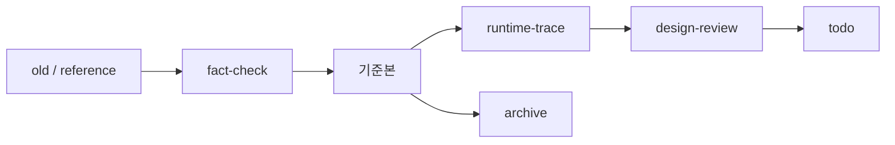

# 03.analysis_results 운영 규칙

## 1. 목적

이 문서는 `03.analysis_results` 전체에 공통 적용할 문서 운영 규칙을 정리한 기준 문서다.

이 폴더는 단순 산출물 저장소가 아니라 다음 목적을 가진 분석 지식베이스로 본다.

- 번호 체계로 depth와 분류가 보이는 구조 유지
- 기준본과 과거 원본을 분리해 정보 손실 방지
- 사실, 해석, 미확인 항목을 섞지 않는 문서 운영
- 후속 작업자가 읽는 순서를 바로 따라갈 수 있는 탐색 구조 유지

## 2. 기본 원칙

1. 기존 조사 결과를 버리지 않는다.
2. 새 기준본은 old 위에 덮어쓰지 않고 분리한다.
3. 미확인 정보는 확정 문장으로 쓰지 않는다.
4. 문서는 읽는 순서를 가져야 한다.
5. 번호는 구조를 설명해야 한다.

## 3. 폴더 번호 규칙

### 3.1 depth 표현

- 번호는 폴더 depth를 드러내는 수단으로 사용한다.
- 예:
  - `03`
  - `031`
  - `0310 ~ 0319`

즉 숫자만 봐도 대략 어떤 레벨의 문서인지 읽혀야 한다.

### 3.2 하위 폴더 규칙

- 하위 폴더는 `4자리 번호`만 사용한다.
- 예: `0310.index`, `0311.overview`
- 같은 레벨에서는 `...0 ~ ...9` 식으로 배치한다.

### 3.3 파일 번호 규칙

- 폴더 안 파일은 별도 번호를 써도 된다.
- 예:
  - `01.Framework-개요.md`
  - `02.Command-Navigation-Dispatch.md`
- 파일 번호는 폴더 번호와 독립적으로 관리한다.

## 4. 문서 상태 규칙

### 4.1 기준본

- 루트 번호 폴더(`0311~0318` 등)에 있는 문서는 현재 기준본이다.
- 실사용자는 먼저 기준본을 읽는다.
- 설명, 탐색, 설계평가, todo, fact-check는 기준본 체계 안에서 관리한다.

### 4.2 old

- `old/`는 재구성 이전 문서 또는 과거 조사본을 구조 유지 상태로 보존하는 공간이다.
- old 문서는 삭제하지 않는다.
- 다만 기본 읽기 경로에서는 기준본보다 뒤에 둔다.

### 4.3 archive

- `0319.archive`는 재구성 이후 생긴 보존본, 이전판, 초안을 보관하는 공간이다.
- 기준본이 교체되더라도 바로 삭제하지 않고 archive로 보낸다.

## 5. 문서 유형 규칙

### 5.1 index

- 전체 목차, 문서맵, 용어집을 둔다.
- 처음 들어온 사람이 여기서 출발할 수 있어야 한다.

### 5.2 overview

- 큰 구조 설명 문서
- 개념 설명과 읽는 순서 정리에 집중한다.

### 5.3 front-channel

- Servlet, Navigation, Command, Interceptor, ServiceProxy, MiPlatform 같은 요청 처리 구조를 다룬다.

### 5.4 data-access

- LCommonDao, LQueryMaker, XML Query, JDBC, Pool, TX 같은 DB 접근 구조를 다룬다.

### 5.5 runtime-trace

- 실제 화면/업무 기준 실행체인을 다룬다.
- 개념 문서가 아니라 추적 문서다.
- 가능하면 템플릿을 맞춰 재사용한다.

### 5.6 design-review

- 구조 평가, 기술부채, 단순화 방향을 다룬다.
- 감정적 평가 대신 근거 기반으로 쓴다.

### 5.7 reference

- jar, API 문서, 설정 파일 등 근거 확인용 문서를 둔다.
- 본문 설명보다 증거 확인에 집중한다.

### 5.8 fact-check

- 확정 사실
- 미확인 사실
- 오해하기 쉬운 표현

을 구분해 적는다.

### 5.9 todo

- 아직 닫히지 않은 항목만 적는다.
- 새 추측을 늘리는 공간이 아니라, 후속 조사 목록을 관리하는 공간이다.

## 6. 문장 규칙

### 6.1 확정 문장

코드, 설정, jar, API 문서 등으로 직접 확인한 내용만 확정 문장으로 쓴다.

예:
- `LCommonDao는 NPH 업무 코드에서 광범위하게 사용된다.`
- `LQueryMaker는 devon-framework.jar와 API 문서에서 실존이 확인된다.`

### 6.2 미확정 문장

직접 확인이 부족하면 반드시 아래 표현을 쓴다.

- `미확인`
- `추정`
- `가능성`
- `현재 기준으로는 ... 해석이 가장 안전하다`

### 6.3 피해야 할 표현

- 근거 없이 단정하는 문장
- 감정적 평가를 사실처럼 쓰는 문장
- old 문서의 과거 추정을 현재 사실처럼 재사용하는 문장

## 7. 링크 규칙

1. 각 문서는 가능하면 상위/하위 문서로 이동하는 링크를 가진다.
2. 개요 문서는 다음에 읽을 문서를 안내해야 한다.
3. 추적 문서는 다시 개요, data-access, design-review로 올라가는 링크를 가져야 한다.
4. 용어집이 필요한 문서는 서두에 용어집 링크를 둔다.

## 8. 용어집 규칙

- 약어와 클래스명은 `0310.index/약어-용어집`에 모은다.
- 정리 방식은 다음 두 축을 같이 쓴다.
  - 구획 순
  - 빠른 찾기용 약어 순
- 대표 화면, 대표 command, 대표 PC, 대표 EC, 대표 xmlquery 파일군도 같이 관리한다.

## 9. runtime-trace 규칙

trace 문서는 가능하면 아래 템플릿을 따른다.

1. 목적
2. 상위 구조에서 이 문서를 읽는 위치
3. 대표 진입 경로
4. command / PC / UC / EC
5. query path -> xmlquery
6. 해석
7. 다시 올라갈 문서

즉 trace 문서는 단순 설명문이 아니라, 실제 추적 경로를 닫는 문서여야 한다.

## 10. 기준본 갱신 규칙

1. 먼저 old/reference/fact-check로 근거를 확인한다.
2. 확정 가능한 내용만 기준본으로 올린다.
3. 미확인 항목은 todo나 fact-check에 남긴다.
4. 기준본을 크게 수정할 때는 가능하면 백업 또는 이전판을 남긴다.

## 11. 추천 운영 흐름

## 12. 최종 목표

`03.analysis_results`는 아래 상태를 목표로 운영한다.

- 번호만 봐도 구조가 읽힌다.
- README만 봐도 읽는 순서가 보인다.
- old는 보존되지만 기준본과 섞이지 않는다.
- 사실과 추정이 구분된다.
- 새 분석을 추가해도 같은 템플릿으로 확장할 수 있다.
