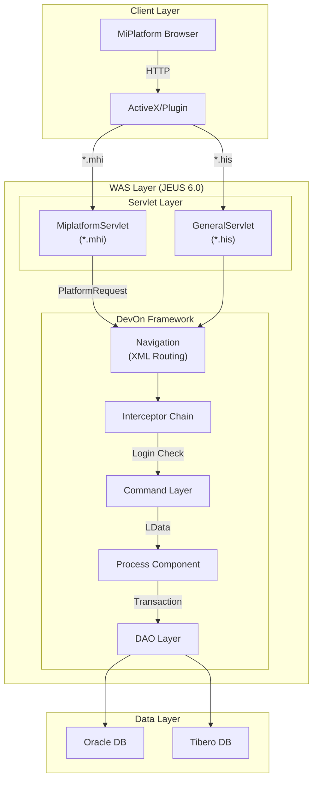
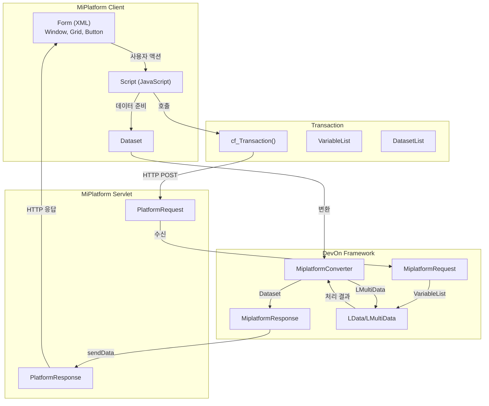
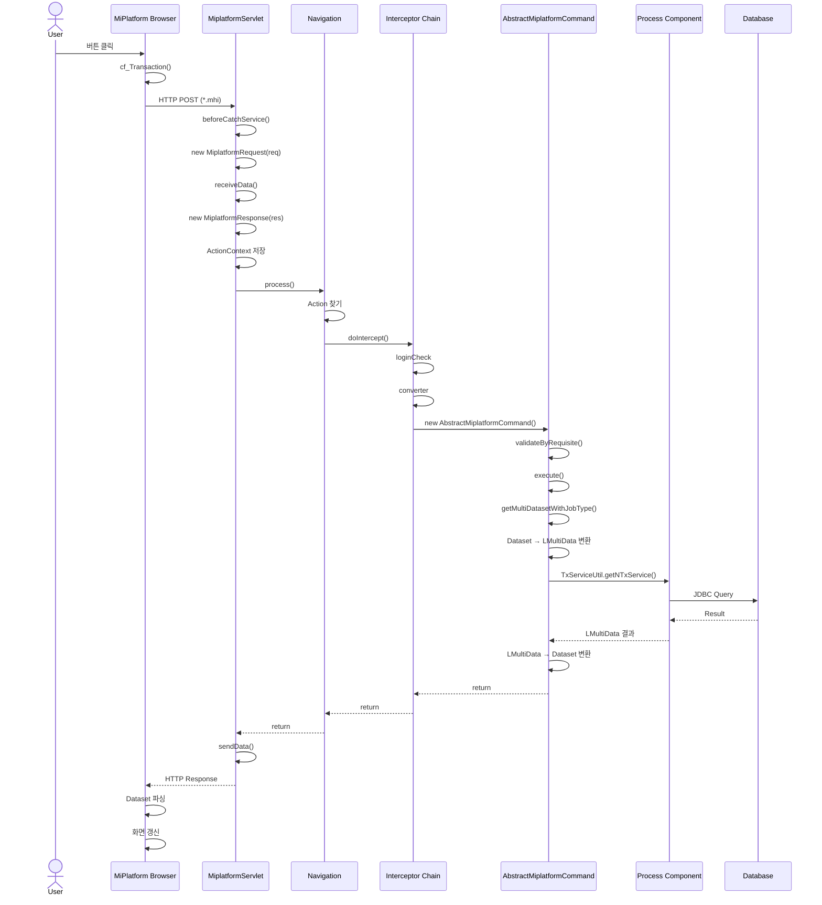
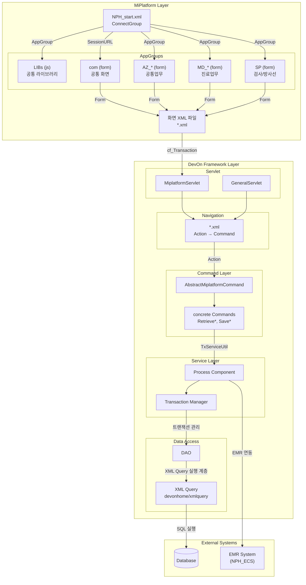

# NPH 프로젝트 상세 분석 보고서

> MiPlatform 매뉴얼 기준 구조 분석 + DevOn Framework 실행 플로우

---

## 목차

1. [시스템 아키텍처](#1-시스템-아키텍처)
2. [MiPlatform 구조 분석](#2-miplatform-구조-분석)
3. [DevOn Framework 실행 플로우](#3-devon-framework-실행-플로우)
4. [컴포넌트 구조](#4-컴포넌트-구조)
5. [데이터 변환 상세](#5-데이터-변환-상세)
6. [Appendix: 다이어그램 목록](#appendix-다이어그램-목록)

---

## 1. 시스템 아키텍처

### 1.1 전체 시스템 구성도



### 1.2 아키텍처 설명

| 계층 | 구성요소 | 역할 |
|------|----------|------|
| **Client** | MiPlatform Browser | UI 렌더링, ActiveX 기반 Windows 전용 |
| **WAS** | JEUS 6.0 | 티맥스소프트 애플리케이션 서버 |
| **Servlet** | MiplatformServlet | MiPlatform 요청 처리 |
| **Framework** | DevOn | LG CNS 엔터프라이즈 프레임워크 |
| **Data** | Oracle/Tibero | 의료 데이터 저장 |

---

## 2. MiPlatform 구조 분석

### 2.1 MiPlatform 실행 플로우



### 2.2 매뉴얼 vs 실제 프로젝트 매핑

| 매뉴얼 개념 | 실제 경로 | 비고 |
|-------------|-----------|------|
| AppGroup | `/webapp/ui/NPH_start.xml` | Prefix, Type, BaseUrl |
| Form | `/webapp/ui/{업무}/{화면}.xml` | AZ_COM99005M.xml |
| Dataset | Form 내 `<Datasets>` | ds_PtInfo 등 |
| StartXML | `NPH_start.xml` | SessionURL 설정 |
| LIBs | `/webapp/ui/LIBs/` | 공통 JavaScript |

### 2.3 AppGroup 구조

**NPH_start.xml 구조:**
```xml
<ConnectGroup Title="경찰병원의료정보시스템"
              SessionURL="com::Login3.xml"
              width="1280" height="986">

    <container Version="1000">
        <Component Id="Grid" Name="cyGrid" Module="CyGrid"/>
        <Component Id="Button" Name="cyButton" Module="CyButton"/>
    </container>

    <protocols>
        <protocol id="http" name="cyHttpAdp"
                  Compress="True" CompressMethod="ZLIB"/>
    </protocols>

    <AppGroups>
        <AppGroup Prefix="LIBs" Type="js" Baseurl="LIBs/"/>
        <AppGroup Prefix="com" Type="form" Baseurl="com/"/>
        <AppGroup Prefix="AZ_COM" Type="form" Baseurl="AZ/COM/"/>
        <AppGroup Prefix="MD_OPN" Type="form" Baseurl="MD/OPN/"/>
        <AppGroup Prefix="SP" Type="form" Baseurl="SP/"/>
    </AppGroups>
</ConnectGroup>
```

| Prefix | Type | BaseUrl | 용도 |
|--------|------|---------|------|
| LIBs | js | LIBs/ | 공통 JavaScript |
| com | form | com/ | 공통 화면 |
| AZ_COM | form | AZ/COM/ | 공통업무 |
| MD_OPN | form | MD/OPN/ | 외래진료 |
| SP | form | SP/ | 검사/방사선 |

### 2.4 Form XML 구조

**화면 파일 구조 (예: Login3.xml):**
```xml
<?xml version="1.0" encoding="utf-8"?>
<Window>
    <Form Height="802" Id="Login3" Title="로그인"
          OnLoadCompleted="Form_OnLoadCompleted">

        <!-- 1. Dataset 정의 -->
        <Datasets>
            <Dataset Id="ds_UserInfo" UseClientLayout="1">
                <colinfo id="usId" type="STRING"/>
                <colinfo id="usNm" type="STRING"/>
            </Dataset>
        </Datasets>

        <!-- 2. UI 컴포넌트 -->
        <Edit Id="ED_UserID" OnKeyDown="ED_UserID_OnKeyDown"/>
        <Edit Id="ED_Password" Password="TRUE"/>
        <Button Id="btn_Login" OnClick="btn_Login_OnClick" Text="로그인"/>
        <Grid Id="Grid0" BindDataset="ds_UserInfo"/>

        <!-- 3. 스크립트 -->
        <Script><![CDATA[
            function Form_OnLoadCompleted(obj) {
                // 초기화 로직
            }

            function btn_Login_OnClick(obj) {
                var params = "usid=" + ED_UserID.Value;
                Transaction("CheckUserInfo",
                    "NPHSE::/az/bizcom/authNavi/LoginUser.mhi",
                    "", "ds_UserInfo=ds_UserInfo", params, "LoginCallback");
            }
        ]]></Script>
    </Form>
</Window>
```

---

## 3. DevOn Framework 실행 플로우

### 3.1 전체 실행 시퀀스



### 3.2 플로우 단계별 상세

#### 단계 1: HTTP Request 수신
```java
// web.xml
<servlet-mapping>
    <servlet-name>MiPlatformChannelServlet</servlet-name>
    <url-pattern>*.mhi</url-pattern>
</servlet-mapping>

// URL 패턴: /az/bizcom/cmcdNavi/SaveDetail.mhi
// → az/bizcom/cmcdNavi.xml의 SaveDetail Action
```

#### 단계 2: Request/Response 초기화
```java
// MiplatformServlet.java
protected void beforeCatchService() {
    // 1. HTTP 요청/응답 객체 획득
    HttpServletRequest req = LActionContext.getHttpServletRequest();
    HttpServletResponse res = LActionContext.getHttpServletResponse();

    // 2. MiplatformRequest 생성 (데이터 수신)
    MiplatformRequest platformReq = new MiplatformRequest(req);
    platformReq.receiveData();  // PlatformRequest.receiveData()

    // 3. MiplatformResponse 생성 (응답 준비)
    MiplatformResponse platformRes = new MiplatformResponse(res,
        PlatformRequest.XML, "utf-8");

    // 4. ActionContext에 저장 (ThreadLocal)
    LActionContext.set(MiplatformConstants.MIPLATFORM_REQUEST, platformReq);
    LActionContext.set(MiplatformConstants.MIPLATFORM_RESPONSE, platformRes);
}
```

#### 단계 3: Navigation 라우팅
```xml
<!-- devonhome/navigation/his/az/comnNavi.xml -->
<navigation>
    <action name="SavePbhlCd">
        <command>nph.his.az.bizcom.cmcd.cmd.SavePbhlCdCMD</command>
        <interceptor>defaultStack</interceptor>
    </action>
</navigation>
```

#### 단계 4: Interceptor Chain
```xml
<!-- devon-framework.xml -->
<interceptor-stack name="defaultStack">
    <interceptor-ref name="loginCheck"/>
    <interceptor-ref name="converter"/>
    <interceptor-ref name="command"/>
</interceptor-stack>
```

| Interceptor | 역할 |
|-------------|------|
| loginCheck | 로그인 세션 유효성 검증 |
| converter | 데이터 형식 변환 |
| command | Command 실행 |

#### 단계 5: Command 실행
```java
// AbstractMiplatformCommand.java
public AbstractMiplatformCommand() {
    // 1. Request/Response 획득
    platformRequest = (MiplatformRequest) LActionContext.get(
        MiplatformConstants.MIPLATFORM_REQUEST);
    platformResponse = (MiplatformResponse) LActionContext.get(
        MiplatformConstants.MIPLATFORM_RESPONSE);

    // 2. 파라미터 데이터 추출
    data = platformRequest.getParamData();

    // 3. Requisite 유효성 검증
    validateByRequisite(data);

    // 4. 개인정보 로깅
    logWrite();
}

// execute() 메소드 (구체적 Command에서 구현)
public void execute() {
    // Input Dataset 변환
    LMultiData input = getMultiDatasetWithJobType("ds_Input");

    // PC 호출
    LMultiData result = PC.retrieveXxxList(input);

    // Output Dataset 추가
    platformResponse.addDataset("ds_Result", result);
}
```

#### 단계 6: Transaction 처리
```java
// AbstractDevonTransactionUsingJob.java
private void transactionInitiate() throws Exception {
    transactionManager = new DevonTransactoinManager(transaction);
    transactionManager.begin();
}

public void afterExecute(JobContext context) throws Exception {
    if (context.getErrorCount(this) == 0) {
        transactionManager.commit();
    } else {
        transactionManager.rollback();
    }
    transactionManager.release();
}
```

---

## 4. 컴포넌트 구조

### 4.1 전체 컴포넌트 다이어그램



### 4.2 주요 클래스 목록

| 클래스 | 파일 경로 | 역할 |
|--------|-----------|------|
| MiplatformServlet | COMMON/src/devonx/nph/system/servlet/MiplatformServlet.java | MiPlatform 요청 처리 |
| MiplatformRequest | COMMON/src/devonx/nph/miplatform/MiplatformRequest.java | 요청 데이터 파싱 |
| MiplatformResponse | COMMON/src/devonx/nph/miplatform/MiplatformResponse.java | 응답 데이터 구성 |
| MiplatformConverter | COMMON/src/devonx/nph/miplatform/MiplatformConverter.java | Dataset ↔ LData 변환 |
| AbstractMiplatformCommand | COMMON/src/devonx/nph/system/cmd/AbstractMiplatformCommand.java | Command 기본 클래스 |

---

## 5. 데이터 변환 상세

### 5.1 Dataset → LMultiData 변환 (with JobType)

```java
// MiplatformConverter.java
public static LMultiData convertToLMultiDataWithJobType(Dataset ds, Dataset sessionDs) {
    LMultiData mData = new LMultiData("convertedMultiData");

    int count = ds.getRowCount();
    for (int rowIdx = 0; rowIdx < count; rowIdx++) {
        // 1. 행 상태 확인
        String rowType = ds.getRowStatus(rowIdx);
        String jobType = "";

        // 2. CUD 상태에 따른 JobType 설정
        if (rowType.equalsIgnoreCase("INSERT")) {
            jobType = "C";  // Create
        } else if (rowType.equalsIgnoreCase("UPDATE")) {
            jobType = "U";  // Update
        }

        // 3. JobType 추가
        mData.add("_CUD", jobType);

        // 4. 행 데이터 추가
        setMultiDataset(ds, rowIdx, mData, isOrder, usid);
    }

    // 5. 삭제된 행 처리
    int delCount = ds.getDeleteRowCount();
    for (int rowIdx = 0; rowIdx < delCount; rowIdx++) {
        mData.add("_CUD", "D");  // Delete
        setDeleteMultiDataset(ds, rowIdx, mData);
    }

    return mData;
}
```

### 5.2 LMultiData → Dataset 변환

```java
// MiplatformConverter.java
public static Dataset convertToDataset(LMultiData mData) {
    Dataset ds = new Dataset();

    if (mData != null) {
        // 1. 메타데이터 추출
        LMetaData metaData = mData.getMetaData();

        // 2. 컬럼 정의 생성
        convertToDataset(metaData, mData, ds);
    }

    return ds;
}

private static void convertToDataset(LMetaData metaData,
                                       LMultiData mData,
                                       Dataset ds) {
    int dataCount = mData.getDataCount();

    // 각 행 변환
    for (int i = 0; i < dataCount; i++) {
        int row = ds.appendRow();
        LData data = mData.getLData(i);

        // 컬럼별 데이터 설정
        for (String colId : data.getKeys()) {
            ds.setColumn(row, colId, data.getString(colId));
        }
    }
}
```

### 5.3 데이터 타입 매핑

| MiPlatform Dataset | DevOn LData | SQL Type |
|-------------------|-------------|----------|
| STRING | String | VARCHAR, CHAR |
| INT | int | INTEGER |
| DECIMAL | BigDecimal | NUMERIC, DECIMAL |
| DATE | Date | DATE, TIMESTAMP |
| BLOB | byte[] | BLOB, CLOB |

---

## Appendix: 다이어그램 목록

| 파일명 | 설명 |
|--------|------|
| `system-architecture.mmd` | 전체 시스템 아키텍처 |
| `miplatform-flow.mmd` | MiPlatform 실행 플로우 |
| `devon-execution-flow.mmd` | DevOn 시퀀스 다이어그램 |
| `component-structure.mmd` | 컴포넌트 구조도 |

---

*본 보고서는 MiPlatform 매뉴얼과 실제 소스코드를 기반으로 작성되었습니다.*
