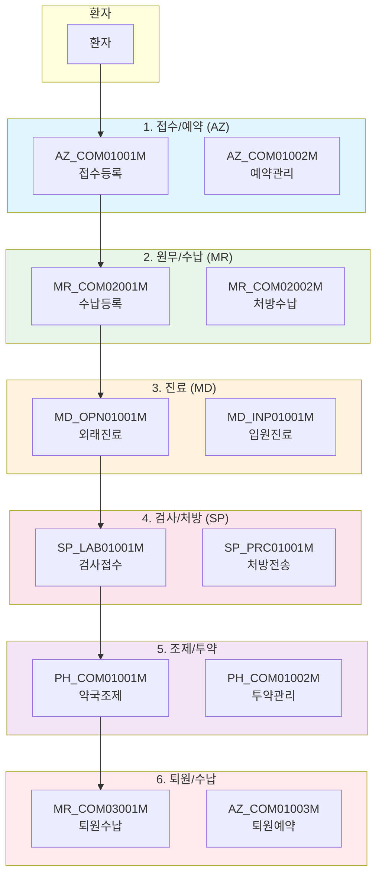
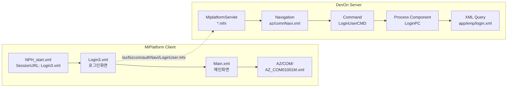
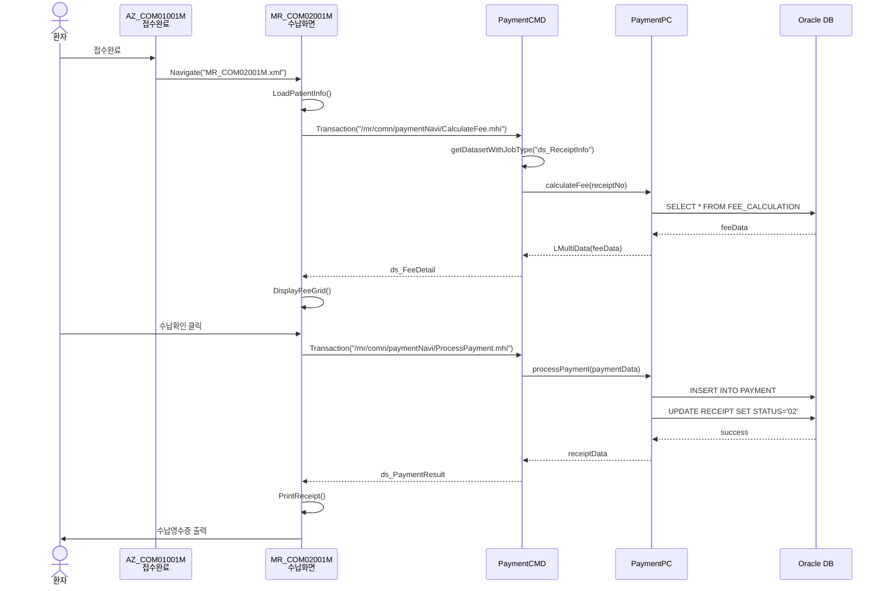
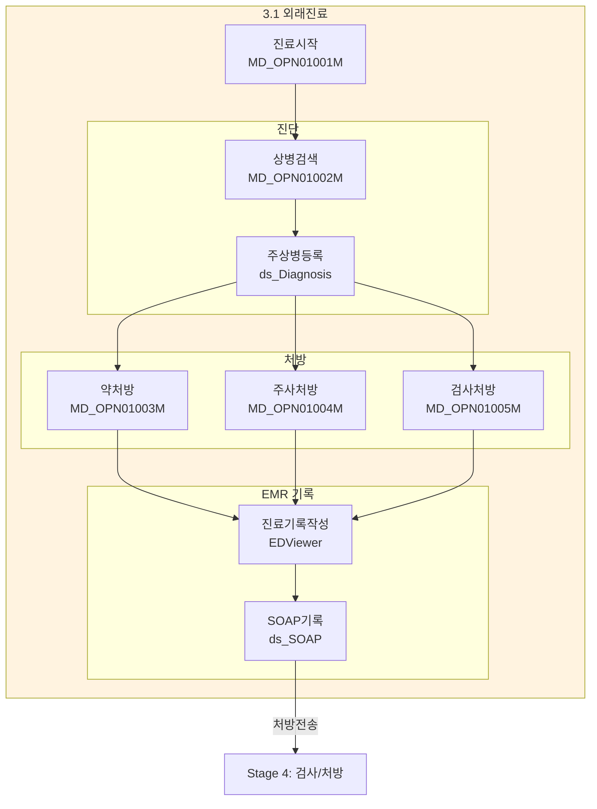
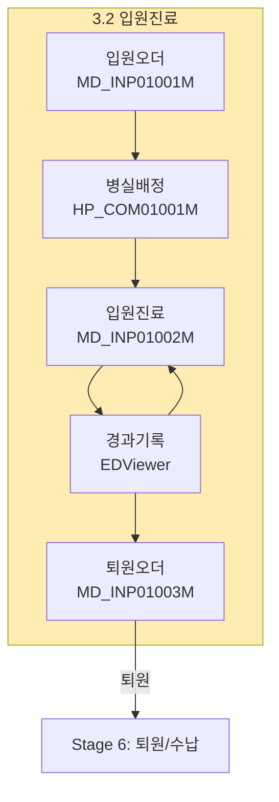
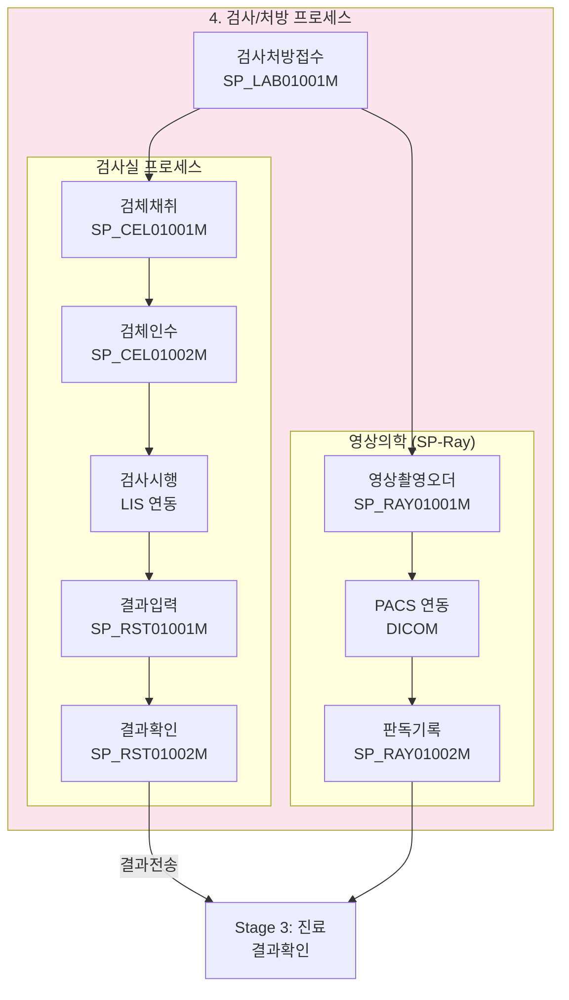
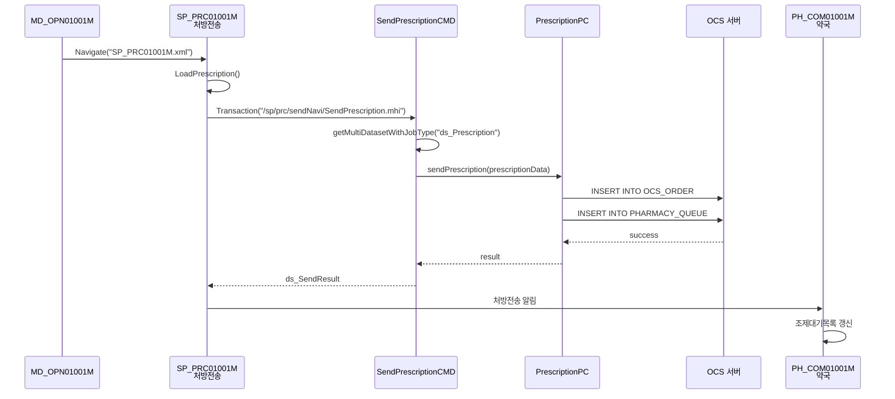
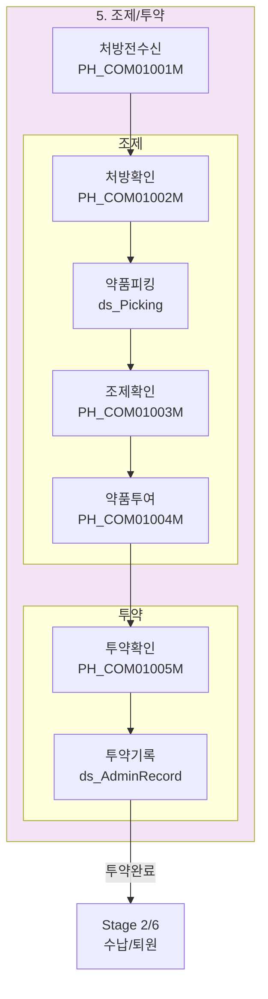
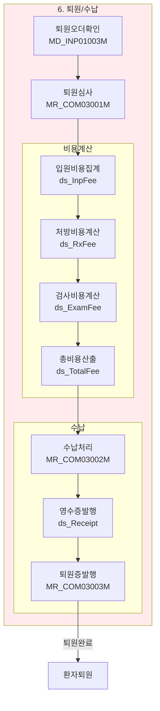
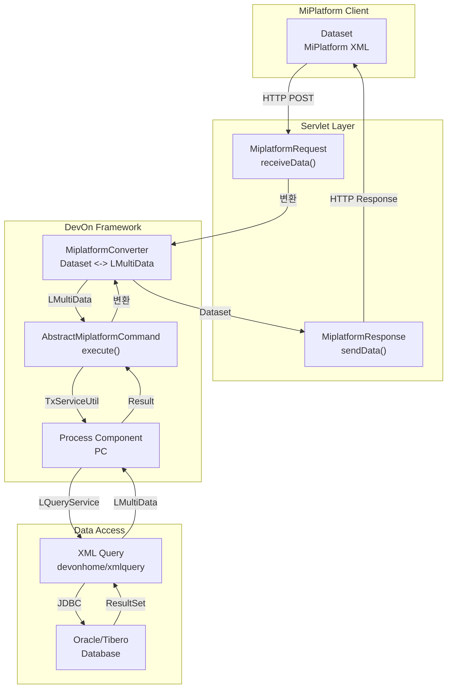

# NPH 병원정보시스템 Patient Journey 시뮬레이션

> 국립의료원 병원정보시스템(NPH) 환자 여정 흐름 분석
> 분석일: 2026-03-05
> 기반: DevOn Framework 4.0 + MiPlatform 3.3

---

## 시스템 개요

### NPH 모듈 구성

| 모듈 코드 | 모듈명 | 설명 |
|-----------|--------|------|
| **AZ** | Access/Registration | 접수/예약, 원무업무 |
| **MR** | Medical Record | 의무기록, 원무/수납 |
| **MD** | Medical Doctor | 진료 (외래/입원) |
| **SP** | Specimen/Procedure | 검사/처방/방사선 |
| **HP** | Hospitalization Patient | 입원관리 |
| **ER** | Emergency Room | 응급실 |

### 기술 스택

- **UI 플랫폼**: MiPlatform 3.3 (투비소프트)
- **백엔드 프레임워크**: DevOn Framework 4.0 (LG CNS)
- **WAS**: JEUS 6.0 (티맥스소프트)
- **DB**: Oracle / Tibero
- **데이터 연동**: Dataset → LMultiData → XML Query

---

## Patient Journey 전체 플로우



---

## 단계별 상세 시뮬레이션

---

### Stage 1: 접수/예약 (AZ - Access/Registration)

#### 1.1 환경 및 초기 화면



#### 1.2 화면 정보

| 항목 | 내용 |
|------|------|
| **화면 ID** | AZ_COM01001M |
| **화면 경로** | `/webapp/ui/AZ/COM/AZ_COM01001M.xml` |
| **화면명** | 외래접수등록 |
| **AppGroup** | AZ_COM (BaseUrl: AZ/COM/) |
| **관련 Dataset** | ds_PatientInfo, ds_DeptList, ds_DoctorList |

#### 1.3 MiPlatform Form 구조

```xml
<?xml version="1.0" encoding="utf-8"?>
<Window>
    <Form Height="802" Id="AZ_COM01001M" Title="외래접수등록"
          OnLoadCompleted="Form_OnLoadCompleted">
        <Datasets>
            <!-- 환자 정보 Dataset -->
            <Dataset Id="ds_PatientInfo" UseClientLayout="1">
                <colinfo id="pid" type="STRING" size="10"/>
                <colinfo id="name" type="STRING" size="50"/>
                <colinfo id="birthDate" type="STRING" size="8"/>
                <colinfo id="gender" type="STRING" size="1"/>
                <colinfo id="phone" type="STRING" size="20"/>
                <colinfo id="address" type="STRING" size="200"/>
            </Dataset>

            <!-- 진료과 목록 -->
            <Dataset Id="ds_DeptList" UseClientLayout="1">
                <colinfo id="deptCode" type="STRING" size="10"/>
                <colinfo id="deptName" type="STRING" size="50"/>
            </Dataset>

            <!-- 의사 목록 -->
            <Dataset Id="ds_DoctorList" UseClientLayout="1">
                <colinfo id="docCode" type="STRING" size="10"/>
                <colinfo id="docName" type="STRING" size="50"/>
                <colinfo id="deptCode" type="STRING" size="10"/>
            </Dataset>
        </Datasets>

        <!-- UI 컴포넌트 -->
        <Edit Id="ED_PatientID" OnKeyDown="ED_PatientID_OnKeyDown"/>
        <Edit Id="ED_PatientName"/>
        <Grid Id="Grid_DeptList" BindDataset="ds_DeptList"/>
        <Grid Id="Grid_DoctorList" BindDataset="ds_DoctorList"/>
        <Button Id="btn_Register" OnClick="btn_Register_OnClick" Text="접수등록"/>

        <Script><![CDATA[
            // 접수등록 버튼 클릭
            function btn_Register_OnClick(obj) {
                var patientId = ED_PatientID.Value;
                var deptCode = ds_DeptList.GetColumn(Grid_DeptList.Row, "deptCode");
                var docCode = ds_DoctorList.GetColumn(Grid_DoctorList.Row, "docCode");

                var params = "pid=" + patientId + "&dept=" + deptCode + "&doc=" + docCode;

                Transaction("RegisterPatient",
                    "NPHSE::/az/comn/receiptNavi/RegisterOutpatient.mhi",
                    "ds_PatientInfo=ds_PatientInfo:u",
                    "ds_Result=ds_Result",
                    params,
                    "RegisterCallback");
            }

            function RegisterCallback(svcId, errorCode, errorMsg) {
                if (errorCode == 0) {
                    alert("접수가 완료되었습니다. 접수번호: " + ds_Result.GetColumn(0, "receiptNo"));
                    // 다음 단계(수납)로 이동
                    Navigate("MR_COM02001M.xml");
                }
            }
        ]]></Script>
    </Form>
</Window>
```

#### 1.4 DevOn Command/PC 연결

| 구분 | 클래스/파일 | 경로 |
|------|-------------|------|
| **Navigation** | `az/comn/receiptNavi.xml` | `devonhome/navigation/his/az/comn/` |
| **Command** | `RegisterOutpatientCMD` | `nph.his.az.comn.receipt.cmd` |
| **PC** | `ReceiptPC` | `nph.his.az.comn.receipt.pc` |
| **XML Query** | `receipt.xml` | `devonhome/xmlquery/az/comn/` |

#### 1.5 Navigation 설정

```xml
<!-- az/comn/receiptNavi.xml -->
<navigation>
    <action name="RegisterOutpatient">
        <command>nph.his.az.comn.receipt.cmd.RegisterOutpatientCMD</command>
        <interceptor>defaultStack</interceptor>
    </action>

    <action name="RetrievePatientInfo">
        <command>nph.his.az.comn.receipt.cmd.RetrievePatientInfoCMD</command>
        <interceptor>defaultStack</interceptor>
    </action>
</navigation>
```

#### 1.6 Command 예시

```java
// RegisterOutpatientCMD.java
package nph.his.az.comn.receipt.cmd;

import devonx.nph.system.cmd.AbstractMiplatformCommand;
import devonx.nph.util.LData;
import devonx.nph.util.LMultiData;
import devonx.nph.util.TxServiceUtil;

public class RegisterOutpatientCMD extends AbstractMiplatformCommand {

    @Override
    public void execute() throws Exception {
        // 1. Input Dataset 변환
        LMultiData inputData = getMultiDatasetWithJobType("ds_PatientInfo");

        // 2. Parameter 추출
        String patientId = platformRequest.getParamData().getString("pid");
        String deptCode = platformRequest.getParamData().getString("dept");
        String docCode = platformRequest.getParamData().getString("doc");

        // 3. PC 호출
        ReceiptPC pc = (ReceiptPC) TxServiceUtil.getNTxService("az.comn.ReceiptPC");
        LMultiData result = pc.registerOutpatient(inputData, patientId, deptCode, docCode);

        // 4. Output Dataset 추가
        platformResponse.addDataset("ds_Result", result);
    }
}
```

#### 1.7 데이터 흐름 (Dataset)

```
[MiPlatform Client] AZ_COM01001M
       │
       │ ds_PatientInfo (C: Create)
       ▼
[Transaction] "/az/comn/receiptNavi/RegisterOutpatient.mhi"
       │
       ▼
[MiplatformServlet] → [Navigation] → [RegisterOutpatientCMD]
       │
       │ Dataset → LMultiData 변환 (CUD: C)
       ▼
[ReceiptPC.registerOutpatient()]
       │
       ▼
[LQueryService.executeQuery()]
       │
       ▼
[Oracle DB] - INSERT INTO RECEIPT, INSERT INTO OUTPATIENT_VISIT
       │
       ▼
[Result: LMultiData] → [Dataset: ds_Result]
       │
       ▼
[MiPlatform Client] 접수번호 반환, 다음 화면 이동
```

#### 1.8 XML Query 예시

```xml
<!-- devonhome/xmlquery/az/comn/receipt.xml -->
<queries>
    <query name="insertReceipt">
        <statement>
            INSERT INTO OUTPATIENT_RECEIPT (
                RECEIPT_NO, PID, DEPT_CODE, DOC_CODE,
                RECEIPT_DATE, RECEIPT_TIME, STATUS, REG_ID
            ) VALUES (
                SEQ_RECEIPT_NO.NEXTVAL,
                '${pid}',
                '${deptCode}',
                '${docCode}',
                TO_CHAR(SYSDATE, 'YYYYMMDD'),
                TO_CHAR(SYSDATE, 'HH24MISS'),
                '01',
                '${regId}'
            )
        </statement>
    </query>

    <query name="selectReceiptNo">
        <statement>
            SELECT RECEIPT_NO, PID, DEPT_CODE, DOC_CODE
            FROM OUTPATIENT_RECEIPT
            WHERE RECEIPT_NO = SEQ_RECEIPT_NO.CURRVAL
        </statement>
    </query>
</queries>
```

#### 1.9 다음 단계 전환

| 현재 단계 | 다음 단계 | 전환 조건 | 전환 화면 |
|-----------|-----------|-----------|-----------|
| 접수완료 | 원무/수납 | 접수번호 생성 완료 | MR_COM02001M.xml |
| 예약접수 | 접수대기 | 예약시간 도래 | AZ_COM01001M.xml |

---

### Stage 2: 원무/수납 (MR - Medical Record/Billing)

#### 2.1 화면 정보

| 항목 | 내용 |
|------|------|
| **화면 ID** | MR_COM02001M |
| **화면 경로** | `/webapp/ui/MR/COM/MR_COM02001M.xml` |
| **화면명** | 외래수납등록 |
| **AppGroup** | MR_COM (BaseUrl: MR/COM/) |

#### 2.2 화면 플로우



#### 2.3 Dataset 구조

| Dataset ID | 용도 | 주요 컬럼 |
|------------|------|-----------|
| ds_ReceiptInfo | 접수정보 | receiptNo, pid, deptCode, docCode |
| ds_FeeDetail | 수납상세 | feeCode, feeName, amount, insuranceAmt, patientAmt |
| ds_PaymentInfo | 결제정보 | paymentType, paymentAmt, cardNo, approvalNo |
| ds_PaymentResult | 결제결과 | receiptNo, paymentNo, totalAmt, paymentDate |

#### 2.4 DevOn 연결

```xml
<!-- mr/comn/paymentNavi.xml -->
<navigation>
    <action name="CalculateFee">
        <command>nph.his.mr.comn.payment.cmd.CalculateFeeCMD</command>
        <interceptor>defaultStack</interceptor>
    </action>

    <action name="ProcessPayment">
        <command>nph.his.mr.comn.payment.cmd.ProcessPaymentCMD</command>
        <interceptor>defaultStack</interceptor>
        <transaction type="required"/>
    </action>
</navigation>
```

#### 2.5 다음 단계 전환

| 현재 단계 | 다음 단계 | 전환 조건 | 전환 화면 |
|-----------|-----------|-----------|-----------|
| 수납완료 | 외래진료 | 수납영수증 출력 완료 | MD_OPN01001M.xml |
| 수납대기 | 접수화면 | 수납취소 | AZ_COM01001M.xml |

---

### Stage 3: 진료 (MD - Medical Doctor)

#### 3.1 외래진료 (Outpatient)

##### 3.1.1 화면 정보

| 항목 | 내용 |
|------|------|
| **화면 ID** | MD_OPN01001M |
| **화면 경로** | `/webapp/ui/MD/OPN/MD_OPN01001M.xml` |
| **화면명** | 외래진료메인 |
| **AppGroup** | MD_OPN (BaseUrl: MD/OPN/) |

##### 3.1.2 진료 프로세스 플로우



##### 3.1.3 Dataset 구조

| Dataset ID | 용도 | 주요 컬럼 |
|------------|------|-----------|
| ds_PatientQueue | 대기환자목록 | pid, name, receiptNo, waitTime |
| ds_Diagnosis | 상병정보 | diagCode, diagName, diagType, mainYn |
| ds_Prescription | 처방정보 | rxCode, rxName, qty, freq, days |
| ds_SOAP | 진료기록 | subjective, objective, assessment, plan |
| ds_VitalSign | 생체사인 | bp, pulse, temp, resp, weight, height |

##### 3.1.4 MiPlatform Transaction 예시

```javascript
// 진료완료 및 처방전송
function btn_CompleteTreatment_OnClick(obj) {
    // SOAP 데이터 준비
    var soapData = {
        subjective: ED_Subjective.Value,
        objective: ED_Objective.Value,
        assessment: ED_Assessment.Value,
        plan: ED_Plan.Value
    };

    // 처방 데이터
    var prescriptionRows = ds_Prescription.GetRowCount();
    if (prescriptionRows == 0) {
        alert("처방을 입력하세요.");
        return;
    }

    var params = "receiptNo=" + receiptNo +
                 "&docCode=" + docCode +
                 "&patientId=" + pid;

    // Transaction: 진료완료 + 처방전송
    Transaction("CompleteTreatment",
        "NPHSE::/md/opn/treatNavi/CompleteTreatment.mhi",
        "ds_Diagnosis=ds_Diagnosis:u,ds_Prescription=ds_Prescription:u,ds_SOAP=ds_SOAP:u",
        "ds_Result=ds_Result",
        params,
        "CompleteCallback");
}

function CompleteCallback(svcId, errorCode, errorMsg) {
    if (errorCode == 0) {
        var result = ds_Result.GetColumn(0, "result");
        if (result == "SUCCESS") {
            alert("진료가 완료되었습니다.");

            // EMR 저장 (NPH_ECS 연동)
            SaveEMR();

            // 다음 환자 또는 Stage 4로
            if (ds_Prescription.GetRowCount() > 0) {
                Navigate("SP_LAB01001M.xml");  // 검사/처방 화면
            }
        }
    }
}
```

#### 3.2 입원진료 (Inpatient)

##### 3.2.1 화면 정보

| 항목 | 내용 |
|------|------|
| **화면 ID** | MD_INP01001M |
| **화면 경로** | `/webapp/ui/MD/INP/MD_INP01001M.xml` |
| **화면명** | 입원진료메인 |
| **AppGroup** | MD_INP (BaseUrl: MD/INP/) |

##### 3.2.2 입원진료 플로우



##### 3.2.3 입원 Dataset

| Dataset ID | 용도 | 주요 컬럼 |
|------------|------|-----------|
| ds_AdmissionOrder | 입원오더 | admissionDate, deptCode, roomType |
| ds_RoomInfo | 병실정보 | roomNo, bedNo, roomType, status |
| ds_InpatientInfo | 입원정보 | admissionNo, pid, roomNo, admissionDate |
| ds_DischargeOrder | 퇴원오더 | dischargeDate, dischargeType, doctorComment |

#### 3.3 DevOn 연결

```xml
<!-- md/opn/treatNavi.xml -->
<navigation>
    <action name="CompleteTreatment">
        <command>nph.his.md.opn.treat.cmd.CompleteTreatmentCMD</command>
        <interceptor>defaultStack</interceptor>
        <transaction type="required"/>
    </action>

    <action name="RetrievePatientQueue">
        <command>nph.his.md.opn.treat.cmd.RetrievePatientQueueCMD</command>
        <interceptor>defaultStack</interceptor>
    </action>

    <action name="SaveEMR">
        <command>nph.his.md.opn.treat.cmd.SaveEMRCMD</command>
        <interceptor>defaultStack</interceptor>
    </action>
</navigation>
```

#### 3.4 다음 단계 전환

| 현재 단계 | 다음 단계 | 전환 조건 | 전환 화면 |
|-----------|-----------|-----------|-----------|
| 외래진료완료 | 검사/처방 | 약/검사 처방 존재 | SP_LAB01001M.xml |
| 외래진료완료 | 수납/퇴원 | 처방 없음 | MR_COM03001M.xml |
| 입원오더완료 | 병실배정 | 입원승인 | HP_COM01001M.xml |
| 퇴원오더완료 | 퇴원수납 | 퇴원승인 | MR_COM03001M.xml |

---

### Stage 4: 검사/처방 (SP - Specimen/Procedure)

#### 4.1 검사접수 (Laboratory)

##### 4.1.1 화면 정보

| 항목 | 내용 |
|------|------|
| **화면 ID** | SP_LAB01001M |
| **화면 경로** | `/webapp/ui/SP/LAB/SP_LAB01001M.xml` |
| **화면명** | 검사접수관리 |
| **AppGroup** | SP (BaseUrl: SP/) |

##### 4.1.2 검사 프로세스



##### 4.1.3 Dataset 구조

| Dataset ID | 용도 | 주요 컬럼 |
|------------|------|-----------|
| ds_LabOrder | 검사오더 | orderNo, receiptNo, testCode, testName |
| ds_SpecimenInfo | 검체정보 | specimenNo, specimenType, collectTime |
| ds_LabResult | 검사결과 | resultCode, resultValue, refRange, abnormalFlag |
| ds_RadiologyOrder | 영상오더 | xrayCode, bodyPart, position |

##### 4.1.4 MiPlatform Transaction

```javascript
// 검체채취 완료
function btn_CollectComplete_OnClick(obj) {
    var specimenNo = "SP" + getCurrentDateTime();

    var params = "specimenNo=" + specimenNo +
                 "&orderNo=" + orderNo +
                 "&collectTime=" + getCurrentTime();

    Transaction("CollectSpecimen",
        "NPHSE::/sp/lab/specimenNavi/CollectSpecimen.mhi",
        "ds_SpecimenInfo=ds_SpecimenInfo:u",
        "",
        params,
        "CollectCallback");
}

// 검사결과 저장
function btn_SaveResult_OnClick(obj) {
    Transaction("SaveLabResult",
        "NPHSE::/sp/lab/resultNavi/SaveLabResult.mhi",
        "ds_LabResult=ds_LabResult:u",
        "",
        "",
        "SaveResultCallback");
}
```

#### 4.2 처방전송 (Prescription)

##### 4.2.1 처방전송 플로우



#### 4.3 DevOn 연결

```xml
<!-- sp/lab/specimenNavi.xml -->
<navigation>
    <action name="CollectSpecimen">
        <command>nph.his.sp.lab.specimen.cmd.CollectSpecimenCMD</command>
        <interceptor>defaultStack</interceptor>
    </action>

    <action name="SaveLabResult">
        <command>nph.his.sp.lab.result.cmd.SaveLabResultCMD</command>
        <interceptor>defaultStack</interceptor>
    </action>

    <action name="SendPrescription">
        <command>nph.his.sp.prc.send.cmd.SendPrescriptionCMD</command>
        <interceptor>defaultStack</interceptor>
        <transaction type="required"/>
    </action>
</navigation>
```

#### 4.4 다음 단계 전환

| 현재 단계 | 다음 단계 | 전환 조건 | 전환 화면 |
|-----------|-----------|-----------|-----------|
| 검체채취완료 | 검사진행 | 검체인수확인 | 내부 LIS 연동 |
| 검사결과완료 | 진료확인 | 결과승인 | MD_OPN01001M.xml |
| 처방전송완료 | 약국조제 | 전송성공 | PH_COM01001M.xml |

---

### Stage 5: 조제/투약 (Pharmacy)

#### 5.1 화면 정보

| 항목 | 내용 |
|------|------|
| **화면 ID** | PH_COM01001M |
| **화면 경로** | `/webapp/ui/PH/COM/PH_COM01001M.xml` |
| **화면명** | 약국조제관리 |
| **AppGroup** | PH_COM (BaseUrl: PH/COM/) |

#### 5.2 조제 프로세스



#### 5.3 Dataset 구조

| Dataset ID | 용도 | 주요 컬럼 |
|------------|------|-----------|
| ds_PrescriptionQueue | 처방대기목록 | rxNo, pid, drugCode, drugName, qty |
| ds_Picking | 피킹목록 | drugCode, location, qty, pickedYn |
| ds_Preparation | 조제정보 | prepNo, rxNo, pharmacistId, prepTime |
| ds_AdminRecord | 투약기록 | adminTime, adminRoute, result |

#### 5.4 MiPlatform 예시

```javascript
// 조제완료 처리
function btn_PreparationComplete_OnClick(obj) {
    var prepNo = "PR" + getCurrentDateTime();

    var params = "prepNo=" + prepNo +
                 "&rxNo=" + rxNo +
                 "&pharmacistId=" + getUserId();

    Transaction("CompletePreparation",
        "NPHSE::/ph/comn/prepNavi/CompletePreparation.mhi",
        "ds_Preparation=ds_Preparation:u",
        "",
        params,
        "PrepCompleteCallback");
}

function PrepCompleteCallback(svcId, errorCode, errorMsg) {
    if (errorCode == 0) {
        alert("조제가 완료되었습니다.");

        // 투약 화면으로 이동
        Navigate("PH_COM01004M.xml");
    }
}
```

#### 5.5 DevOn 연결

```xml
<!-- ph/comn/prepNavi.xml -->
<navigation>
    <action name="CompletePreparation">
        <command>nph.his.ph.comn.prep.cmd.CompletePreparationCMD</command>
        <interceptor>defaultStack</interceptor>
    </action>

    <action name="RecordAdministration">
        <command>nph.his.ph.comn.admin.cmd.RecordAdministrationCMD</command>
        <interceptor>defaultStack</interceptor>
    </action>
</navigation>
```

#### 5.6 다음 단계 전환

| 현재 단계 | 다음 단계 | 전환 조건 | 전환 화면 |
|-----------|-----------|-----------|-----------|
| 조제완료 | 투약실시 | 복약지도 완료 | PH_COM01004M.xml |
| 투약완료 | 외래수납 | 외래처방 | MR_COM02001M.xml |
| 투약완료 | 입원관리 | 입원처방 | HP_COM01001M.xml |

---

### Stage 6: 퇴원/수납 (Discharge/Billing)

#### 6.1 화면 정보

| 항목 | 내용 |
|------|------|
| **화면 ID** | MR_COM03001M |
| **화면 경로** | `/webapp/ui/MR/COM/MR_COM03001M.xml` |
| **화면명** | 퇴원수납관리 |
| **AppGroup** | MR_COM (BaseUrl: MR/COM/) |

#### 6.2 퇴원 프로세스



#### 6.3 Dataset 구조

| Dataset ID | 용도 | 주요 컬럼 |
|------------|------|-----------|
| ds_DischargeInfo | 퇴원정보 | dischargeNo, admissionNo, dischargeDate |
| ds_InpFee | 입원비용 | feeCode, feeName, days, unitPrice, amount |
| ds_RxFee | 처방비용 | rxCode, rxName, qty, unitPrice, amount |
| ds_ExamFee | 검사비용 | examCode, examName, amount |
| ds_TotalFee | 총비용 | totalAmount, insuranceAmt, patientAmt |
| ds_Receipt | 영수증정보 | receiptNo, paymentType, paymentAmt |

#### 6.4 MiPlatform 예시

```javascript
// 퇴원수납 처리
function btn_DischargePayment_OnClick(obj) {
    // 비용 계산
    CalculateTotalFee();

    var params = "admissionNo=" + admissionNo +
                 "&dischargeDate=" + getCurrentDate() +
                 "&paymentType=" + combo_PaymentType.Value;

    Transaction("ProcessDischarge",
        "NPHSE::/mr/comn/dischNavi/ProcessDischarge.mhi",
        "ds_TotalFee=ds_TotalFee,ds_Payment=ds_Payment:u",
        "ds_Receipt=ds_Receipt",
        params,
        "DischargeCallback");
}

function DischargeCallback(svcId, errorCode, errorMsg) {
    if (errorCode == 0) {
        var receiptNo = ds_Receipt.GetColumn(0, "receiptNo");
        alert("퇴원수납이 완료되었습니다.\n영수증번호: " + receiptNo);

        // 영수증 출력
        PrintReceipt(receiptNo);

        // 퇴원증 발행
        Navigate("MR_COM03003M.xml");
    }
}
```

#### 6.5 DevOn 연결

```xml
<!-- mr/comn/dischNavi.xml -->
<navigation>
    <action name="ProcessDischarge">
        <command>nph.his.mr.comn.disch.cmd.ProcessDischargeCMD</command>
        <interceptor>defaultStack</interceptor>
        <transaction type="required"/>
    </action>

    <action name="CalculateInpFee">
        <command>nph.his.mr.comn.disch.cmd.CalculateInpFeeCMD</command>
        <interceptor>defaultStack</interceptor>
    </action>
</navigation>
```

#### 6.6 최종 종료

| 현재 단계 | 상태 | 결과 |
|-----------|------|------|
| 퇴원수납완료 | Patient Journey 종료 | 영수증발행, 퇴원증발행 |
| 예약후퇴원 | 재방문 예약 | AZ_COM01003M.xml (예약화면) |

---

## 전체 데이터 흐름 요약

### Dataset 변환 플로우



### 핵심 Dataset 매핑

| MiPlatform Dataset | DevOn LMultiData | DB Table |
|-------------------|------------------|----------|
| ds_PatientInfo | LMultiData | PATIENT_MASTER |
| ds_ReceiptInfo | LMultiData | OUTPATIENT_RECEIPT |
| ds_Prescription | LMultiData | PRESCRIPTION_MASTER |
| ds_LabOrder | LMultiData | LAB_ORDER |
| ds_AdmissionInfo | LMultiData | INPATIENT_ADMISSION |

---

## 주요 화면 ID 목록

### 접수/예약 (AZ)

| 화면 ID | 화면명 | 경로 |
|---------|--------|------|
| AZ_COM01001M | 외래접수등록 | ui/AZ/COM/AZ_COM01001M.xml |
| AZ_COM01002M | 예약관리 | ui/AZ/COM/AZ_COM01002M.xml |
| AZ_COM01003M | 예약조회 | ui/AZ/COM/AZ_COM01003M.xml |
| AZ_COM01004M | 접수현황 | ui/AZ/COM/AZ_COM01004M.xml |

### 원무/수납 (MR)

| 화면 ID | 화면명 | 경로 |
|---------|--------|------|
| MR_COM02001M | 외래수납등록 | ui/MR/COM/MR_COM02001M.xml |
| MR_COM02002M | 처방수납 | ui/MR/COM/MR_COM02002M.xml |
| MR_COM03001M | 퇴원수납관리 | ui/MR/COM/MR_COM03001M.xml |

### 진료 (MD)

| 화면 ID | 화면명 | 경로 |
|---------|--------|------|
| MD_OPN01001M | 외래진료메인 | ui/MD/OPN/MD_OPN01001M.xml |
| MD_OPN01002M | 상병등록 | ui/MD/OPN/MD_OPN01002M.xml |
| MD_OPN01003M | 약처방 | ui/MD/OPN/MD_OPN01003M.xml |
| MD_INP01001M | 입원진료메인 | ui/MD/INP/MD_INP01001M.xml |

### 검사/처방 (SP)

| 화면 ID | 화면명 | 경로 |
|---------|--------|------|
| SP_LAB01001M | 검사접수관리 | ui/SP/LAB/SP_LAB01001M.xml |
| SP_CEL01001M | 검체채취 | ui/SP/CEL/SP_CEL01001M.xml |
| SP_RST01001M | 검사결과입력 | ui/SP/RST/SP_RST01001M.xml |
| SP_RAY01001M | 영상촬영오더 | ui/SP/RAY/SP_RAY01001M.xml |

### 입원 (HP)

| 화면 ID | 화면명 | 경로 |
|---------|--------|------|
| HP_COM01001M | 병실배정 | ui/HP/COM/HP_COM01001M.xml |
| HP_COM01002M | 입원관리 | ui/HP/COM/HP_COM01002M.xml |

### 약국 (PH)

| 화면 ID | 화면명 | 경로 |
|---------|--------|------|
| PH_COM01001M | 약국조제관리 | ui/PH/COM/PH_COM01001M.xml |
| PH_COM01002M | 처방확인 | ui/PH/COM/PH_COM01002M.xml |
| PH_COM01003M | 조제확인 | ui/PH/COM/PH_COM01003M.xml |

---

## DevOn Navigation 경로 규칙

### URL 패턴

```
/{모듈}/{업무}/{네비게이션명}/{액션명}.mhi

예시:
- /az/comn/receiptNavi/RegisterOutpatient.mhi
- /mr/comn/paymentNavi/ProcessPayment.mhi
- /md/opn/treatNavi/CompleteTreatment.mhi
- /sp/lab/specimenNavi/CollectSpecimen.mhi
```

### Navigation 파일 경로

```
devonhome/navigation/his/
├── az/
│   ├── comn/
│   │   ├── receiptNavi.xml
│   │   └── patientNavi.xml
│   └── biz/
├── mr/
│   └── comn/
│       ├── paymentNavi.xml
│       └── dischNavi.xml
├── md/
│   ├── opn/
│   │   └── treatNavi.xml
│   └── inp/
│       └── treatNavi.xml
├── sp/
│   ├── lab/
│   │   ├── specimenNavi.xml
│   │   └── resultNavi.xml
│   └── prc/
│       └── sendNavi.xml
└── ph/
    └── comn/
        ├── prepNavi.xml
        └── adminNavi.xml
```

---

## 결론

### Patient Journey 핵심 요약

| 단계 | 모듈 | 핵심 화면 | DevOn Command | 데이터 흐름 |
|------|------|-----------|---------------|-------------|
| 1. 접수 | AZ | AZ_COM01001M | RegisterOutpatientCMD | ds_PatientInfo → RECEIPT 테이블 |
| 2. 수납 | MR | MR_COM02001M | ProcessPaymentCMD | ds_FeeDetail → PAYMENT 테이블 |
| 3. 진료 | MD | MD_OPN01001M | CompleteTreatmentCMD | ds_Diagnosis/Prescription → 진료기록 |
| 4. 검사 | SP | SP_LAB01001M | CollectSpecimenCMD | ds_LabOrder → 검사실 연동 |
| 5. 조제 | PH | PH_COM01001M | CompletePreparationCMD | ds_Prescription → 약국조제 |
| 6. 퇴원 | MR | MR_COM03001M | ProcessDischargeCMD | ds_TotalFee → 수납완료 |

### 시스템 특징

1. **MiPlatform 3.3 기반 RIA**: ActiveX 기반 클라이언트, DevOn Framework와의 Dataset 연동
2. **DevOn Framework 4.0**: Struts 1.x 기반, Command/PC 패턴, XML 기반 Navigation
3. **데이터 흐름**: Dataset → LMultiData → XML Query → DB (양방향)
4. **모듈화 구조**: AZ/MR/MD/SP/HP/PH 모듈별 독립적 관리
5. **EMR 연동**: NPH_ECS를 통한 전자의무기록 통합

---

*분석 완료: 2026-03-05*
*시스템: NPH (National Hospital Information System)*
*기술스택: MiPlatform 3.3 + DevOn Framework 4.0 + Oracle/Tibero*
